# ANÁLISIS INTEGRAL DE MACROPROCESOS Y ESPECIFICACIÓN BPMN 2.0
## Sistema de Gestión por Procesos y Arquitectura de Software para el CORLAD Junín

> **Entidad:** Colegio Regional de Licenciados en Administración – CORLAD Junín  
> **Propósito:** Especificación formal de macroprocesos, procesos institucionales y flujos BPMN para su implementación en Bizagi Process Modeler y desarrollo del software de gestión (Tesis de Ingeniería de Sistemas).  
> **Marco Normativo:** Ley N° 31060 (Ley del Ejercicio Profesional), D.L. N° 22087, D.S. N° 020-2006-ED, Estatuto Nacional del CLAD y Plan Estratégico Institucional (PEI 2021–2025).  
> **Documentos Fuente Integrados:**
> - `corlad procesos institucionales.pdf` / `.md` (Anexo 6: Caracterización y flujogramas de 16 procesos).
> - `distribucion de funciones.pdf` / `.md` (Estructura de puestos y funciones permanentes).
> - `PLAN ESTRATEGICO INSTITUCIONAL 2021-2025.pdf` / `.md` (Diagnóstico, Ejes, Matrices y CMI).

---

## ÍNDICE GENERAL

1. [Arquitectura Global de Procesos (Nivel 0)](#1-arquitectura-global-de-procesos-nivel-0)
2. [Matriz de Roles, Actores y Módulos de Software](#2-matriz-de-roles-actores-y-módulos-de-software)
3. [Especificación Detallada de los Procesos Estratégicos (PE)](#3-especificación-detallada-de-los-procesos-estratégicos-pe)
   - [PE-01: Gestión Estratégica](#pe-01-proceso-de-gestión-estratégica)
   - [PE-02: Gestión de la Calidad](#pe-02-proceso-de-gestión-de-la-calidad)
   - [PE-03: Gestión de Personal y Talento Humano](#pe-03-proceso-de-gestión-de-personal-y-talento-humano)
   - [PE-04: Gestión de Articulación y Convenios](#pe-04-proceso-de-gestión-de-articulación-y-convenios)
4. [Especificación Detallada de los Procesos Misionales (PM)](#4-especificación-detallada-de-los-procesos-misionales-pm)
   - [PM-01: Colegiatura y Habilitación Profesional](#pm-01-proceso-de-colegiatura-y-habilitación-profesional)
   - [PM-02: Eventos Académicos y Capacitación Continua](#pm-02-proceso-de-eventos-académicos-y-capacitación-continua)
   - [PM-03: Seguridad y Bienestar Social](#pm-03-proceso-de-seguridad-y-bienestar-social)
   - [PM-04: Información Científica, Tecnológica e Investigación](#pm-04-proceso-de-información-científica-tecnológica-e-investigación)
   - [PM-05: Imagen Institucional y Comunicación](#pm-05-proceso-de-imagen-institucional-y-comunicación)
   - [PM-06: Economía y Finanzas Institucionales](#pm-06-proceso-de-economía-y-finanzas-institucionales)
   - [PM-07: Secretaría, Actas y Fe Pública](#pm-07-proceso-de-secretaría-actas-y-fe-pública)
5. [Especificación Detallada de los Procesos de Apoyo (PA)](#5-especificación-detallada-de-los-procesos-de-apoyo-pa)
   - [PA-01: Asesoría Legal](#pa-01-proceso-de-asesoría-legal)
   - [PA-02: Gestión Contable y Tributaria](#pa-02-proceso-de-gestión-contable-y-tributaria)
   - [PA-03: Gestión Logística y Abastecimiento](#pa-03-proceso-de-gestión-logística-y-abastecimiento)
   - [PA-04: Tecnologías de la Información y Comunicación (TIC)](#pa-04-proceso-de-tecnologías-de-la-información-y-comunicación-tic)
   - [PA-05: Deontología y Tribunal de Honor](#pa-05-proceso-de-deontología-y-tribunal-de-honor)
6. [Matriz de Trazabilidad: Proceso BPMN vs. Requerimientos Funcionales de Software](#6-matriz-de-trazabilidad-proceso-bpmn-vs-requerimientos-funcionales-de-software)
7. [Modelo Conceptual de Datos del Sistema](#7-modelo-conceptual-de-datos-del-sistema)
8. [Pautas Metodológicas para el Modelado en Bizagi Process Modeler](#8-pautas-metodológicas-para-el-modelado-en-bizagi-process-modeler)

---

## 1. Arquitectura Global de Procesos (Nivel 0)

La cadena de valor del CORLAD Junín estructura sus operaciones en torno a 3 Macroprocesos que integran 16 Procesos Institucionales:

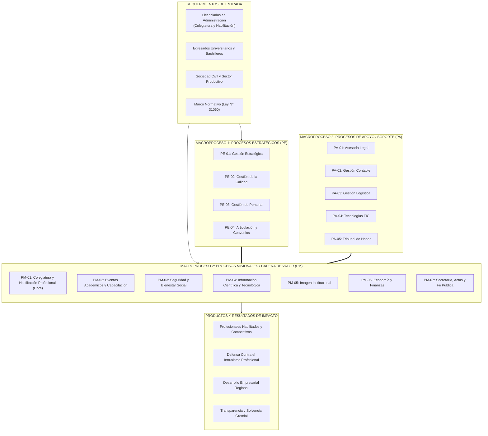

---

## 2. Matriz de Roles, Actores y Módulos de Software

A partir del manual de distribución de funciones y el organigrama del PEI, se establecen los roles que operarán tanto en los **Swimlanes de Bizagi** como en la **Matriz de Control de Acceso (RBAC)** del software:

| Rol Institucional | Carril Bizagi (Swimlane) | Responsabilidades Clave | Módulo del Software Asignado |
| :--- | :--- | :--- | :--- |
| **Decano Regional** | `Decanatura` | Dirección institucional, suscripción de resoluciones, convenios y diplomas. | Módulo de Gobierno y Firma Digital |
| **Consejo Directivo** | `Consejo Directivo` | Aprobación de planes, convenios, presupuestos y subsidios sociales. | Módulo de Sesiones y Acuerdos |
| **Gerente Regional** | `Gerencia / Administración` | Articulación operativa, revisión técnica de informes, supervisión de personal y compras. | Módulo de Gestión Administrativa |
| **Secretaria Regional** | `Secretaría / Mesa de Partes` | Mesa de partes (física/virtual), emisión de habilidad, armado de legajos de colegiatura. | Módulo de Trámite Documentario |
| **Encargada de Tesorería** | `Tesorería / Cobranzas` | Recaudación, emisión de boletas/facturas, depósitos < 48h, liquidación de eventos. | Módulo de Caja y Facturación |
| **Director Académico** | `Eventos Académicos` | Diseño curricular, asignación de ponentes, evaluación y certificación. | Módulo Académico y Aula Virtual |
| **Director de Bienestar** | `Bienestar Social` | Evaluación de solicitudes de auxilio mutuo, integración y salud. | Módulo de Previsión Social |
| **Encargado de Marketing** | `Gestión Comercial / Mkt` | Campañas digitales, administración de web/redes, formularios de inscripción. | Módulo de Marketing y Portal Web |
| **Asesor Legal** | `Asesoría Legal` | Dictámenes jurídicos, defensa gremial, visación de contratos y convenios. | Módulo Jurídico y Deontológico |
| **Contador Regional** | `Contabilidad` | Asientos contables, libros electrónicos (PLE), liquidación SUNAT y balances. | Módulo Contable y Tributario |
| **Encargado de Logística** | `Logística / Almacén` | Requerimientos, cuadros comparativos, compras y entrega física con pecosas. | Módulo de Inventario y Almacén |
| **Especialista TIC** | `Sistemas / TIC` | Soporte a hardware/redes, administración de Big Data y seguridad informática. | Módulo de Infraestructura y TIC |
| **Tribunal de Honor** | `Tribunal de Honor` | Instrucción deontológica, audiencias probatorias y dictámenes disciplinarios. | Módulo Disciplinario |
| **Agremiado / Postulante** | `Licenciado / Colegiado` | Postulación a colegiatura, pago de aportes, descarga de habilidad digital. | Portal del Colegiado (Front-End) |

---

## 3. Especificación Detallada de los Procesos Estratégicos (PE)

### PE-01: Proceso de Gestión Estratégica

* **Código:** `PE-01`
* **Objetivo:** Direccionar, alinear y conducir a la orden profesional hacia el cumplimiento de su misión y visión estratégica mediante planes operativos anuales (POA).
* **Alcance:** Inicia con el diagnóstico situacional de las áreas y culmina con la ejecución y control de los planes de trabajo.
* **Módulo de Software:** *Módulo de Gestión Estratégica y Tableros de Control (KPIs)*.

#### Diagrama de Flujo BPMN (Mermaid)
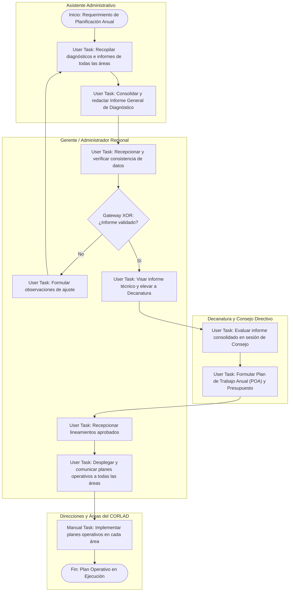

#### Especificación de Actividades y Reglas de Negocio
1. **Recopilación Situacional:** El Asistente Administrativo extrae reportes de desempeño histórico de la base de datos (colegiaturas logradas, ingresos por eventos, morosidad).
2. **Validación Administrativa (Gateway XOR):** El Administrador verifica la viabilidad financiera del diagnóstico. Si hay inconsistencias, se devuelve para corrección de datos.
3. **Aprobación de Consejo Directivo:** Decanatura aprueba el Plan de Trabajo Anual mediante Resolución Decanal.
4. **Despliegue Institucional:** Notificación digital automatizada a los directores de línea mediante el software.
* **Entradas:** Informes de gestión por áreas, balances del ejercicio anterior.
* **Salidas:** Plan de Trabajo Anual (POA), Presupuesto Institucional Aprobado.
* **Indicador (KPI):**
  $$\text{Porcentaje de Cumplimiento de Objetivos} = \left(\frac{\text{Objetivos Cumplidos}}{\text{Objetivos Planteados}}\right) \times 100 \quad [\text{Meta: } \ge 80\%]$$

---

### PE-02: Proceso de Gestión de la Calidad

* **Código:** `PE-02`
* **Objetivo:** Monitorear permanentemente los estándares de atención, procesar quejas/sugerencias e implementar estrategias de mejora continua.
* **Alcance:** Inicia con el levantamiento de quejas, reclamos y encuestas de satisfacción, y finaliza con la verificación de la eficacia de las medidas correctivas.
* **Módulo de Software:** *Módulo de Calidad, Auditoría Interna y Libro de Reclamaciones Virtual*.

#### Diagrama de Flujo BPMN (Mermaid)
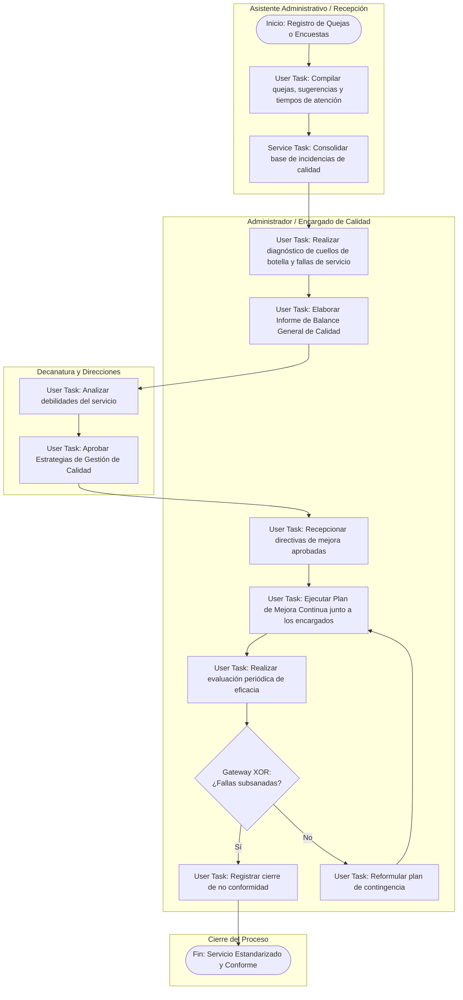

#### Especificación de Actividades y Reglas de Negocio
1. **Captura Automatizada:** El software recopila quejas registradas en el Libro de Reclamaciones Virtual y encuestas enviadas por correo al emitir una constancia o culminar un evento.
2. **Evaluación de Eficacia (Gateway XOR):** Tras 30 días de aplicada la mejora, el sistema genera métricas automáticas de tiempo de ciclo de trámites. Si no superan el estándar, el ticket de calidad se reabre.
* **Entradas:** Reclamos, tickets de soporte demorados, encuestas post-servicio.
* **Salidas:** Informe de Balance de Calidad, Plan de Mejora Continua, Acta de Cierre de No Conformidad.
* **Indicador (KPI):**
  $$\text{Nivel de Satisfacción de los Agremiados} \ge 80\% \quad [\text{Medición Mensual}]$$

---

### PE-03: Proceso de Gestión de Personal y Talento Humano

* **Código:** `PE-03`
* **Objetivo:** Gestionar el ciclo de vida del personal administrativo y practicantes: reclutamiento, selección, contratación, control de asistencia y pago de haberes.
* **Alcance:** Inicia con el requerimiento de personal por un área y culmina con la cancelación mensual de remuneraciones y actualización del legajo.
* **Módulo de Software:** *Módulo de Recursos Humanos, Asistencia Biométrica y Planillas*.

#### Diagrama de Flujo BPMN (Mermaid)
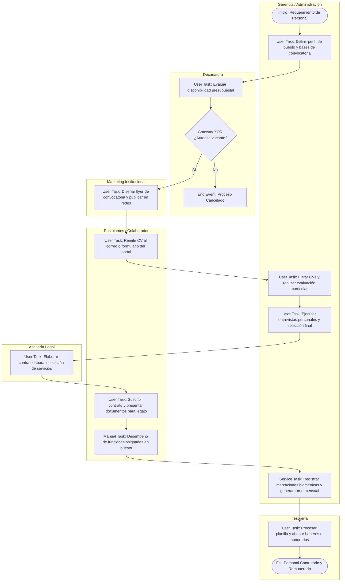

#### Especificación de Actividades y Reglas de Negocio
1. **Control de Presupuesto:** Decanatura no puede autorizar una plaza si el costo mensual no está contemplado en la Matriz 5 del PEI (Presupuesto de Talento Humano).
2. **Integración Biométrica:** El software sincroniza las marcaciones de huella/facial del reloj biométrico con el módulo de RRHH para calcular tardanzas, faltas y subsidios.
* **Entradas:** Solicitud de requerimiento de personal, CVs documentados.
* **Salidas:** Contrato de trabajo suscrito, Legajo digital de personal, Boleta de pago electrónica.
* **Indicador (KPI):**
  $$\text{Nivel de Desempeño Laboral} \ge 80\% \quad [\text{Evaluación Periódica}]$$

---

### PE-04: Proceso de Gestión de Articulación y Convenios

* **Código:** `PE-04`
* **Objetivo:** Gestionar, aprobar, suscribir y monitorear convenios interinstitucionales con entidades públicas, universidades y empresas privadas.
* **Alcance:** Inicia con la identificación o recepción de la propuesta de convenio y finaliza con la ejecución y evaluación de resultados de la alianza.
* **Módulo de Software:** *Módulo de Convenios y Relaciones Institucionales*.

#### Diagrama de Flujo BPMN (Mermaid)
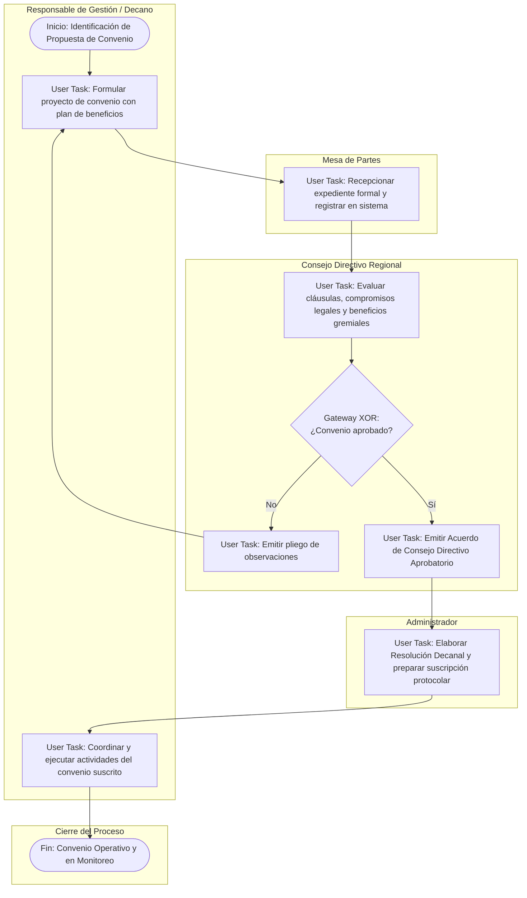

#### Especificación de Actividades y Reglas de Negocio
1. **Regla de Aprobación Colegiada:** Ningún convenio marco o específico puede suscribirse sin el Acuerdo formal del Consejo Directivo Regional asentado en el Libro de Actas.
2. **Alertas de Caducidad:** El sistema notifica a Gerencia 60 días antes del vencimiento de cada convenio para evaluar su prórroga.
* **Entradas:** Propuesta formal de convenio, cartas de intención de municipalidades, universidades o empresas.
* **Salidas:** Convenio suscrito, Resolución Decanal de aprobación, Libro de Registro de Convenios actualizado.
* **Indicador (KPI):**
  $$\text{Número de Convenios Celebrados Activos} \ge 20 \text{ al año}$$

---

## 4. Especificación Detallada de los Procesos Misionales (PM)

### PM-01: Proceso de Colegiatura y Habilitación Profesional

* **Código:** `PM-01`
* **Objetivo:** Incorporar legalmente a nuevos profesionales en administración mediante matrícula oficial y garantizar el mantenimiento de la condición de colegiado hábil (Ley 31060).
* **Alcance:** Inicia con la captación/inscripción del titulado y culmina con la entrega de diploma/medalla y la emisión periódica de constancias de habilidad profesional.
* **Módulo de Software:** *Módulo Central de Colegiatura, Padrón Regional de Agremiados y Habilitación Digital (Big Data CORLAD)*.

#### Diagrama de Flujo BPMN (Mermaid)
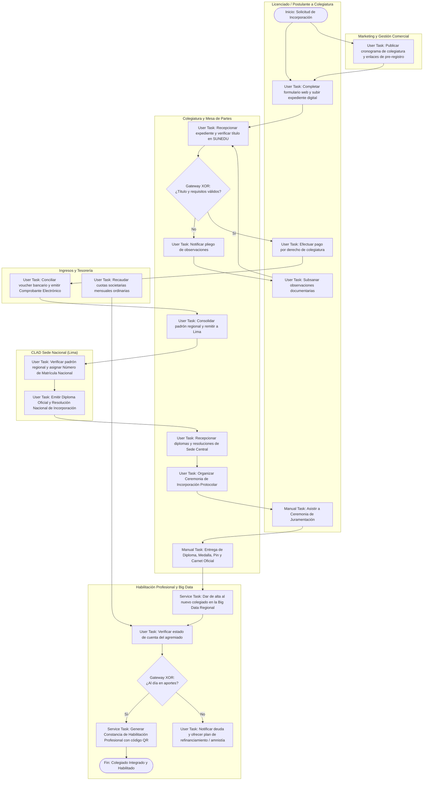

#### Especificación de Actividades y Reglas de Negocio
1. **Validación SUNEDU (Gateway 1):** El software valida el código de registro del Título Profesional contra la base de datos de SUNEDU. Si el título no está registrado o no coincide el DNI, se rechaza la admisión.
2. **Regla de Habilidad (Gateway 2):**
   * Un agremiado se encuentra **HÁBIL** si adeuda $\le 2$ cuotas mensuales ordinarias.
   * Si adeuda $\ge 3$ cuotas, pasa automáticamente a estado **INHABILITADO POR DEUDA**, bloqueando la descarga de la constancia digital hasta el pago o suscripción de convenio de pago.
3. **Constancia Digital Segura:** La constancia emitida incorpora firma digital X.509 y un código QR criptográfico único que permite a instituciones públicas y privadas verificar la habilidad en tiempo real en la web del CORLAD.
* **Entradas:** Título universitario, DNI, fotos de frente, voucher de pago, certificado de antecedentes penales.
* **Salidas:** Número de Colegiatura Regional y Nacional, Diploma de Colegiatura, Constancia de Habilidad Profesional Digital.
* **Indicadores (KPIs):**
  - Incorporación mensual: $\text{N° de Colegiados Incorporados} \ge 30\text{ al mes}$.
  - Padrón habilitado: $\text{N° de Colegiados Habilitados} \ge 30\text{ al mes}$.

---

### PM-02: Proceso de Eventos Académicos y Capacitación Continua

* **Código:** `PM-02`
* **Objetivo:** Planificar, comercializar, desarrollar y liquidar actividades formativas (diplomados, conferencias, talleres) para la especialización continua.
* **Alcance:** Inicia con la formulación del plan temático y culmina con la emisión de certificados con valor curricular y liquidación financiera.
* **Módulo de Software:** *Módulo Académico, Pasarela de Inscripciones y Aula Virtual*.

#### Diagrama de Flujo BPMN (Mermaid)
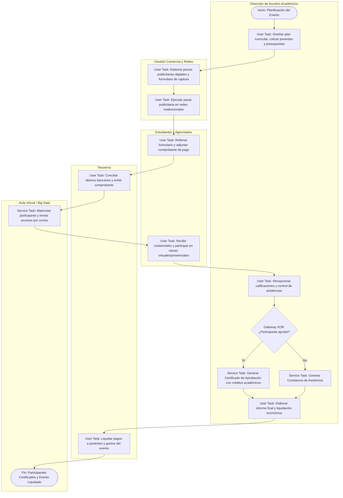

#### Especificación de Actividades y Reglas de Negocio
1. **Regla de Certificación (Gateway XOR):**
   * Certificado de Especialización: Requiere asistencia mínima del $80\%$ y nota final en evaluación $\ge 14.00$.
   * Constancia de Asistencia: Asistencia $\ge 80\%$ con nota $< 14.00$.
2. **Generación Automatizada:** Los certificados se emiten en PDF con hash SHA-256 y QR de verificación curricular institucional.
* **Entradas:** Plan de trabajo académico, hojas de vida de expositores, inscripciones de alumnos.
* **Salidas:** Certificados digitales con valor oficial, Informe de liquidación económica.
* **Indicadores (KPIs):**
  - Satisfacción académica: $\text{Nivel de Satisfacción} \ge 80\%$.
  - Meta de producción: $\text{N° de Eventos Realizados} = 5\text{ por mes}$.

---

### PM-03: Proceso de Seguridad y Bienestar Social

* **Código:** `PM-03`
* **Objetivo:** Administrar el Fondo de Previsión Social, otorgar subsidios de auxilio mutuo y promover actividades recreativas y de salud integral.
* **Alcance:** Inicia con la contingencia o solicitud del agremiado y finaliza con el desembolso económico o ejecución de la actividad integradora.
* **Módulo de Software:** *Módulo de Bienestar Social y Fondo de Previsión*.

#### Diagrama de Flujo BPMN (Mermaid)
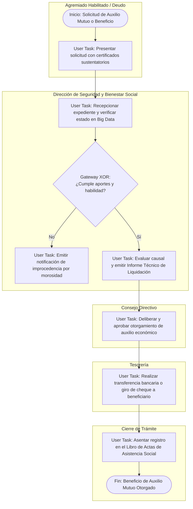

#### Especificación de Actividades y Reglas de Negocio
1. **Regla de Acceso al Fondo:** El solicitante debe encontrarse en condición de colegiado HÁBIL y con un tiempo de afiliación ininterrumpida $\ge 6$ meses.
2. **Causales de Auxilio Mutuo:** Fallecimiento del titular o cónyuge/hijos, incapacidad permanente, intervención quirúrgica grave.
* **Entradas:** Solicitud formal, certificado de defunción/médico, documentos de parentesco.
* **Salidas:** Resolución de otorgamiento, Cheque/Transferencia bancaria, Asiento en Libro de Actas.
* **Indicador (KPI):**
  $$\text{Satisfacción de Servicios de Bienestar} \ge 80\%$$

---

### PM-04: Proceso de Información Científica, Tecnológica e Investigación

* **Código:** `PM-04`
* **Objetivo:** Estimular la producción intelectual en administración, brindar asesoría de tesis y publicar la revista científica institucional.
* **Alcance:** Inicia con la formulación del plan de fomento científico y culmina con la catalogación e indexación de publicaciones y tesis.
* **Módulo de Software:** *Módulo de Repositorio Digital y Gestión Editorial de Tesis*.

#### Diagrama de Flujo BPMN (Mermaid)
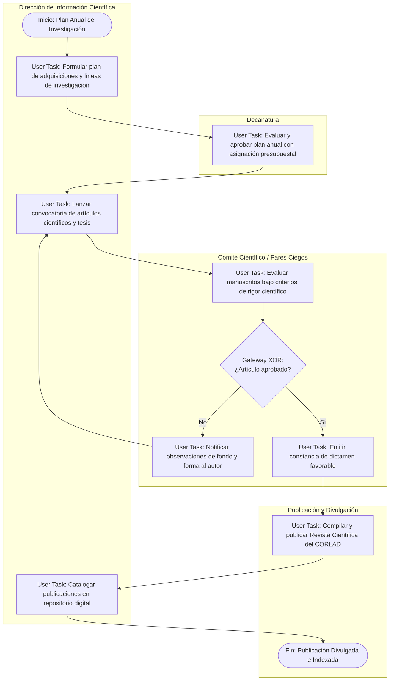

#### Especificación de Actividades y Reglas de Negocio
1. **Arbitraje por Pares Ciegos:** Cada artículo propuesto para la Revista Científica pasa por al menos dos dictaminadores externos anónimos.
2. **Líneas de Investigación Priorizadas:** Gestión pública y descentralización, dirección de PYMES regionales, transformación digital de operaciones.
* **Entradas:** Plan anual, manuscritos de investigación, tesis de pre y posgrado.
* **Salidas:** Revista Científica CORLAD Junín (edición semestral), Repositorio institucional indexado.
* **Indicadores (KPIs):**
  - Adquisición científica: $\ge 70\%$.
  - Acopio bibliográfico e indexaciones: $\ge 50\%$.

---

### PM-05: Proceso de Imagen Institucional y Comunicación

* **Código:** `PM-05`
* **Objetivo:** Proyectar la reputación gremial, gestionar redes sociales, emitir comunicados de prensa y defender la marca CORLAD.
* **Alcance:** Inicia con las directrices de la Decanatura y culmina con la difusión multicanal y análisis de métricas de impacto.
* **Módulo de Software:** *Módulo de Comunicaciones, Portal Institucional y Redes Sociales*.

#### Diagrama de Flujo BPMN (Mermaid)
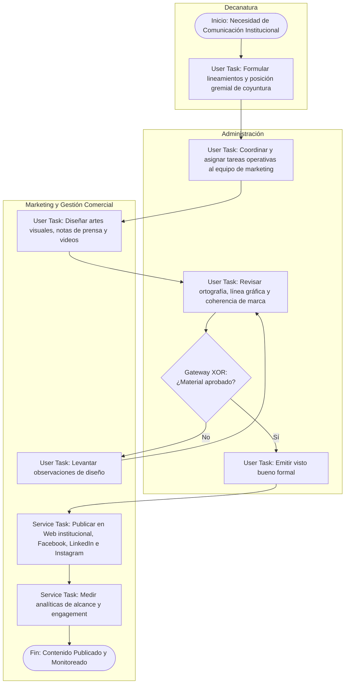

#### Especificación de Actividades y Reglas de Negocio
1. **Manual de Identidad Visual (MIV):** Todo arte debe respetar la paleta de colores institucional, el escudo oficial y tipografías autorizadas.
2. **Pronunciamientos Oficiales:** Comunicados de coyuntura política o económica deben llevar firma digital del Decano antes de publicarse.
* **Entradas:** Directivas de Decanatura, notas de eventos, efemérides.
* **Salidas:** Campañas digitales en redes, notas de prensa en medios regionales, portal web actualizado.
* **Indicador (KPI):**
  $$\text{Nivel de Aprobación de Imagen Institucional} \ge 50\%$$

---

### PM-06: Proceso de Economía y Finanzas Institucionales

* **Código:** `PM-06`
* **Objetivo:** Programar los presupuestos, controlar los flujos de ingresos/egresos y formular balances económicos transparentes y auditables.
* **Alcance:** Inicia con los requerimientos contables y financieros del ejercicio y culmina con la aprobación del Balance General en Asamblea General.
* **Módulo de Software:** *Módulo de Tesorería, Conciliaciones Bancarias y Balances Financieros*.

#### Diagrama de Flujo BPMN (Mermaid)
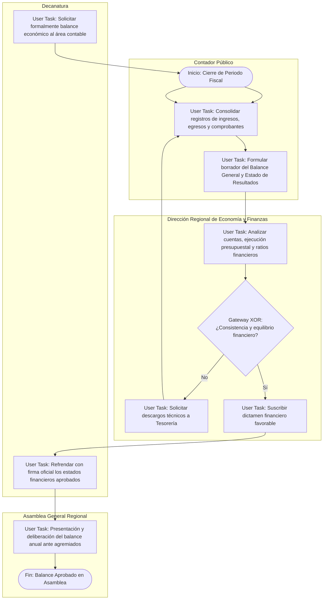

#### Especificación de Actividades y Reglas de Negocio
1. **Equilibrio Presupuestal:** Los gastos institucionales consolidados no deben superar el $80\%$ de los ingresos recaudados en el ejercicio fiscal.
2. **Depósitos Bancarios (< 48 hrs):** Todo ingreso percibido por caja en efectivo debe depositarse obligatoriamente en las cuentas bancarias institucionales dentro de las 48 horas.
* **Entradas:** Reportes de caja, extractos bancarios, facturas de compras, comprobantes de pago emitidos.
* **Salidas:** Balance General, Estado de Ganancias y Pérdidas, Memoria Económica Anual Aprobada.
* **Indicadores (KPIs):**
  - Eficiencia de gasto: $\ge 10\%$.
  - Equilibrio presupuestal: $\frac{\text{Gastos}}{\text{Ingresos}} \times 100 \le 80\%$.

---

### PM-07: Proceso de Secretaría, Actas y Fe Pública

* **Código:** `PM-07`
* **Objetivo:** Conducir el sistema de trámite documentario (Mesa de Partes), sentar actas oficiales y custodiar el archivo central del colegio.
* **Alcance:** Inicia con la recepción de documentación física o virtual y culmina con la notificación al administrado y archivo definitivo del legajo.
* **Módulo de Software:** *Módulo de Mesa de Partes Virtual, Trámite Documentario (SGD) y Libro de Actas Digital*.

#### Diagrama de Flujo BPMN (Mermaid)
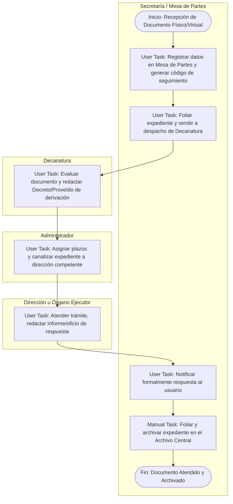

#### Especificación de Actividades y Reglas de Negocio
1. **Trazabilidad de Trámite:** El sistema asigna un código único de expediente (`EXP-2026-XXXX`) con el que el usuario puede consultar el estado del trámite en línea.
2. **Plazos de Atención (TUO Ley 27444):** Trámites generales tienen un plazo perentorio máximo de 30 días hábiles para respuesta bajo apercibimiento de silencio administrativo positivo o negativo según TUPA.
* **Entradas:** Solicitudes, cartas, oficios de entidades externas, recursos impugnatorios.
* **Salidas:** Cargo de recepción, Proveído de derivación, Oficio de respuesta notificado, Legajo archivado.
* **Indicadores (KPIs):**
  - Eficiencia en tramitación: $> 3\text{ puntos (Escala Likert)}$.
  - Satisfacción del usuario en Mesa de Partes: $> 3\text{ puntos}$.

---

## 5. Especificación Detallada de los Procesos de Apoyo (PA)

### PA-01: Proceso de Asesoría Legal

* **Código:** `PA-01`
* **Objetivo:** Cautelar la legalidad de los actos del CORLAD, emitir dictámenes jurídicos y defender a la orden contra el intrusismo profesional (Ley 31060).
* **Alcance:** Inicia con la derivación de consultas o expedientes y culmina con la expedición del informe jurídico visado y formalización del acto resolutivo.
* **Módulo de Software:** *Módulo de Gestión Jurídica y Defensa Profesional*.

#### Diagrama de Flujo BPMN (Mermaid)
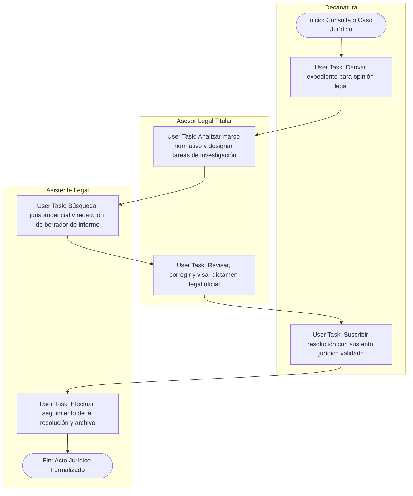

#### Especificación de Actividades y Reglas de Negocio
1. **Defensa Obligatoria Ley 31060:** Ante convocatorias del sector público que omitan el requisito de colegiatura para plazas administrativas, Asesoría Legal despacha exhortación formal y denuncia ante SERVIR o Fiscalía.
* **Entradas:** Expedientes contenciosos, proyectos de convenios, denuncias por ejercicio ilegal.
* **Salidas:** Informe Legal suscrito, Proyecto de Resolución visado.
* **Indicador (KPI):**
  $$\text{Porcentaje de Casos Favorablemente Resueltos} \ge 80\%$$

---

### PA-02: Proceso de Gestión Contable y Tributaria

* **Código:** `PA-02`
* **Objetivo:** Liquidar tributos, mantener los libros electrónicos contables y dar soporte en las declaraciones juradas a la SUNAT.
* **Alcance:** Inicia con la recepción de comprobantes diarios y culmina con el envío de libros y pago mensual de tributos fiscales.
* **Módulo de Software:** *Módulo de Contabilidad Computarizada e Interfaz SUNAT (PLE/SIRE)*.

#### Diagrama de Flujo BPMN (Mermaid)
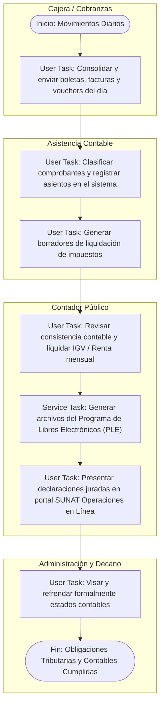

#### Especificación de Actividades y Reglas de Negocio
1. **Validación de Comprobantes:** Los comprobantes de egreso deben contar obligatoriamente con RUC activo y habido, y factura electrónica verificada en SUNAT.
* **Entradas:** Comprobantes de pago de compras y ventas, extractos bancarios.
* **Salidas:** Libros Contables Electrónicos generados, Declaraciones SUNAT presentadas (PDT 621, PLAME).
* **Indicador (KPI):**
  $$\text{Declaraciones Oportunas sin Multas SUNAT} = 100\%$$

---

### PA-03: Proceso de Gestión Logística y Abastecimiento

* **Código:** `PA-03`
* **Objetivo:** Abastecer de forma oportuna y económica a todas las áreas institucionales de bienes muebles, útiles de oficina y servicios auxiliares.
* **Alcance:** Inicia con el pedido de bienes por los colaboradores y culmina con la entrega física en almacén mediante pecosa de salida.
* **Módulo de Software:** *Módulo de Adquisiciones, Compras y Control de Inventarios (Kardex)*.

#### Diagrama de Flujo BPMN (Mermaid)
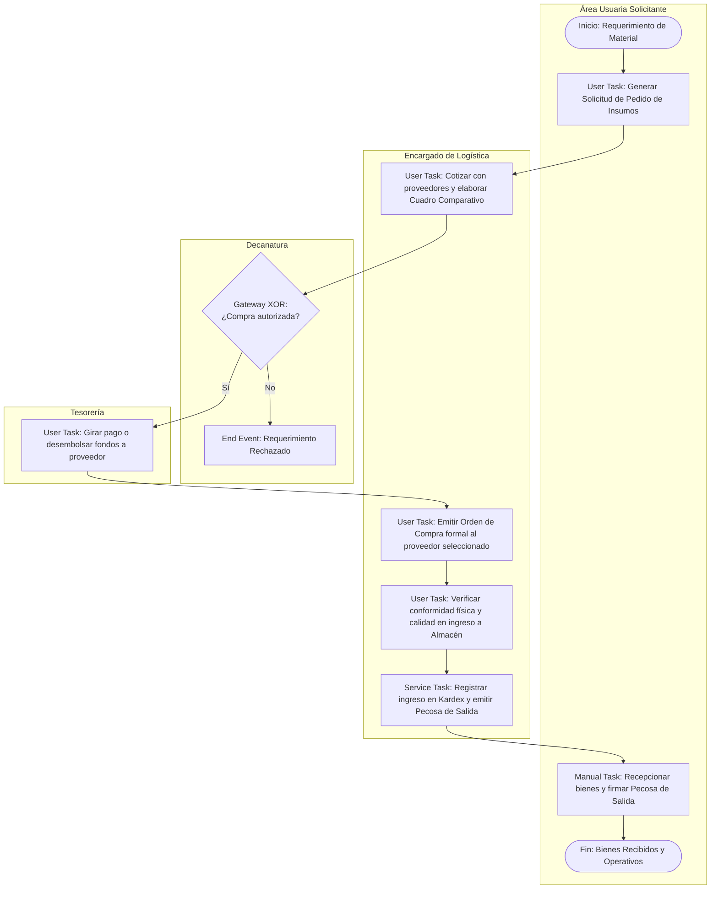

#### Especificación de Actividades y Reglas de Negocio
1. **Control de Adquisiciones:** Para compras que superen $1\text{ UIT}$, se exige obligatoriamente cuadro comparativo de tres cotizaciones y aprobación del Consejo Directivo.
2. **Kardex Automatizado:** Cada entrega resta existencias en el inventario digital en tiempo real.
* **Entradas:** Pedido de insumos del personal, cotizaciones de proveedores.
* **Salidas:** Orden de Compra, Guía de Remisión/Factura, Pecosa de salida de almacén firmada.
* **Indicador (KPI):**
  $$\text{Eficacia del Abastecimiento Institucional} > 3\text{ puntos (Escala Likert)}$$

---

### PA-04: Proceso de Tecnologías de la Información y Comunicación (TIC)

* **Código:** `PA-04`
* **Objetivo:** Proveer soporte técnico continuo, mantener servidores, custodiar la Big Data regional y garantizar la seguridad perimetral de los sistemas.
* **Alcance:** Inicia con el ticket de soporte o requerimiento informático y finaliza con la puesta en producción y cierre del ticket en bitácora.
* **Módulo de Software:** *Módulo HelpDesk (Mesa de Ayuda TIC), Servidores y Backups Automáticos*.

#### Diagrama de Flujo BPMN (Mermaid)
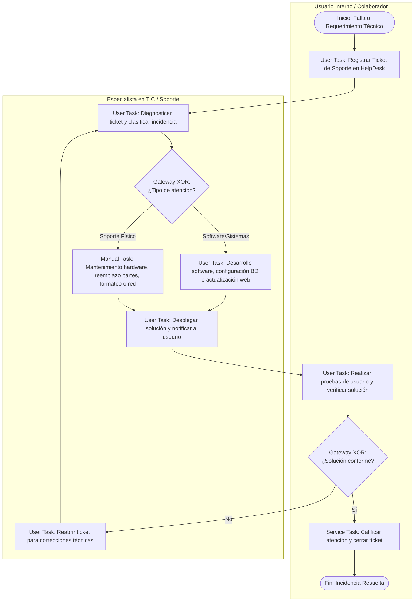

#### Especificación de Actividades y Reglas de Negocio
1. **Política de Respaldo (Backup):** El software ejecuta volcados de base de datos diariamente a las 23:00 hrs con almacenamiento cifrado tanto local como en nube externa.
2. **Nivel de Servicio (SLA):** Caídas de servidor o red tienen un tiempo máximo de respuesta técnica de 2 horas.
* **Entradas:** Ticket de incidencia, requerimientos de plataformas, alertas de seguridad.
* **Salidas:** Ticket resuelto, Bitácora de soporte actualizada, Respaldos cifrados.
* **Indicador (KPI):**
  $$\text{Disponibilidad de Servidores y Sistemas} \ge 95\%$$

---

### PA-05: Proceso de Deontología y Tribunal de Honor

* **Código:** `PA-05`
* **Objetivo:** Tutelar el ejercicio ético de la profesión, atender denuncias contra miembros de la orden, sustanciar audiencias e imponer sanciones disciplinarias.
* **Alcance:** Inicia con la interposición de la denuncia y culmina con la ejecutoria de la sanción o elevación en apelación al Consejo Directivo Nacional (CDN Lima).
* **Módulo de Software:** *Módulo de Procesos Disciplinarios y Registro de Sanciones*.

#### Diagrama de Flujo BPMN (Mermaid)
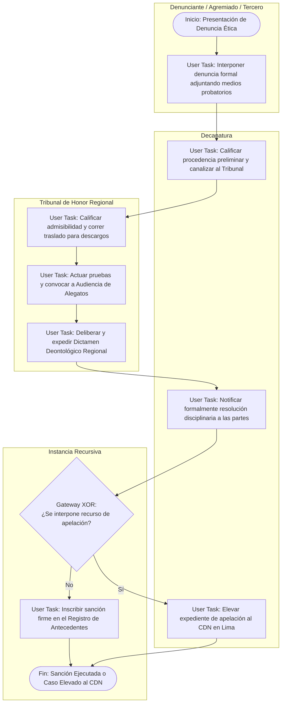

#### Especificación de Actividades y Reglas de Negocio
1. **Debido Proceso y Plazos:** El denunciado cuenta con 10 días hábiles para presentar sus descargos por escrito ante el Tribunal de Honor tras su notificación.
2. **Tipología de Sanciones:**
   * Amonestación escrita privada o pública.
   * Suspensión temporal de la colegiatura y habilidad (1 a 36 meses).
   * Expulsión definitiva de la orden profesional (inhabilitación permanente).
3. **Efecto de Sanción en Big Data:** Al registrar una suspensión o expulsión firme, el sistema bloquea inmediatamente en la Big Data la condición de habilidad del profesional y emite una alerta a los portales públicos.
* **Entradas:** Escrito de denuncia ética, pruebas instrumentales, descargos.
* **Salidas:** Dictamen Deontológico, Resolución de Sanción, Asiento en Registro de Antecedentes Disciplinarios.
* **Indicador (KPI):**
  $$\text{Resolución Oportuna de Procesos Disciplinarios} \ge 80\%$$

---

## 6. Matriz de Trazabilidad: Proceso BPMN vs. Requerimientos Funcionales de Software

Para el diseño del sistema de software que implementará estos procesos, se define la siguiente matriz de requisitos:

| Código Proceso | Nombre del Proceso | Código RF | Requerimiento Funcional del Software (Casos de Uso) | Rol de Usuario |
| :---: | :--- | :---: | :--- | :--- |
| **PE-01** | Gestión Estratégica | `RF-01` | Módulo de registro de metas anuales y cálculo automático de cumplimiento de KPIs del PEI. | Decano / Administrador |
| **PE-02** | Gestión de Calidad | `RF-02` | Libro de Reclamaciones virtual integrado con alertas de plazo (15 días) y encuestas post-trámite. | Público / Administrador |
| **PE-03** | Gestión de Personal | `RF-03` | Interfaz de sincronización con reloj biométrico, generación de tareos y cálculo de planillas. | Administrador / Tesorería |
| **PE-04** | Articulación y Convenios | `RF-04` | Repositorio de convenios con alertas de vencimiento (60 días) y control de compromisos. | Responsable de Convenios |
| **PM-01** | Colegiatura y Habilitación | `RF-05` | Formulario web de pre-inscripción y carga de título profesional verificado con API SUNEDU. | Postulante / Mesa de Partes |
| **PM-01** | Colegiatura y Habilitación | `RF-06` | Emisión automatizada de Constancias de Habilidad con Firma Digital y código QR de validación. | Colegiado / Sistema |
| **PM-01** | Colegiatura y Habilitación | `RF-07` | Motor de reglas de habilidad: Bloqueo automático de habilidad para colegiados con morosidad $\ge 3$ meses. | Sistema (Big Data) |
| **PM-02** | Eventos Académicos | `RF-08` | Pasarela de pagos en línea (tarjetas/transferencias) y matriculación automática en Aula Virtual. | Participante / Tesorería |
| **PM-02** | Eventos Académicos | `RF-09` | Generador de certificados digitales con hash único criptográfico y registro de horas y créditos. | Director Académico |
| **PM-03** | Bienestar Social | `RF-10` | Sistema de solicitudes de auxilio mutuo con validación cruzada de estado de cuenta y tiempo de aporte. | Agremiado / Bienestar |
| **PM-04** | Información Científica | `RF-11` | Repositorio digital de tesis y artículos con motor de búsqueda y visor de documentos PDF. | Investigadores / Público |
| **PM-05** | Imagen Institucional | `RF-12` | Gestor de contenidos (CMS) para publicación de comunicados y noticias en el portal oficial. | Marketing |
| **PM-06** | Economía y Finanzas | `RF-13` | Módulo de caja diaria con conciliación bancaria y emisión de reportes automáticos de ingresos/egresos. | Tesorería / Contador |
| **PM-07** | Secretaría y Actas | `RF-14` | Sistema de Gestión Documental (SGD) con asignación de código de seguimiento y consulta pública de expediente. | Secretaria / Administrado |
| **PA-01** | Asesoría Legal | `RF-15` | Bandeja de dictámenes legales con registro de antecedentes de intrusismo profesional (Ley 31060). | Asesor Legal |
| **PA-02** | Gestión Contable | `RF-16` | Exportación de estructuras de libros electrónicos oficiales para validación PLE / SIRE ante SUNAT. | Contador |
| **PA-03** | Gestión Logística | `RF-17` | Control de stock de almacén con alertas de stock mínimo y generación digital de órdenes y pecosas. | Logística |
| **PA-04** | Tecnologías TIC | `RF-18` | Mesa de ayuda (HelpDesk) interna para tickets de soporte a equipos y copias de seguridad automáticas. | Especialista TIC / Usuarios |
| **PA-05** | Tribunal de Honor | `RF-19` | Módulo confidencial de expedientes disciplinarios y registro de inhabilitaciones que bloquea la Big Data. | Tribunal de Honor |

---

## 7. Modelo Conceptual de Datos del Sistema

El diagrama entidad-relación base para soportar la ejecución del software en base de datos relacional (Microsoft SQL Server 2022 / Azure SQL Database):

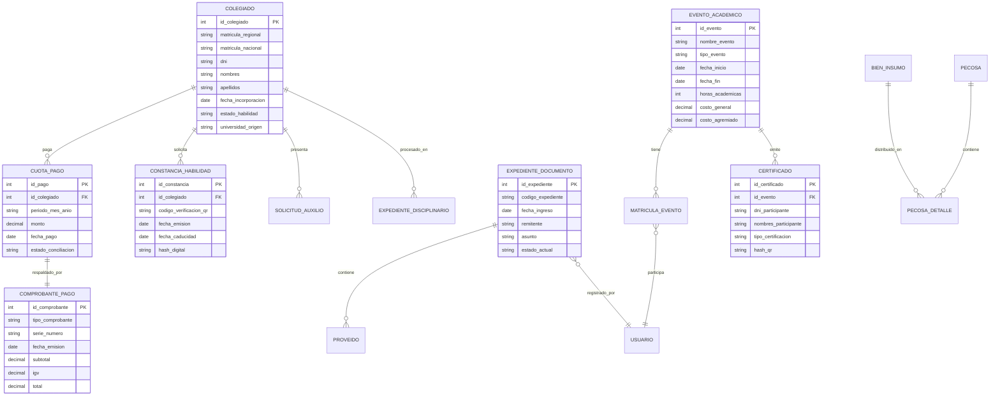

---

## 8. Pautas Metodológicas para el Modelado en Bizagi Process Modeler

Al proceder con la diagramación formal en Bizagi Process Modeler, considere las siguientes recomendaciones:

1. **Estructuración del Archivo `.bpm`:**
   * Genere un único proyecto denominado `CORLAD_Junin_Modelo_Procesos.bpm`.
   * Configure en la carátula principal del modelo el **Diagrama de Nivel 0** conteniendo los tres contenedores de Macroprocesos.
   * Utilice **Subprocesos Reusables** (*Reusable Sub-Process*) para vincular cada uno de los 16 procesos institucionales en diagramas independientes.
2. **Buenas Prácticas BPMN en Bizagi:**
   * **Nombres de Tareas:** Aplique rigurosamente la regla gramatical: **[Verbo en Infinitivo] + [Sustantivo Objeto]** (Ejemplo: *Validar requisitos de colegiatura*, no *Revisión*).
   * **Tipo de Tareas:**
     * Use `User Task` (icono de persona) para las actividades asistidas por computadora donde un usuario interactúa con el sistema.
     * Use `Service Task` (icono de engranajes) para tareas automatizadas del software (generación de QR, envío de correos, bloqueo de morosos).
     * Use `Manual Task` (icono de mano) para acciones físicas no automatizables (entrega protocolar de medalla, archivo de cajas físicas).
   * **Compuertas Exclusivas (Gateways XOR):** Rotule siempre el rombo con una pregunta cerrada (Ej. *¿Expediente Conforme?*) y las transiciones salientes con las condiciones exactas (*Sí*, *No*).
3. **Parametrización de la Documentación en Bizagi:**
   * En la pestaña **Propiedades > General** de cada tarea, copie la descripción detallada y reglas de negocio descritas en este documento.
   * En la sección **Artefactos**, vincule los Objetos de Datos (*Data Objects*) correspondientes para facilitar la futura generación de la documentación oficial del manual de procedimientos (MAPRO).
