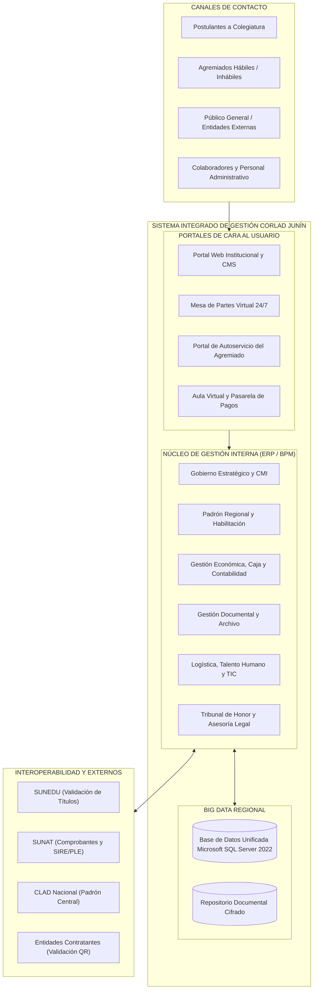
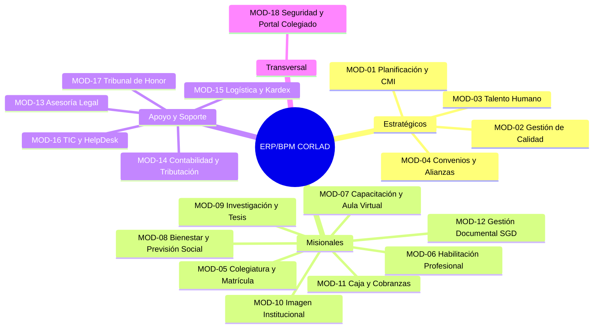
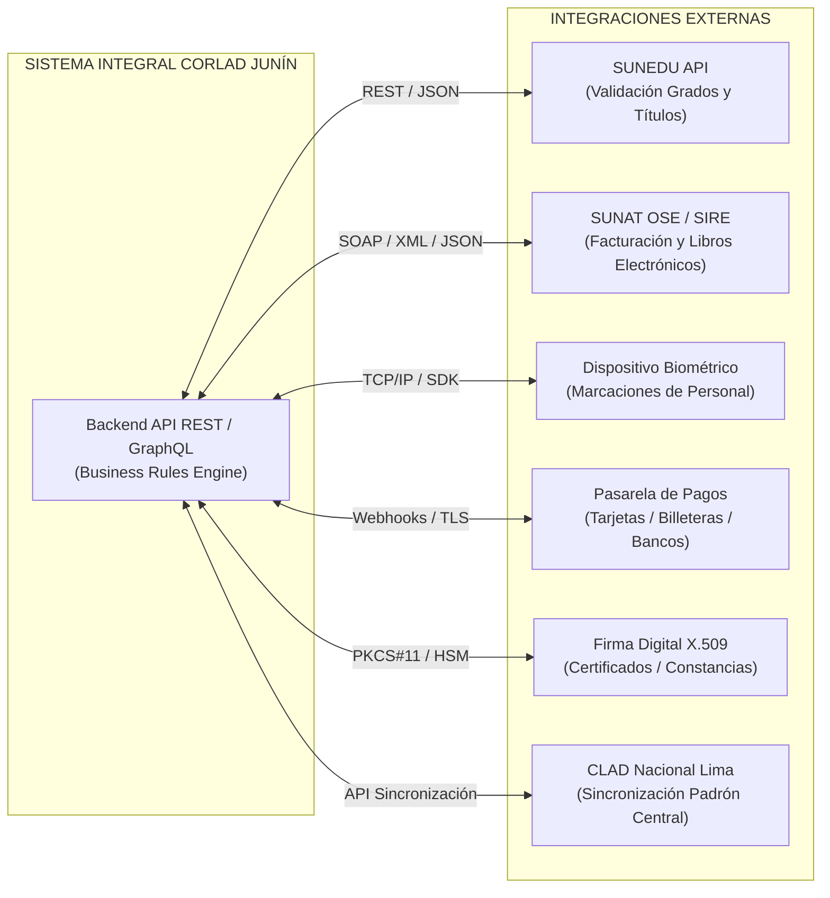

# ESPECIFICACIÓN INTEGRAL DE REQUERIMIENTOS FUNCIONALES (ERS)
## Plataforma de Transformación Digital y Sistema Integrado de Gestión Institucional (ERP / BPM)
### Colegio Regional de Licenciados en Administración – CORLAD Junín

---

> **Documento Base para Tesis de Ingeniería de Sistemas y Desarrollo de Software**  
> **Entidad:** Colegio Regional de Licenciados en Administración – Sede Regional Junín  
> **Marco Normativo:** Ley N° 31060 (Ley del Ejercicio Profesional del Licenciado en Administración), D.L. N° 22087, D.S. N° 020-2006-ED, Estatuto Nacional del CLAD y Plan Estratégico Institucional (PEI 2021–2025).  
> **Fuentes Integradas:**
> 1. `corlad procesos institucionales.pdf` / `.md` (Caracterización SIPOC y flujogramas de los 16 procesos).
> 2. `distribucion de funciones.pdf` / `.md` (Manual operativo y de asignación funcional de puestos).
> 3. `PLAN ESTRATEGICO INSTITUCIONAL 2021-2025.pdf` / `.md` (Ejes, Objetivos, Matrices 1 a 7 y Cuadro de Mando Integral / CMI).
> 4. `ANALISIS_PROCESOS_CORLAD_BIZAGI_SOFTWARE.md` (Especificación BPMN 2.0 y Modelo Conceptual).

---

## ÍNDICE GENERAL

1. [Alcance y Visión General del Sistema](#1-alcance-y-visión-general-del-sistema)
2. [Matriz de Roles y Perfiles de Usuario (RBAC)](#2-matriz-de-roles-y-perfiles-de-usuario-rbac)
3. [Estructura Modular del Sistema Integral (18 Módulos)](#3-estructura-modular-del-sistema-integral-18-módulos)
4. [Especificación Detallada de Requerimientos Funcionales](#4-especificación-detallada-de-requerimientos-funcionales)
   - [Módulo 01: Planificación Estratégica y Cuadro de Mando Integral (PE-01)](#módulo-01-planificación-estratégica-y-cuadro-de-mando-integral-pe-01)
   - [Módulo 02: Gestión de la Calidad y Libro de Reclamaciones (PE-02)](#módulo-02-gestión-de-la-calidad-y-libro-de-reclamaciones-pe-02)
   - [Módulo 03: Gestión del Talento Humano, Asistencia y Planillas (PE-03)](#módulo-03-gestión-del-talento-humano-asistencia-y-planillas-pe-03)
   - [Módulo 04: Articulación, Convenios y Relaciones Institucionales (PE-04)](#módulo-04-articulación-convenios-y-relaciones-institucionales-pe-04)
   - [Módulo 05: Colegiatura, Matrícula y Padrón Regional (PM-01 - Core)](#módulo-05-colegiatura-matrícula-y-padrón-regional-pm-01---core)
   - [Módulo 06: Habilitación Profesional y Motor de Reglas Financieras (PM-01 / PM-06)](#módulo-06-habilitación-profesional-y-motor-de-reglas-financieras-pm-01--pm-06)
   - [Módulo 07: Gestión Académica, Capacitación Continua y Aula Virtual (PM-02)](#módulo-07-gestión-académica-capacitación-continua-y-aula-virtual-pm-02)
   - [Módulo 08: Seguridad y Bienestar Social – Fondo de Previsión (PM-03)](#módulo-08-seguridad-y-bienestar-social--fondo-de-previsión-pm-03)
   - [Módulo 09: Información Científica, Asesoría de Tesis y Repositorio (PM-04)](#módulo-09-información-científica-asesoría-de-tesis-y-repositorio-pm-04)
   - [Módulo 10: Imagen Institucional, Portal Web y Comunicaciones (PM-05)](#módulo-10-imagen-institucional-portal-web-y-comunicaciones-pm-05)
   - [Módulo 11: Caja, Cobranzas y Recaudación Diaria (PM-06)](#módulo-11-caja-cobranzas-y-recaudación-diaria-pm-06)
   - [Módulo 12: Trámite Documentario, Mesa de Partes y Archivo Central (PM-07)](#módulo-12-trámite-documentario-mesa-de-partes-y-archivo-central-pm-07)
   - [Módulo 13: Asesoría Legal y Defensa contra el Intrusismo Profesional (PA-01)](#módulo-13-asesoría-legal-y-defensa-contra-el-intrusismo-profesional-pa-01)
   - [Módulo 14: Gestión Contable, Libros Electrónicos y Tributación (PA-02)](#módulo-14-gestión-contable-libros-electrónicos-y-tributación-pa-02)
   - [Módulo 15: Logística, Abastecimiento y Control de Inventarios / Kardex (PA-03)](#módulo-15-logística-abastecimiento-y-control-de-inventarios--kardex-pa-03)
   - [Módulo 16: Tecnologías TIC, HelpDesk y Respaldo de Datos (PA-04)](#módulo-16-tecnologías-tic-helpdesk-y-respaldo-de-datos-pa-04)
   - [Módulo 17: Deontología, Tribunal de Honor y Registro Disciplinario (PA-05)](#módulo-17-deontología-tribunal-de-honor-y-registro-disciplinario-pa-05)
   - [Módulo 18: Seguridad Transversal, Auditoría y Portal del Colegiado](#módulo-18-seguridad-transversal-auditoría-y-portal-del-colegiado)
5. [Matriz de Trazabilidad: Requerimientos Funcionales vs. Procesos vs. Ejes PEI 2021–2025](#5-matriz-de-trazabilidad-requerimientos-funcionales-vs-procesos-vs-ejes-pei-20212025)
6. [Interoperabilidad y Arquitectura de Integración Externa](#6-interoperabilidad-y-arquitectura-de-integración-externa)

---

## 1. Alcance y Visión General del Sistema

El **Sistema Integrado de Gestión Institucional del CORLAD Junín** es una solución informática de clase empresarial concebida para automatizar el 100% de las operaciones institucionales del Colegio Regional de Licenciados en Administración de Junín. 

El sistema reemplaza los registros fragmentados en hojas de cálculo, cuadernos físicos y trámites manuales, implementando una **Gestión por Procesos (BPM)** articulada con los lineamientos del **Plan Estratégico Institucional (PEI 2021–2025)** y el marco normativo vinculante de la **Ley N° 31060**.

---

## 2. Matriz de Roles y Perfiles de Usuario (RBAC)

De acuerdo con el documento de *Distribución de Funciones (2018)*, el *Reglamento Interno* y el *Organigrama Estructural del PEI*, se establecen los siguientes roles en el sistema:

| Código Rol | Nombre del Perfil / Rol | Alcance Operativo en el Sistema |
| :---: | :--- | :--- |
| `ROL-DEC` | **Decano Regional** | Aprobación de resoluciones, visado de convenios, firma digital de diplomas, tablero de mando general. |
| `ROL-CDIR` | **Consejo Directivo Regional** | Deliberación colegiada, aprobación de presupuestos, convenios, acuerdos y auxilios mutuos. |
| `ROL-GER` | **Gerente / Administrador Regional** | Control operativo, autorización de compras, supervisión de personal, asignación de trámites. |
| `ROL-SEC` | **Secretaria / Mesa de Partes** | Recepción documental, armado de legajos de colegiatura, emisión de habilidad física/virtual, actas. |
| `ROL-TES` | **Tesorería y Cobranzas** | Cobro por caja, emisión de facturas/boletas, conciliación bancaria, registro de morosidad, liquidaciones. |
| `ROL-DAC` | **Director de Asuntos Académicos** | Creación de eventos, syllabus, asignación de ponentes, actas de notas y aprobación de certificados. |
| `ROL-DBS` | **Director de Bienestar Social** | Evaluación de subsidios por auxilio mutuo, control del fondo de previsión, eventos sociales y salud. |
| `ROL-DIC` | **Director de Información Científica**| Gestión de asesorías de tesis, líneas de investigación, revisión por pares y revista científica. |
| `ROL-MKT` | **Marketing y Comercial** | Gestión de redes, publicación en portal web, formularios de captura, campañas de colegiatura. |
| `ROL-LEG` | **Asesor Legal** | Emisión de dictámenes legales, visación de contratos, fiscalización laboral (Ley 31060). |
| `ROL-CON` | **Contador General** | Asientos contables automáticos, exportación de libros electrónicos (PLE/SIRE), balances tributarios. |
| `ROL-LOG` | **Encargado de Logística y Almacén** | Cuadros comparativos, órdenes de compra, control de inventario (Kardex) y pecosas de salida. |
| `ROL-TIC` | **Especialista TIC / Administrador TI**| Configuración de roles, soporte helpdesk, políticas de backups, monitoreo de servidores. |
| `ROL-HON` | **Tribunal de Honor** | Instrucción disciplinaria ética, notificaciones probatorias, dictámenes y sanciones reservadas. |
| `ROL-AGR` | **Colegiado / Agremiado** | Acceso a su estado de cuenta, descarga de habilidad digital con QR, aula virtual, solicitud de auxilio. |
| `ROL-POS` | **Postulante a Colegiatura** | Llenado de ficha de inscripción, carga de requisitos digitales, seguimiento del trámite de matrícula. |

---

## 3. Estructura Modular del Sistema Integral (18 Módulos)

---

## 4. Especificación Detallada de Requerimientos Funcionales

---

### Módulo 01: Planificación Estratégica y Cuadro de Mando Integral (PE-01)

#### `RF-EST-01`: Formulación y Registro del Plan Operativo Anual (POA) y Presupuesto
* **Proceso BPMN:** `PE-01: Proceso de Gestión Estratégica` (Fase Planificar / Hacer).
* **Actores:** Asistente Administrativo, Gerente Regional, Decano Regional, Consejo Directivo.
* **Descripción:** El sistema debe permitir a cada área y dirección registrar sus metas operativas, actividades programadas y requerimientos presupuestales para el año fiscal siguiente, consolidando automáticamente el Plan de Trabajo Anual (POA) y el anteproyecto de Presupuesto Institucional.
* **Entradas:** Diagnósticos situacionales por área, metas físicas, partidas de gasto proyectadas.
* **Procesamiento:**
  1. El sistema abre la ventana de programación presupuestal anual.
  2. Valida que los montos proyectados no excedan el techo financiero histórico de ingresos ($80\%$ de ratio de gasto).
  3. Consolida la matriz y permite al Gerente Regional formular observaciones y ajustes.
  4. Genera el proyecto formal de POA en formato PDF para deliberación del Consejo Directivo.
* **Salidas:** Matriz POA consolidada y aprobada mediante Resolución Decanal registrada en base de datos.
* **Regla de Negocio:** Ningún área puede ejecutar gastos en el periodo si la actividad no cuenta con partida asignada en el POA aprobado.
* **Criterios de Aceptación:** El sistema debe impedir el envío de presupuestos con campos vacíos y debe notificar por correo institucional a los directivos la aprobación formal del POA.
* **Prioridad:** Media | **Trazabilidad:** PEI Matriz 4, OG3.

#### `RF-EST-02`: Tablero de Control y Cuadro de Mando Integral (Balanced Scorecard / CMI)
* **Proceso BPMN:** `PE-01: Proceso de Gestión Estratégica` (Fase Verificar).
* **Actores:** Decano Regional, Gerente Regional, Responsable de Planificación.
* **Descripción:** El sistema debe calcular y mostrar en tiempo real el Cuadro de Mando Integral del CORLAD Junín (PEI 2021–2025), estructurado en sus 4 Ejes Estratégicos (Desarrollo Profesional, Fortalecimiento Institucional, Posicionamiento Institucional y Responsabilidad Social) con semaforización automatizada.
* **Entradas:** Datos transaccionales del ERP (colegiaturas efectuadas, eventos realizados, convenios suscritos, recaudación, atenciones de bienestar).
* **Procesamiento:**
  1. Ejecuta periódicamente las fórmulas oficiales del CMI:
     - *Efectividad de Colegiaturas:* $(\text{Nuevos Colegiados} / \text{Meta Anual}) \times 100$.
     - *Tasa de Habilitación:* $(\text{Colegiados Hábiles} / \text{Padrón Total}) \times 100$.
     - *Ejecución Presupuestal:* $(\text{Gasto Real} / \text{Presupuesto Aprobado}) \times 100$.
  2. Aplica la semaforización oficial del PEI:
     - 🟢 **Verde:** Cumplimiento $\ge 85\%$.
     - 🟡 **Amarillo:** Cumplimiento entre $70\%$ y $84\%$.
     - 🔴 **Rojo:** Cumplimiento $< 70\%$.
* **Salidas:** Dashboard interactivo con gráficos de velocímetro, series temporales 2021–2025 y opción de exportación a PDF/Excel.
* **Criterios de Aceptación:** Los indicadores deben actualizarse de forma automática al registrarse transacciones en los módulos operativos, sin requerir carga manual externa.
* **Prioridad:** Alta | **Trazabilidad:** PEI Cuadro de Mando Integral Matrices 1 a 5.

---

### Módulo 02: Gestión de la Calidad y Libro de Reclamaciones (PE-02)

#### `RF-CAL-01`: Libro de Reclamaciones Virtual con Código de Seguimiento y Alerta Legal
* **Proceso BPMN:** `PE-02: Proceso de Gestión de la Calidad`.
* **Actores:** Ciudadano / Agremiado, Gerente Regional, Asistente Administrativo.
* **Descripción:** El sistema debe disponer de una interfaz pública accesible desde el portal web conforme al Reglamento del Libro de Reclamaciones del Estado, permitiendo registrar quejas o reclamos, generando una hoja de reclamación digital con código correlativo único (`LR-YYYY-XXXXX`) y remitiendo copia en PDF al correo del usuario.
* **Entradas:** DNI/RUC, nombres, domicilio, teléfono, correo electrónico, tipo de afectación (queja o reclamo), detalle del hecho y pretensión.
* **Procesamiento:**
  1. Almacena la reclamación con sello de tiempo criptográfico inmutable.
  2. Notifica inmediatamente a Gerencia y Mesa de Partes.
  3. Inicia un contador de tiempo perentorio de 15 días hábiles para respuesta obligatoria según normativa.
  4. Envía alertas de advertencia al Gerente a los 5 y 2 días previos al vencimiento.
* **Salidas:** Hoja de Reclamación Oficial en PDF descargable y registro en la bandeja de gestión de reclamos.
* **Regla de Negocio:** El sistema no permitirá eliminar ni alterar reclamaciones registradas bajo ninguna circunstancia.
* **Criterios de Aceptación:** Si el reclamo no es respondido formalmente en el plazo legal, el sistema debe catalogarlo como "VENCIDO" y emitir una alerta roja en el tablero directivo.
* **Prioridad:** Alta | **Trazabilidad:** PEI Matriz 4, Ley 27444 y D.S. Libro de Reclamaciones.

#### `RF-CAL-02`: Gestión de Encuestas Automatizadas de Satisfacción Post-Trámite y Post-Evento
* **Proceso BPMN:** `PE-02: Proceso de Gestión de la Calidad` (Fase Verificar / Actuar).
* **Actores:** Agremiado, Participante de Eventos, Encargado de Calidad.
* **Descripción:** El sistema debe disparar encuestas de satisfacción digital estructuradas en escala Likert (1 a 5) al concluir un trámite en Mesa de Partes, tramitar la habilidad o culminar un diplomado/conferencia, procesando automáticamente el indicador:
$$\text{Nivel de Satisfacción} \ge 80\%$$
* **Salidas:** Reporte analítico mensual de satisfacción del usuario con desglose por área evaluada.
* **Prioridad:** Media | **Trazabilidad:** PEI Anexos 2 y 3.

---

### Módulo 03: Gestión del Talento Humano, Asistencia y Planillas (PE-03)

#### `RF-RRHH-01`: Convocatoria, Recepción de CVs y Evaluación Curricular Digital
* **Proceso BPMN:** `PE-03: Proceso de Gestión de Personal`.
* **Actores:** Gerente Regional, Postulantes Externos, Asesor Legal.
* **Descripción:** El sistema debe permitir publicar bases de convocatorias laborales y de prácticas en el portal web, recibir expedientes curriculares digitales en formato PDF, calificar factores de formación y experiencia, y publicar cuadros de méritos oficiales.
* **Entradas:** Datos de la vacante, perfil de puesto, CV digitalizado del postulante.
* **Salidas:** Cuadro de méritos, acta de selección y expediente de personal admitido.
* **Regla de Negocio:** Solo se activará una convocatoria si cuenta con certificación presupuestal previa aprobada por Decanatura.
* **Prioridad:** Media | **Trazabilidad:** PEI Matriz 5 (Talento Humano).

#### `RF-RRHH-02`: Integración con Reloj Biométrico y Generación Automática del Tareo Mensual
* **Proceso BPMN:** `PE-03: Proceso de Gestión de Personal` (Fase Verificar).
* **Actores:** Personal Administrativo, Secretaria, Gerente Regional, Tesorería.
* **Descripción:** El sistema debe sincronizarse periódicamente (o vía API/red local) con el dispositivo de control biométrico (huella dactilar/facial) de la sede institucional, procesando marcaciones de entrada, refrigerio y salida, calculando automáticamente tardanzas, faltas injustificadas y licencias.
* **Entradas:** Registros crudos de marcación biométrica con fecha, hora y código de colaborador.
* **Procesamiento:**
  1. Cruza las marcas con el horario contractual asignado a cada trabajador.
  2. Aplica la tolerancia oficial institucional (ej. 10 minutos de tolerancia matutina).
  3. Acumula minutos de tardanza y computa días laborados efectivos.
  4. Genera la sábana mensual de tareo consolidada.
* **Salidas:** Reporte de Tareo Mensual visado electrónicamente para pase a Tesorería.
* **Prioridad:** Alta | **Trazabilidad:** Distribución de Funciones (Secretaria / Gerente).

#### `RF-RRHH-03`: Cálculo de Planillas y Emisión de Boletas Electrónicas de Pago
* **Proceso BPMN:** `PE-03: Proceso de Gestión de Personal` (Fase Actuar).
* **Actores:** Tesorería, Gerente Regional, Colaborador.
* **Descripción:** A partir del tareo mensual validado, el sistema debe calcular la planilla de haberes y honorarios profesionales, deduciendo aportes previsionales (AFP/ONP), retenciones de quinta o cuarta categoría, y emitiendo boletas de pago electrónicas con firma digital.
* **Salidas:** Boletas de pago en PDF enviadas al correo personal y archivadas en el legajo digital del trabajador.
* **Prioridad:** Alta | **Trazabilidad:** Matriz 5 PEI y Legislación Laboral.

---

### Módulo 04: Articulación, Convenios y Relaciones Institucionales (PE-04)

#### `RF-CONV-01`: Registro y Ciclo de Vida de Convenios con Universidades y Entidades
* **Proceso BPMN:** `PE-04: Proceso de Gestión de Articulación y Convenios`.
* **Actores:** Gerente Regional, Decano Regional, Consejo Directivo, Asesor Legal.
* **Descripción:** El sistema debe registrar las propuestas de convenios marco y específicos con municipalidades, universidades y empresas, almacenar el documento digitalizado, registrar las obligaciones y beneficios para los agremiados, y llevar el control de vigencia.
* **Entradas:** Entidad aliada, representante, vigencia (fecha inicio y fin), cláusulas de beneficios y compromisos mutuos.
* **Salidas:** Ficha técnica de convenio, estado (En negociación, Aprobado por Consejo, Suscrito, Vencido).
* **Regla de Negocio:** Ningún convenio podrá marcarse como "Suscrito" sin vincular el número de Acuerdo de Consejo Directivo Regional que lo autoriza.
* **Prioridad:** Media | **Trazabilidad:** PEI Matriz 3 (OG2, OE2.1), CMI Matriz 2.

#### `RF-CONV-02`: Motor de Alertas Preventivas de Caducidad de Convenios
* **Proceso BPMN:** `PE-04: Proceso de Gestión de Articulación y Convenios`.
* **Actores:** Gerente Regional, Decano Regional.
* **Descripción:** El sistema debe emitir alertas automatizadas en el dashboard y notificaciones por correo electrónico a Gerencia y Decanatura con una anticipación de **60 días y 30 días** antes del vencimiento de cada convenio interinstitucional, facilitando la evaluación de su renovación.
* **Prioridad:** Baja | **Trazabilidad:** PEI Matriz 3.

---

### Módulo 05: Colegiatura, Matrícula y Padrón Regional (PM-01 - Core)

#### `RF-COL-01`: Formulario Web de Pre-inscripción y Carga Digital de Expedientes
* **Proceso BPMN:** `PM-01: Proceso de Colegiatura y Habilitación Profesional`.
* **Actores:** Postulante / Licenciado en Administración, Mesa de Partes.
* **Descripción:** El sistema debe proporcionar una plataforma pública de auto-registro donde el titulado universitario registre sus datos personales, laborales, universidad de egreso, y cargue en formato digital los requisitos obligatorios:
  - Documento Nacional de Identidad (DNI) legible.
  - Título Profesional escaneado por ambas caras.
  - Certificado de Antecedentes Penales vigente.
  - Fotografías tamaño pasaporte con fondo blanco.
  - Voucher o constancia de pago por derecho de colegiatura.
* **Salidas:** Expediente digital de postulación con código de trámite y credenciales temporales de consulta.
* **Prioridad:** Alta | **Trazabilidad:** PEI Matriz 1 (OE1.2), Ley 31060.

#### `RF-COL-02`: Interoperabilidad y Validación de Títulos con API SUNEDU
* **Proceso BPMN:** `PM-01: Proceso de Colegiatura y Habilitación Profesional` (Gateway 1).
* **Actores:** Secretaria Regional, Sistema Automático.
* **Descripción:** El sistema debe conectarse mediante un servicio web / API REST al Registro Nacional de Grados y Títulos de SUNEDU para verificar la autenticidad del título profesional a partir del número de DNI y código de registro oficial. Si no existe coincidencia, el sistema bloquea el pase y formula la observación respectiva.
* **Entradas:** Número de DNI del postulante.
* **Procesamiento:** Consulta síncrona a la base de datos de SUNEDU; rescata grado obtenido, universidad emisora, fecha de expedición y número de resolución.
* **Salidas:** Constancia de verificación SUNEDU adosada automáticamente al legajo digital del postulante.
* **Regla de Negocio:** La falta de validación positiva en SUNEDU impide continuar con la fase de remisión del padrón a la Sede Nacional de Lima.
* **Prioridad:** Alta | **Trazabilidad:** Ley 31060 y Anexo 6 (Proceso 05).

#### `RF-COL-03`: Padrón Regional de Colegiados y Emisión de Matrícula y Carnet Oficial
* **Proceso BPMN:** `PM-01: Proceso de Colegiatura y Habilitación Profesional`.
* **Actores:** Secretaria Regional, Decano Regional, CLAD Sede Nacional.
* **Descripción:** Una vez ratificada la incorporación por el Consejo Directivo y recibido el visto bueno de la Sede Nacional (Lima), el sistema asigna el **Número de Matrícula Regional** correlativo e inalterable, vincula el **Número de Matrícula Nacional**, y genera la plantilla digital para la impresión del Diploma de Colegiatura y el Carnet Oficial del Agremiado con código de barras / QR.
* **Salidas:** Alta en el Padrón Regional (Big Data CORLAD), emisión de diploma oficial y carnet.
* **Prioridad:** Alta | **Trazabilidad:** PEI Matriz 1, CMI Matriz 1.

---

### Módulo 06: Habilitación Profesional y Motor de Reglas Financieras (PM-01 / PM-06)

#### `RF-HAB-01`: Motor Automatizado de Reglas de Habilidad Profesional
* **Proceso BPMN:** `PM-01: Proceso de Colegiatura y Habilitación Profesional` (Gateway 2).
* **Actores:** Sistema Central (Big Data), Tesorería.
* **Descripción:** El sistema debe evaluar diariamente y en tiempo real la situación financiera de cada colegiado adscrito al CORLAD Junín según sus cuotas societarias mensuales ordinarias pagadas:
  - Si el agremiado adeuda $\le 2$ cuotas mensuales: Condición = **HÁBIL**.
  - Si el agremiado adeuda $\ge 3$ cuotas mensuales: Condición = **INHABILITADO POR MOROSIDAD**.
  - Si el agremiado registra sanción disciplinaria vigente: Condición = **INHABILITADO POR SANCIÓN ÉTICA**.
* **Procesamiento:** Ejecución de job batch nocturno y re-evaluación al momento de cada transacción de caja. Al registrarse el pago de las cuotas adeudadas, el sistema restaura el estado "HÁBIL" de forma instantánea.
* **Salidas:** Estado de habilidad actualizado en la Big Data regional y visible en el portal público de consultas.
* **Prioridad:** Alta | **Trazabilidad:** Ley 31060 Art. 4, PEI Matriz 1.

#### `RF-HAB-02`: Emisión de Constancia de Habilidad Profesional Digital con Firma X.509 y QR
* **Proceso BPMN:** `PM-01: Proceso de Colegiatura y Habilitación Profesional`.
* **Actores:** Colegiado, Decano Regional, Secretaria Regional.
* **Descripción:** Los agremiados habilitados podrán autogenerar y descargar su **Constancia de Habilidad Profesional Digital** desde el portal web en cualquier momento (24/7). El documento PDF generado debe incorporar:
  - Firma digital certificada (X.509) de la Decanatura y Secretaría Regional.
  - Código hash criptográfico único (SHA-256).
  - Código QR dinámico que enlaza a la plataforma de validación oficial.
  - Periodo de vigencia de la constancia (máximo 3 meses desde su expedición).
* **Regla de Negocio:** El sistema bloqueará la opción de descarga si el agremiado no cumple con la regla de habilidad financiera o si pesa sobre él una sanción del Tribunal de Honor.
* **Prioridad:** Alta | **Trazabilidad:** PEI Matriz 4 (OE3.1), Anexo 6 (Proceso 05).

#### `RF-HAB-03`: Módulo de Validación Pública de Habilidad Profesional
* **Proceso BPMN:** `PM-01: Proceso de Colegiatura y Habilitación Profesional`.
* **Actores:** Entidades Públicas (SERVIR, Gobiernos Regionales, OSCE), Empresas Privadas, Público General.
* **Descripción:** El sistema dispondrá de un buscador público abierto donde cualquier persona o institución podrá ingresar el número de DNI o matrícula del profesional, o escanear el código QR de su constancia/carnet, visualizando de inmediato su fotografía, nombres, apellidos, universidad, fecha de incorporación y condición actual (HÁBIL / NO HÁBIL).
* **Prioridad:** Alta | **Trazabilidad:** Ley 31060 (Lucha contra el ejercicio ilegal).

---

### Módulo 07: Gestión Académica, Capacitación Continua y Aula Virtual (PM-02)

#### `RF-ACA-01`: Diseño, Presupuesto y Catálogo de Eventos Académicos
* **Proceso BPMN:** `PM-02: Proceso de Eventos Académicos y Capacitación Continua`.
* **Actores:** Director de Asuntos Académicos, Gerente Regional, Encargada de Marketing.
* **Descripción:** El sistema debe permitir planificar y catalogar diplomados, cursos de especialización, conferencias magistrales y talleres, especificando nombre, temática, modalidad (presencial/virtual/híbrida), plana docente, horas académicas, créditos universitarios, cupos y tarifario diferenciado (agremiados hábiles vs. estudiantes vs. público general).
* **Salidas:** Ficha del evento publicada en la cartelera digital y sincronizada con el módulo de inscripciones.
* **Prioridad:** Alta | **Trazabilidad:** PEI Matriz 1 (OE1.1, OE1.3), Distribución de Funciones.

#### `RF-ACA-02`: Pasarela de Pagos e Inscripción en Línea con Auto-Matriculación
* **Proceso BPMN:** `PM-02: Proceso de Eventos Académicos y Capacitación Continua`.
* **Actores:** Participante / Estudiante, Tesorería.
* **Descripción:** Los participantes podrán inscribirse desde el portal web seleccionando el evento, completando sus datos y pagando mediante pasarela digital (tarjetas de crédito/débito, transferencias y billeteras móviles). Al confirmarse la transacción, el sistema emite el comprobante de pago electrónico y genera automáticamente su cuenta y matrícula en el Aula Virtual (LMS).
* **Prioridad:** Alta | **Trazabilidad:** PEI Matriz 4 (OE3.1).

#### `RF-ACA-03`: Control de Asistencias, Calificaciones y Generación de Certificados Digitales
* **Proceso BPMN:** `PM-02: Proceso de Eventos Académicos y Capacitación Continua` (Gateway XOR).
* **Actores:** Director Académico, Ponente / Docente, Participante.
* **Descripción:** El sistema debe registrar las asistencias a sesiones sincrónicas/presenciales y las calificaciones obtenidas en las evaluaciones del curso, aplicando las siguientes reglas para la certificación:
  - **Certificado de Aprobación:** Requiere asistencia $\ge 80\%$ y nota final $\ge 14.00$ (en escala vigesimal). Se consignan horas y créditos académicos.
  - **Constancia de Participación / Asistencia:** Requiere asistencia $\ge 80\%$ y nota final $< 14.00$.
* **Salidas:** Certificado digital en formato PDF con hash único, QR de validación curricular y envío al casillero virtual del participante.
* **Prioridad:** Alta | **Trazabilidad:** Anexo 6 (Proceso 06), Matriz CMI 1.

#### `RF-ACA-04`: Liquidación Económica y Rentabilidad de Eventos Académicos
* **Proceso BPMN:** `PM-02: Proceso de Eventos Académicos y Capacitación Continua`.
* **Actores:** Director Académico, Tesorería, Contador General.
* **Descripción:** El sistema debe liquidar automáticamente cada evento académico ejecutado, comparando la recaudación total percibida por concepto de inscripciones versus los egresos incurridos (honorarios docentes, publicidad en redes, alquiler de auditorio, materiales y coffee break), calculando el margen de utilidad neta y generando el informe económico para Gerencia y Consejo Directivo.
* **Prioridad:** Media | **Trazabilidad:** Distribución de Funciones (Capacitación / Tesorería).

---

### Módulo 08: Seguridad y Bienestar Social – Fondo de Previsión (PM-03)

#### `RF-BS-01`: Solicitud Digital de Auxilio Mutuo y Previsión Social
* **Proceso BPMN:** `PM-03: Proceso de Seguridad y Bienestar Social`.
* **Actores:** Colegiado Habilitado, Deudos / Beneficiarios, Director de Bienestar Social.
* **Descripción:** El sistema debe disponer de una bandeja de trámites para solicitar auxilios económicos solidarios por causales estipuladas en el Estatuto (Fallecimiento del titular, de cónyuge o hijos; enfermedad grave o intervención quirúrgica; invalidez permanente), adjuntando en formato digital actas de defunción, certificados médicos oficiales y partidas de matrimonio/nacimiento.
* **Prioridad:** Media | **Trazabilidad:** PEI Matriz 7 (OG5, OE5.1), Distribución de Funciones.

#### `RF-BS-02`: Validación Automática de Acceso al Fondo de Previsión Social
* **Proceso BPMN:** `PM-03: Proceso de Seguridad y Bienestar Social` (Gateway XOR).
* **Actores:** Sistema Automático (Big Data), Director de Bienestar Social.
* **Descripción:** Al recibir la solicitud, el sistema efectúa la validación cruzada automática de dos condiciones restrictivas:
  1. Que el colegiado se encuentre en condición de **HÁBIL** a la fecha de ocurrencia del evento.
  2. Que registre una antigüedad de afiliación ininterrumpida $\ge 6$ meses en el CORLAD Junín.
* **Regla de Negocio:** Si no cumple alguna de las condiciones, el sistema emite automáticamente un informe de improcedencia por morosidad o falta de carencia temporal, notificando al solicitante.
* **Prioridad:** Alta | **Trazabilidad:** Anexo 6 (Proceso 07) y Reglamento del Fondo de Previsión.

#### `RF-BS-03`: Aprobación Colegiada y Libro de Actas de Asistencia Social Digital
* **Proceso BPMN:** `PM-03: Proceso de Seguridad y Bienestar Social`.
* **Actores:** Consejo Directivo Regional, Director de Bienestar, Tesorería.
* **Descripción:** Las solicitudes conformes son elevadas al Consejo Directivo. Tras su aprobación en sesión, el sistema genera la orden de giro/desembolso en favor del beneficiario e inscribe el registro histórico en el **Libro de Actas de Asistencia Social Digital**, actualizando los saldos del Fondo de Previsión.
* **Salidas:** Resolución aprobatoria, orden de pago bancario y asiento correlativo en el libro de asistencia social.
* **Prioridad:** Media | **Trazabilidad:** Distribución de Funciones (Tesorería punto 5).

---

### Módulo 09: Información Científica, Asesoría de Tesis y Repositorio (PM-04)

#### `RF-INV-01`: Centro Virtual de Asesoramiento de Tesis (Pregrado y Posgrado)
* **Proceso BPMN:** `PM-04: Proceso de Información Científica, Tecnológica e Investigación`.
* **Actores:** Tesistas (Bachilleres / Licenciados), Asesores Metodológicos y Temáticos, Director de Información Científica.
* **Descripción:** El sistema debe gestionar el Centro de Asesoramiento de Tesis del CORLAD Junín, permitiendo registrar líneas de investigación priorizadas (Gestión pública, finanzas de MYPES, gestión ambiental, transformación digital), postulaciones de tesistas, asignación de asesores docentes acreditados, programación de asesorías virtuales y seguimiento al avance de capítulos.
* **Prioridad:** Media | **Trazabilidad:** PEI Matriz 2 (OE1.4).

#### `RF-INV-02`: Gestión Editorial de la Revista Científica Institucional y Revisión por Pares
* **Proceso BPMN:** `PM-04: Proceso de Información Científica, Tecnológica e Investigación`.
* **Actores:** Investigadores / Autores, Comité Editorial, Evaluadores Pares Ciegos (Double-Blind).
* **Descripción:** El sistema debe gestionar el flujo editorial de manuscritos científicos: recepción en formato normalizado (APA), anonimización automática del autor, asignación a dos dictaminadores externos, recepción de observaciones de fondo/forma, dictamen final (Aceptado, Modificaciones menores/mayores, Rechazado) y diagramación final de la revista semestral.
* **Prioridad:** Media | **Trazabilidad:** PEI Matriz 2 (OE1.4), Anexo 6 (Proceso 08).

#### `RF-INV-03`: Repositorio Digital Institucional (Biblioteca Virtual OAI-PMH)
* **Proceso BPMN:** `PM-04: Proceso de Información Científica, Tecnológica e Investigación`.
* **Actores:** Colegiados, Investigadores, Público en General, Administrador TIC.
* **Descripción:** El sistema debe implementar un Repositorio Digital de acceso abierto basado en estándares Dublin Core y protocolo OAI-PMH para la interoperabilidad con ALICIA-CONCYTEC, conteniendo tesis asesoradas, artículos científicos, revistas institucionales, libros donados y memorias técnicas, con motor de indexación de texto completo y visor PDF incrustado.
* **Prioridad:** Alta | **Trazabilidad:** Distribución de Funciones (Comercial punto 5 y 6).

---

### Módulo 10: Imagen Institucional, Portal Web y Comunicaciones (PM-05)

#### `RF-IMG-01`: Gestor de Contenidos (CMS) del Portal Institucional y Sala de Prensa
* **Proceso BPMN:** `PM-05: Proceso de Imagen Institucional y Comunicación`.
* **Actores:** Encargado de Marketing, Gerente Regional, Decano Regional.
* **Descripción:** El sistema debe incluir un gestor de contenidos dinámicos para el portal oficial del CORLAD Junín que permita redactar notas de prensa, publicar noticias gremiales, banners de cursos, fotografías de ceremonias de colegiatura y organigrama actualizado, categorizados por áreas.
* **Prioridad:** Media | **Trazabilidad:** Distribución de Funciones (Comercial).

#### `RF-IMG-02`: Flujo de Visado y Emisión de Pronunciamientos Técnicos de Coyuntura
* **Proceso BPMN:** `PM-05: Proceso de Imagen Institucional y Comunicación`.
* **Actores:** Decano Regional, Comisión Técnica, Encargado de Marketing.
* **Descripción:** Para pronunciamientos del colegio frente a sucesos económicos, políticos o sociales de la región, el sistema debe proveer un flujo de redacción del borrador técnico, visado de estilo por Administración y aprobación final con firma digital de la Decanatura antes de su publicación automática en la web y despacho a medios de comunicación.
* **Salidas:** Comunicado Oficial firmado digitalmente publicado en portal y redes.
* **Prioridad:** Media | **Trazabilidad:** PEI Matriz 6 (OE4.1).

---

### Módulo 11: Caja, Cobranzas y Recaudación Diaria (PM-06)

#### `RF-TES-01`: Facturación Electrónica en Punto de Venta (Boletas, Facturas y Recibos)
* **Proceso BPMN:** `PM-06: Proceso de Economía y Finanzas Institucionales`.
* **Actores:** Cajera / Tesorería, Colegiados, Clientes Externos.
* **Descripción:** El sistema debe operar como punto de venta (POS) para cobrar en ventanilla o caja por todos los conceptos arancelarios (cuotas ordinarias mensuales, derechos de incorporación/colegiatura, constancias de habilidad, alquiler de ambientes del local, certificados académicos y venta de distintivos), emitiendo en tiempo real Comprobantes de Pago Electrónicos (Boleta de Venta o Factura Electrónica) conectados a SUNAT con archivo XML y representación impresa en PDF.
* **Prioridad:** Alta | **Trazabilidad:** Distribución de Funciones (Tesorería punto 2).

#### `RF-TES-02`: Conciliación Bancaria y Alerta del Plazo de Depósito (< 48 Horas)
* **Proceso BPMN:** `PM-06: Proceso de Economía y Finanzas Institucionales`.
* **Actores:** Encargada de Tesorería, Gerente Regional, Contador.
* **Descripción:** El sistema debe llevar el control de los fondos recaudados en efectivo en caja física e imponer el cumplimiento de la regla institucional obligatoria:
$$\text{Plazo de Depósito en Cuentas Corrientes Bancarias} \le 48\text{ horas}$$
El sistema emitirá alertas automáticas si existen saldos en efectivo no depositados superadas las 48 horas de recaudación, exigiendo ingresar el número de operación bancaria y voucher para conciliar y cerrar la remesa.
* **Prioridad:** Alta | **Trazabilidad:** Distribución de Funciones (Tesorería punto 3).

#### `RF-TES-03`: Arqueos de Caja Inopinados Digitales y Resúmenes Semanales
* **Proceso BPMN:** `PM-06: Proceso de Economía y Finanzas Institucionales`.
* **Actores:** Gerente Regional, Encargada de Tesorería.
* **Descripción:** El sistema debe permitir al Gerente Regional ejecutar arqueos de caja inopinados en cualquier momento del día, congelando temporalmente los movimientos del terminal de caja, contrastando el efectivo físico contado contra el saldo virtual en sistema, emitiendo el Acta de Arqueo con detalle de sobrantes o faltantes, y consolidando resúmenes ejecutivos semanales de ingresos/egresos.
* **Prioridad:** Alta | **Trazabilidad:** Distribución de Funciones (Gerente punto 10, Tesorería punto 6).

---

### Módulo 12: Trámite Documentario, Mesa de Partes y Archivo Central (PM-07)

#### `RF-TD-01`: Mesa de Partes Virtual y Presencial con Código Único de Trámite
* **Proceso BPMN:** `PM-07: Proceso de Secretaría, Actas y Fe Pública`.
* **Actores:** Secretaria Regional, Administrado / Ciudadano / Agremiado.
* **Descripción:** El sistema debe registrar todo documento de entrada (solicitudes, oficios de instituciones públicas, cartas notariales, recursos impugnatorios) recibido presencialmente en ventanilla o virtualmente a través de la Mesa de Partes Virtual 24/7. El sistema genera de forma automática un código de expediente único inalterable:
$$\text{Formato de Expediente: } \mathbf{EXP-YYYY-XXXXX} \quad (\text{Ej: } \text{EXP-2026-00142})$$
adjuntando fecha, hora exacta, número de folios, digitalización de los anexos y emitiendo el cargo electrónico de recepción con código de seguridad.
* **Prioridad:** Alta | **Trazabilidad:** TUO Ley 27444, Distribución de Funciones (Secretaria punto 1).

#### `RF-TD-02`: Consulta Pública de Expedientes y Trazabilidad en Tiempo Real
* **Proceso BPMN:** `PM-07: Proceso de Secretaría, Actas y Fe Pública`.
* **Actores:** Administrado, Público en General.
* **Descripción:** El sistema proveerá una página de consulta pública en línea donde el administrado, ingresando su código de expediente y clave de seguridad, podrá verificar el estado del trámite en tiempo real (Registrado, En evaluación en Decanatura, Derivado a Dirección Académica, Atendido, Concluido), conociendo el área en la que se encuentra y los plazos transcurridos.
* **Prioridad:** Alta | **Trazabilidad:** Anexo 6 (Proceso 11).

#### `RF-TD-03`: Motor de Derivaciones, Proveídos Digitales y Control de Plazos (30 Días)
* **Proceso BPMN:** `PM-07: Proceso de Secretaría, Actas y Fe Pública`.
* **Actores:** Decano Regional, Gerente Regional, Directores de Área.
* **Descripción:** El sistema debe permitir al Decano y Gerente redactar proveídos de derivación interna hacia las áreas competentes con un clic, adjuntando instrucciones específicas (Para informe técnico, Para ejecución, Para archivo). El sistema calcula el plazo perentorio legal máximo de **30 días hábiles** establecido en el TUO de la Ley N° 27444, mostrando un semáforo de advertencia:
  - 🟢 **Verde:** Plazo transcurrido $\le 15$ días.
  - 🟡 **Amarillo:** Plazo transcurrido entre 16 y 25 días.
  - 🔴 **Rojo:** Plazo $> 25$ días o vencido (Alerta de posible silencio administrativo).
* **Prioridad:** Alta | **Trazabilidad:** TUO Ley 27444.

#### `RF-TD-04`: Libro de Actas Digitalizado y Custodia del Archivo Central
* **Proceso BPMN:** `PM-07: Proceso de Secretaría, Actas y Fe Pública`.
* **Actores:** Secretaria Regional, Decano Regional.
* **Descripción:** El sistema debe gestionar el libro de actas digital de las Sesiones Ordinarias y Extraordinarias del Consejo Directivo y de las Asambleas Generales, permitiendo redactar el texto del acta, someterla a revisión, incorporar las firmas digitales de los directivos asistentes y clasificar su ubicación topográfica en el Archivo Central del CORLAD Junín (número de estante, archivador y legajo físico).
* **Prioridad:** Media | **Trazabilidad:** Distribución de Funciones (Secretaria punto 10).

---

### Módulo 13: Asesoría Legal y Defensa contra el Intrusismo Profesional (PA-01)

#### `RF-LEG-01`: Bandeja de Dictámenes Legales y Visado de Resoluciones
* **Proceso BPMN:** `PA-01: Proceso de Asesoría Legal`.
* **Actores:** Asesor Legal, Decano Regional, Gerente Regional.
* **Descripción:** El sistema debe gestionar los expedientes derivados por Decanatura para consulta jurídica, permitiendo al Asesor Legal registrar análisis normativo, jurisprudencia, emitir informes legales oficiales firmados digitalmente y visar proyectos de resoluciones decanales previas a su promulgación.
* **Prioridad:** Media | **Trazabilidad:** Anexo 6 (Proceso 12).

#### `RF-LEG-02`: Observatorio de Convocatorias y Defensa Profesional (Ley 31060)
* **Proceso BPMN:** `PA-01: Proceso de Asesoría Legal`.
* **Actores:** Asesor Legal, Comité de Defensa Profesional, Agremiados.
* **Descripción:** El sistema debe permitir registrar y fiscalizar convocatorias laborales públicas (CAS, 276, 728, locación de servicios) de municipalidades y entidades del Estado en Junín que requieran funciones administrativas y omitan la exigencia obligatoria de colegiatura y habilitación establecida en la **Ley N° 31060**. El sistema genera automáticamente el formato de oficio de exhortación legal preventiva y el expediente de denuncia formal ante SERVIR o la Fiscalía Provincial Penal de Turno por ejercicio ilegal de la profesión y usurpación de funciones.
* **Prioridad:** Alta | **Trazabilidad:** Ley N° 31060, PEI Matriz 3 (OE2.1).

---

### Módulo 14: Gestión Contable, Libros Electrónicos y Tributación (PA-02)

#### `RF-CON-01`: Asientos Contables Automatizados desde Caja y Compras
* **Proceso BPMN:** `PA-02: Proceso de Gestión Contable y Tributaria`.
* **Actores:** Asistente Contable, Contador General.
* **Descripción:** Cada vez que el Módulo de Tesorería emite un comprobante de ingreso o el Módulo de Logística aprueba una compra o servicio devengado, el sistema debe generar de forma transparente el asiento contable en el Libro Diario y Libro Mayor bajo el Plan Contable General Empresarial (PCGE) vigente, eliminando la doble digitación.
* **Prioridad:** Alta | **Trazabilidad:** Anexo 6 (Proceso 13).

#### `RF-CON-02`: Exportación de Archivos para Libros Electrónicos PLE y SIRE SUNAT
* **Proceso BPMN:** `PA-02: Proceso de Gestión Contable y Tributaria`.
* **Actores:** Contador General.
* **Descripción:** El sistema debe validar y exportar automáticamente las estructuras de texto plano (.txt) y tramas electrónicas requeridas por la Superintendencia Nacional de Aduanas y de Administración Tributaria (SUNAT) para el **Programa de Libros Electrónicos (PLE)** y el **Sistema Integrado de Registros Electrónicos (SIRE)**:
  - Registro de Ventas e Ingresos Electrónico (RVIE).
  - Registro de Compras Electrónico (RCE).
  - Libro Diario y Libro Mayor Electrónico.
* **Regla de Negocio:** El sistema valida la consistencia de RUC activo/habido de proveedores, periodos, tipos de comprobante y tasas impositivas antes de exportar el archivo, garantizando cero multas por inconsistencia tributaria.
* **Prioridad:** Alta | **Trazabilidad:** Anexo 6 (Proceso 13) y Normativa SUNAT.

#### `RF-CON-03`: Formulación Automatizada del Balance General y Estado de Resultados
* **Proceso BPMN:** `PA-02: Proceso de Gestión Contable y Tributaria`.
* **Actores:** Contador General, Decano Regional, Director de Economía y Finanzas.
* **Descripción:** El sistema debe consolidar las cuentas del ejercicio fiscal y emitir con un clic los estados financieros anuales: Estado de Situación Financiera (Balance General) y Estado de Resultados (Ganancias y Pérdidas), memoria económica y ratios de liquidez/solvencia para su presentación y aprobación ante la Asamblea General Regional de agremiados.
* **Prioridad:** Alta | **Trazabilidad:** Estatuto CORLAD y PEI Eje 2.

---

### Módulo 15: Logística, Abastecimiento y Control de Inventarios / Kardex (PA-03)

#### `RF-LOG-01`: Requerimientos de Bienes/Servicios y Cuadros Comparativos de Cotizaciones
* **Proceso BPMN:** `PA-03: Proceso de Gestión Logística y Abastecimiento`.
* **Actores:** Áreas Usuarias Solicitantes, Encargado de Logística, Gerente Regional.
* **Descripción:** Los colaboradores de las distintas áreas podrán generar solicitudes de requerimiento de útiles de oficina, materiales de limpieza, refrigerios o servicios especializados. Para adquisiciones cuyo monto acumulado supere el valor de **1 Unidad Impositiva Tributaria (1 UIT)**, el sistema exige obligatoriamente adjuntar y registrar un **Cuadro Comparativo con un mínimo de tres (3) cotizaciones** de proveedores formalmente evaluados.
* **Regla de Negocio:** No se podrá emitir una Orden de Compra por montos $> 1\text{ UIT}$ sin el Cuadro Comparativo registrado y la autorización expresa del Gerente Regional y Consejo Directivo.
* **Prioridad:** Alta | **Trazabilidad:** Anexo 6 (Proceso 14).

#### `RF-LOG-02`: Kardex Automatizado de Almacén y Emisión de Pecosas de Salida
* **Proceso BPMN:** `PA-03: Proceso de Gestión Logística y Abastecimiento`.
* **Actores:** Encargado de Logística y Almacén, Personal Solicitante.
* **Descripción:** El sistema debe controlar el inventario permanente en tiempo real (Kardex bajo método Promedio Ponderado / FIFO). Al ingresar mercadería física con guía de remisión y factura, se incrementa el stock; y al entregarse insumos al personal solicitante, el sistema genera la **Pecosa de Salida de Almacén Digital**, requiriendo la firma digital o firma biométrica del receptor y rebajando el saldo en inventario inmediatamente.
* **Salidas:** Pecosa electrónica firmada, alertas de stock de seguridad mínimo.
* **Prioridad:** Alta | **Trazabilidad:** Anexo 6 (Proceso 14), Distribución de Funciones.

#### `RF-LOG-03`: Inventario Físico Patrimonial de Bienes Muebles y Activos Fijos
* **Proceso BPMN:** `PA-03: Proceso de Gestión Logística y Abastecimiento`.
* **Actores:** Secretaria Regional, Gerente Regional, Logística.
* **Descripción:** El sistema debe llevar el inventario físico patrimonial de todos los activos fijos del CORLAD Junín (equipos de cómputo, proyectores, mobiliario de oficina, estantes, banderas y distintivos institucionales), asignando un código de barras / QR patrimonial a cada bien, registrando su ubicación, estado de conservación (Bueno/Regular/Malo) y colaborador responsable de su custodia.
* **Prioridad:** Media | **Trazabilidad:** Distribución de Funciones (Secretaria punto 14).

---

### Módulo 16: Tecnologías TIC, HelpDesk y Respaldo de Datos (PA-04)

#### `RF-TIC-01`: Mesa de Ayuda (HelpDesk) Interna para Soporte a Equipos y Redes
* **Proceso BPMN:** `PA-04: Proceso de Tecnologías de la Información y Comunicación`.
* **Actores:** Colaboradores del CORLAD (Usuarios Internos), Especialista TIC.
* **Descripción:** El sistema debe proveer una mesa de ayuda interna donde cualquier trabajador registre tickets de incidencia técnica (fallas de computadoras, problemas de impresión, conectividad a Internet, caídas de software o reseteo de claves), categorizando el problema (Hardware / Software / Redes), asignando prioridad y midiendo el tiempo de resolución técnica (SLA).
* **Salidas:** Ticket resuelto, encuesta de satisfacción de soporte y bitácora técnica de mantenimiento.
* **Prioridad:** Media | **Trazabilidad:** Anexo 6 (Proceso 15).

#### `RF-TIC-02`: Política de Copias de Seguridad (Backups) Automáticas Cifradas
* **Proceso BPMN:** `PA-04: Proceso de Tecnologías de la Información y Comunicación`.
* **Actores:** Especialista TIC, Sistema Automático.
* **Descripción:** El sistema debe ejecutar de forma automática e ininterrumpida un respaldo completo nativo de la base de datos (Backup .bak de Microsoft SQL Server) y de los expedientes digitalizados diariamente a las **23:00 hrs**. Los archivos de respaldo deben generarse con compresión y suma de verificación (CHECKSUM), cifrarse con algoritmo **AES-256**, almacenándose una copia en el servidor local institucional y sincronizándose una segunda copia en almacenamiento en la nube externo (offsite), garantizando continuidad del negocio y recuperación ante desastres (RPO $\le 24$ horas, RTO $\le 2$ horas).
* **Prioridad:** Alta | **Trazabilidad:** PEI Matriz 4 (OE3.1), Anexo 6 (Proceso 15).

#### `RF-TIC-03`: Monitor de Disponibilidad y Rendimiento de Servidores ($\ge 95\%$)
* **Proceso BPMN:** `PA-04: Proceso de Tecnologías de la Información y Comunicación`.
* **Actores:** Especialista TIC, Gerente Regional.
* **Descripción:** El sistema debe contar con un monitor de telemetría y salud del servidor que registre el tiempo de actividad (*uptime*), uso de CPU, memoria RAM, espacio en disco y accesos concurrentes, alertando vía mensajería instantánea al Especialista TIC ante caídas de servicio para garantizar la meta anual de disponibilidad institucional:
$$\text{Disponibilidad de Servidores} \ge 95\%$$
* **Prioridad:** Alta | **Trazabilidad:** Anexo 6 (Proceso 15).

---

### Módulo 17: Deontología, Tribunal de Honor y Registro Disciplinario (PA-05)

#### `RF-HON-01`: Mesa de Denuncias Éticas Confidenciales y Calificación de Admisibilidad
* **Proceso BPMN:** `PA-05: Proceso de Deontología y Tribunal de Honor`.
* **Actores:** Denunciante, Decano Regional, Miembros del Tribunal de Honor.
* **Descripción:** El sistema debe contar con una bandeja de acceso restringido para recepcionar denuncias por faltas a la ética profesional interpuestas contra agremiados, garantizando la estricta reserva del expediente. El Tribunal de Honor califica la procedencia o admisibilidad del caso en función a las pruebas instrumentales anexadas.
* **Prioridad:** Alta | **Trazabilidad:** Anexo 6 (Proceso 16), Código de Ética del CLAD.

#### `RF-HON-02`: Notificación Electrónica de Pliego de Cargos y Cómputo de Plazos (10 Días)
* **Proceso BPMN:** `PA-05: Proceso de Deontología y Tribunal de Honor`.
* **Actores:** Miembros del Tribunal de Honor, Agremiado Denunciado.
* **Descripción:** Al admitirse la denuncia, el sistema genera la cédula de notificación electrónica y remite el pliego de cargos al correo oficial del agremiado denunciado, computando automáticamente el plazo perentorio legal de **diez (10) días hábiles** para que presente su escrito de descargos y medios de prueba.
* **Regla de Negocio:** Vencido el plazo sin descargos, el sistema registra la condición procesal de rebeldía y habilita al Tribunal a resolver el caso con las pruebas obrantes.
* **Prioridad:** Alta | **Trazabilidad:** Estatuto Nacional del CLAD.

#### `RF-HON-03`: Registro de Sanciones Firmes y Bloqueo Automático en la Big Data
* **Proceso BPMN:** `PA-05: Proceso de Deontología y Tribunal de Honor`.
* **Actores:** Tribunal de Honor, Decanatura, Sistema Automático.
* **Descripción:** Al emitirse una Resolución Disciplinaria consentida o ejecutoriada, el sistema inscribe la sanción en el **Registro Regional de Antecedentes Disciplinarios**:
  - Amonestación escrita (privada o pública).
  - Suspensión temporal de la colegiatura y el ejercicio profesional (de 1 a 36 meses).
  - Expulsión definitiva de la orden profesional.
* **Regla de Negocio Crítica:** Si la sanción es de Suspensión o Expulsión, el sistema dispara un evento automático en la base de datos que **cambia de inmediato el estado del agremiado a "INHABILITADO POR SANCIÓN ÉTICA"**, bloqueando la emisión de constancias de habilidad y publicando la advertencia en el validador web institucional.
* **Prioridad:** Alta | **Trazabilidad:** Ley 31060, Anexo 6 (Proceso 16).

#### `RF-HON-04`: Gestión de Recursos de Apelación ante el Consejo Directivo Nacional
* **Proceso BPMN:** `PA-05: Proceso de Deontología y Tribunal de Honor` (Gateway XOR).
* **Actores:** Agremiado Sancionado, Tribunal de Honor, Decano Regional, CDN Lima.
* **Descripción:** Si el agremiado interpone recurso de apelación dentro del plazo de ley (15 días hábiles), el sistema suspende los efectos de la inhabilitación mientras el expediente es foliado y elevado de manera digital a la sede central del Colegio de Licenciados en Administración (CLAD Nacional - Lima) como segunda y última instancia administrativa.
* **Prioridad:** Media | **Trazabilidad:** Anexo 6 (Proceso 16).

---

### Módulo 18: Seguridad Transversal, Auditoría y Portal del Colegiado

#### `RF-SEG-01`: Control de Acceso Basado en Roles (RBAC) y Autenticación de Doble Factor
* **Proceso BPMN:** Transversal a los 16 Procesos.
* **Actores:** Administrador TIC, Todos los Usuarios.
* **Descripción:** El sistema debe implementar un esquema estricto de Control de Acceso Basado en Roles (RBAC) que restrinja pantallas, botones y consultas según el perfil del usuario. Para cargos directivos con potestades de firma o autorización financiera (Decano, Gerente, Tesorera), el sistema exige obligatoriamente Autenticación de Doble Factor (2FA vía TOTP/correo).
* **Prioridad:** Alta | **Trazabilidad:** Buenas prácticas de seguridad ISO/IEC 27001.

#### `RF-SEG-02`: Pistas de Auditoría Inmutables (Logs de Transacciones)
* **Proceso BPMN:** Transversal a los 16 Procesos.
* **Actores:** Especialista TIC, Órganos de Control (Comisión Revisora de Cuentas).
* **Descripción:** El sistema debe registrar en una bitácora inmutable de auditoría cada operación crítica realizada (creación de usuarios, cambios de estado de habilidad, anulaciones de comprobantes, cobros en caja, aprobaciones de convenios y sentencias éticas), grabando dirección IP, fecha/hora exacta, identificador de usuario y valores antes y después de la modificación.
* **Prioridad:** Alta | **Trazabilidad:** Requisito de Transparencia y Auditoría Interna.

#### `RF-SEG-03`: Portal de Autoservicio del Agremiado (Dashboard Personal)
* **Proceso BPMN:** Transversal a Procesos Misionales (PM-01, PM-02, PM-03).
* **Actores:** Colegiados Hábiles e Inhábiles.
* **Descripción:** El sistema debe brindar a cada agremiado una intranet o área personal segura protegida con contraseña donde pueda:
  1. Consultar su estado de cuenta histórico y pagar cuotas pendientes en línea.
  2. Descargar en tiempo real su Constancia de Habilidad Profesional Digital.
  3. Visualizar y descargar los certificados de eventos académicos aprobados.
  4. Actualizar sus datos de contacto (teléfono, domicilio, correo, centro de trabajo).
  5. Presentar solicitudes de subsidio por auxilio mutuo al Fondo de Previsión.
  6. Acceder a las aulas virtuales de los programas en los que se encuentra matriculado.
* **Prioridad:** Alta | **Trazabilidad:** PEI Eje 1 (Desarrollo Profesional) y Eje 2.

---

## 5. Matriz de Trazabilidad: Requerimientos Funcionales vs. Procesos vs. Ejes PEI 2021–2025

A continuación se presenta la matriz de alineamiento que demuestra la cobertura completa del desarrollo propuesto frente al PEI, los 16 procesos institucionales y el manual de funciones:

| Código RF | Nombre del Requerimiento | Código Proceso | Macroproceso | Eje PEI 2021–2025 | Rol Primario |
| :---: | :--- | :---: | :---: | :--- | :--- |
| `RF-EST-01` | Formulación y Registro del POA y Presupuesto | `PE-01` | Estratégico | Eje 2: Fortalecimiento | Gerente Regional |
| `RF-EST-02` | Tablero de Control y Cuadro de Mando Integral | `PE-01` | Estratégico | Ejes 1, 2, 3 y 4 (CMI) | Decano Regional |
| `RF-CAL-01` | Libro de Reclamaciones Virtual y Alertas (15d) | `PE-02` | Estratégico | Eje 2: Fortalecimiento | Público / Gerente |
| `RF-CAL-02` | Encuestas de Satisfacción Post-Servicio | `PE-02` | Estratégico | Eje 2: Fortalecimiento | Encargado Calidad |
| `RF-RRHH-01`| Convocatorias y Evaluación Curricular Digital | `PE-03` | Estratégico | Eje 2: Fortalecimiento | Administrador |
| `RF-RRHH-02`| Sincronización Biométrica y Tareo Mensual | `PE-03` | Estratégico | Eje 2: Fortalecimiento | Secretaria / Gerente |
| `RF-RRHH-03`| Planillas y Boletas Electrónicas de Pago | `PE-03` | Estratégico | Eje 2: Fortalecimiento | Tesorería |
| `RF-CONV-01`| Ciclo de Vida de Convenios y Alianzas | `PE-04` | Estratégico | Eje 3: Posicionamiento | Responsable Convenios|
| `RF-CONV-02`| Alertas Preventivas de Caducidad de Convenios| `PE-04` | Estratégico | Eje 3: Posicionamiento | Gerente Regional |
| `RF-COL-01` | Formulario Web y Carga de Expedientes | `PM-01` | Misional | Eje 1: Desarrollo Prof. | Postulante a Colegiatura|
| `RF-COL-02` | Validación Automática de Título con SUNEDU | `PM-01` | Misional | Eje 1: Desarrollo Prof. | Secretaria Regional |
| `RF-COL-03` | Padrón Regional, Matrícula y Carnets | `PM-01` | Misional | Eje 1: Desarrollo Prof. | Decanatura / CLAD |
| `RF-HAB-01` | Motor de Reglas de Habilidad ($\le 2$ cuotas) | `PM-01` | Misional | Eje 1: Desarrollo Prof. | Big Data Automático |
| `RF-HAB-02` | Emisión de Habilidad Digital con QR y X.509 | `PM-01` | Misional | Eje 1: Desarrollo Prof. | Colegiado (Autoservicio)|
| `RF-HAB-03` | Validador Público de Habilidad Profesional | `PM-01` | Misional | Eje 3: Posicionamiento | Entidades / Terceros |
| `RF-ACA-01` | Diseño Curricular y Tarifario de Eventos | `PM-02` | Misional | Eje 1: Desarrollo Prof. | Director Académico |
| `RF-ACA-02` | Pasarela de Pagos y Auto-Matriculación LMS | `PM-02` | Misional | Eje 1: Desarrollo Prof. | Participante / Tesorería|
| `RF-ACA-03` | Control de Notas y Certificados con QR/Hash | `PM-02` | Misional | Eje 1: Desarrollo Prof. | Director Académico |
| `RF-ACA-04` | Liquidación Económica y Rentabilidad de Evento| `PM-02` | Misional | Eje 2: Fortalecimiento | Tesorería / Contador |
| `RF-BS-01`  | Solicitud de Auxilio Mutuo por Contingencia | `PM-03` | Misional | Eje 4: Responsabilidad | Colegiado / Deudos |
| `RF-BS-02`  | Validación de Carencia ($\ge 6$m) y Habilidad| `PM-03` | Misional | Eje 4: Responsabilidad | Director Bienestar |
| `RF-BS-03`  | Aprobación de Consejo y Libro de Asistencia | `PM-03` | Misional | Eje 4: Responsabilidad | Consejo Directivo |
| `RF-INV-01` | Centro de Asesoría de Tesis de Pre y Posgrado| `PM-04` | Misional | Eje 1: Desarrollo Prof. | Director Científico |
| `RF-INV-02` | Flujo Editorial de Revista Científica (Pares)| `PM-04` | Misional | Eje 1: Desarrollo Prof. | Comité Editorial |
| `RF-INV-03` | Repositorio Digital OAI-PMH con Visor PDF | `PM-04` | Misional | Eje 1: Desarrollo Prof. | Investigadores / Público|
| `RF-IMG-01` | CMS del Portal Institucional y Sala de Prensa| `PM-05` | Misional | Eje 3: Posicionamiento | Encargado Marketing |
| `RF-IMG-02` | Visado y Emisión de Pronunciamientos Técnicos| `PM-05` | Misional | Eje 3: Posicionamiento | Decano Regional |
| `RF-TES-01` | POS y Facturación Electrónica SUNAT en Caja| `PM-06` | Misional | Eje 2: Fortalecimiento | Cajera / Tesorera |
| `RF-TES-02` | Conciliación y Alerta de Depósito $< 48$h | `PM-06` | Misional | Eje 2: Fortalecimiento | Tesorería / Gerente |
| `RF-TES-03` | Arqueos de Caja Inopinados y Reporte Semanal| `PM-06` | Misional | Eje 2: Fortalecimiento | Gerente Regional |
| `RF-TD-01`  | Mesa de Partes Virtual y Código EXP-YYYY-XXXX| `PM-07` | Misional | Eje 2: Fortalecimiento | Secretaria Regional |
| `RF-TD-02`  | Consulta Pública de Trámites en Línea | `PM-07` | Misional | Eje 2: Fortalecimiento | Administrado / Usuario |
| `RF-TD-03`  | Proveídos y Alertas de Plazos (30d Ley 27444)| `PM-07` | Misional | Eje 2: Fortalecimiento | Decano / Directores |
| `RF-TD-04`  | Libro de Actas Digital y Archivo Central | `PM-07` | Misional | Eje 2: Fortalecimiento | Secretaria Regional |
| `RF-LEG-01` | Dictámenes Legales y Visado de Resoluciones | `PA-01` | Apoyo | Eje 2: Fortalecimiento | Asesor Legal |
| `RF-LEG-02` | Observatorio y Denuncias por Ley 31060 | `PA-01` | Apoyo | Eje 3: Posicionamiento | Asesor Legal |
| `RF-CON-01` | Asientos Contables Automatizados desde Ventas| `PA-02` | Apoyo | Eje 2: Fortalecimiento | Contador General |
| `RF-CON-02` | Exportación PLE / SIRE para Declaración SUNAT| `PA-02` | Apoyo | Eje 2: Fortalecimiento | Contador General |
| `RF-CON-03` | Balance General y Estado de Resultados Anual | `PA-02` | Apoyo | Eje 2: Fortalecimiento | Contador / Asamblea |
| `RF-LOG-01` | Requerimientos y Cuadro Comparativo (> 1 UIT)| `PA-03` | Apoyo | Eje 2: Fortalecimiento | Encargado Logística |
| `RF-LOG-02` | Kardex de Almacén y Pecosas de Salida Digital| `PA-03` | Apoyo | Eje 2: Fortalecimiento | Logística / Solicitante|
| `RF-LOG-03` | Inventario Físico Patrimonial de Bienes Muebles| `PA-03` | Apoyo | Eje 2: Fortalecimiento | Secretaria / Logística |
| `RF-TIC-01` | Mesa de Ayuda HelpDesk Interna (Tickets) | `PA-04` | Apoyo | Eje 2: Fortalecimiento | Especialista TIC |
| `RF-TIC-02` | Backups Automáticos Cifrados Diarios (23:00h)| `PA-04` | Apoyo | Eje 2: Fortalecimiento | Especialista TIC |
| `RF-TIC-03` | Monitor de Disponibilidad de Servidores $\ge 95\%$| `PA-04` | Apoyo | Eje 2: Fortalecimiento | Especialista TIC |
| `RF-HON-01` | Mesa de Denuncias Éticas Confidenciales | `PA-05` | Apoyo | Eje 2: Fortalecimiento | Tribunal de Honor |
| `RF-HON-02` | Pliego de Cargos y Cómputo de Plazos (10d) | `PA-05` | Apoyo | Eje 2: Fortalecimiento | Tribunal de Honor |
| `RF-HON-03` | Sanciones y Bloqueo Inmediato de Habilidad | `PA-05` | Apoyo | Eje 2: Fortalecimiento | Sistema (Big Data) |
| `RF-HON-04` | Elevación de Apelaciones al CDN Lima | `PA-05` | Apoyo | Eje 2: Fortalecimiento | Decano / Tribunal |
| `RF-SEG-01` | Control RBAC y Doble Factor de Autenticación | Transversal| Soporte | Eje 2: Fortalecimiento | Administrador TIC |
| `RF-SEG-02` | Pista de Auditoría Inmutable (Logs de Sistema)| Transversal| Soporte | Eje 2: Fortalecimiento | Auditoría Interna |
| `RF-SEG-03` | Portal de Autoservicio del Agremiado | Transversal| Misional | Eje 1 y Eje 2 | Colegiado Titular |

---

## 6. Interoperabilidad y Arquitectura de Integración Externa

Para que el sistema cumpla plenamente con su rol de modernización institucional, se definen los siguientes componentes de integración:

1. **Servicio Web SUNEDU:** Consumo de endpoint seguro para validación de grados y títulos profesionales en el pre-registro de colegiatura.
2. **Servicio Web SUNAT:** Conexión con Proveedor de Servicios Electrónicos (PSE/OSE) para el timbrado inmediato de comprobantes de venta y generación de estructuras SIRE.
3. **Control Biométrico:** Conector local vía socket TCP/IP o SDK para captura de marcas horarias de colaboradores.
4. **Pasarela de Recaudación Electrónica:** Webhooks cifrados para confirmación de pagos de colegiatura, eventos académicos y cuotas societarias.
5. **Infraestructura de Firma Digital (PKI):** Módulo de firma compatible con certificados digitales reconocidos por INDECOPI para sellar constancias de habilidad, certificados y resoluciones decanales.
6. **Sincronización con el CLAD Nacional:** Exportación estructurada del padrón regional para actualización del Padrón General Nacional de Licenciados en Administración.
