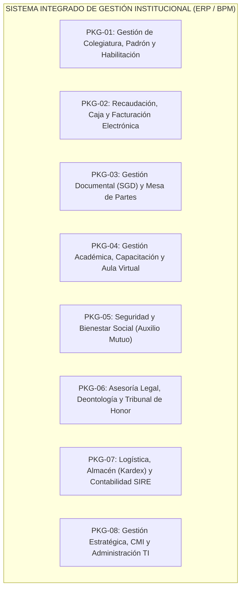
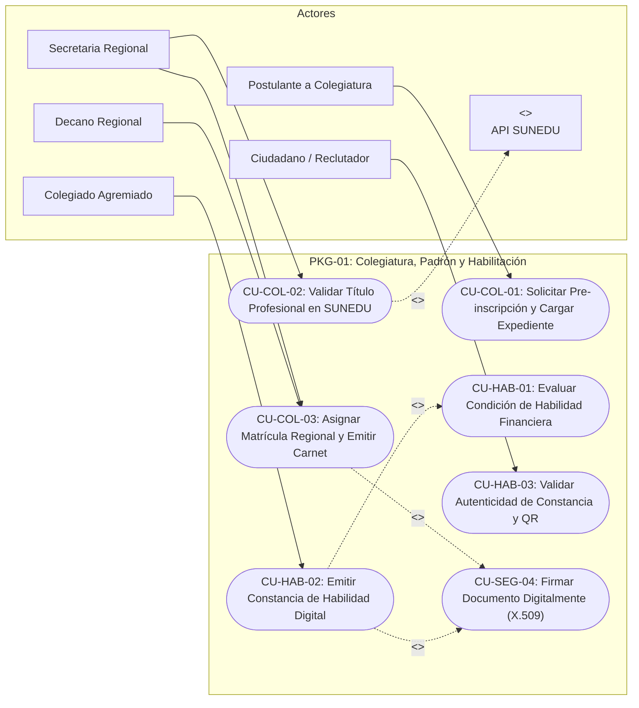
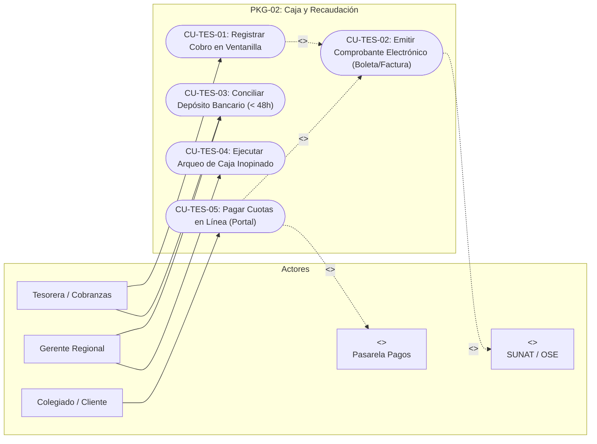
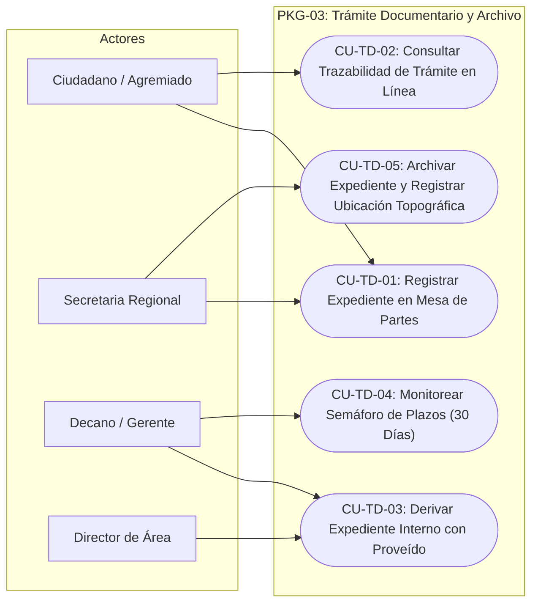
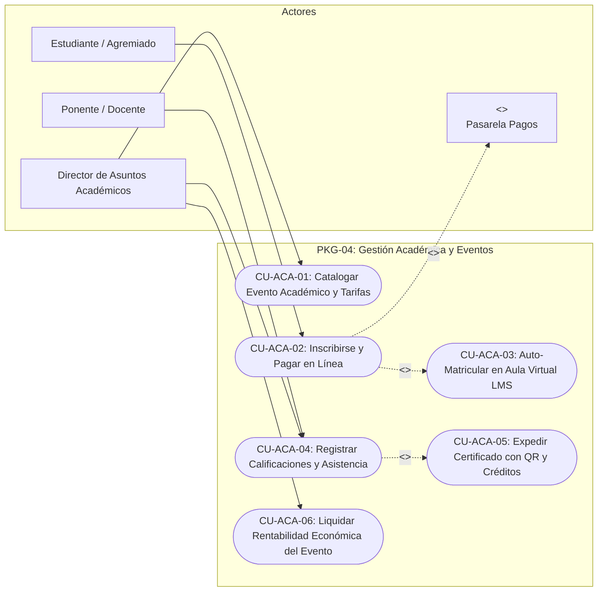
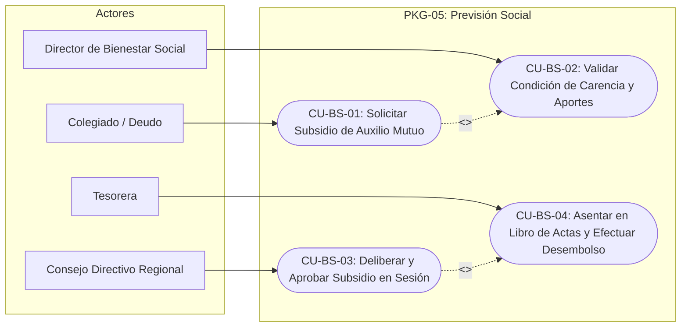
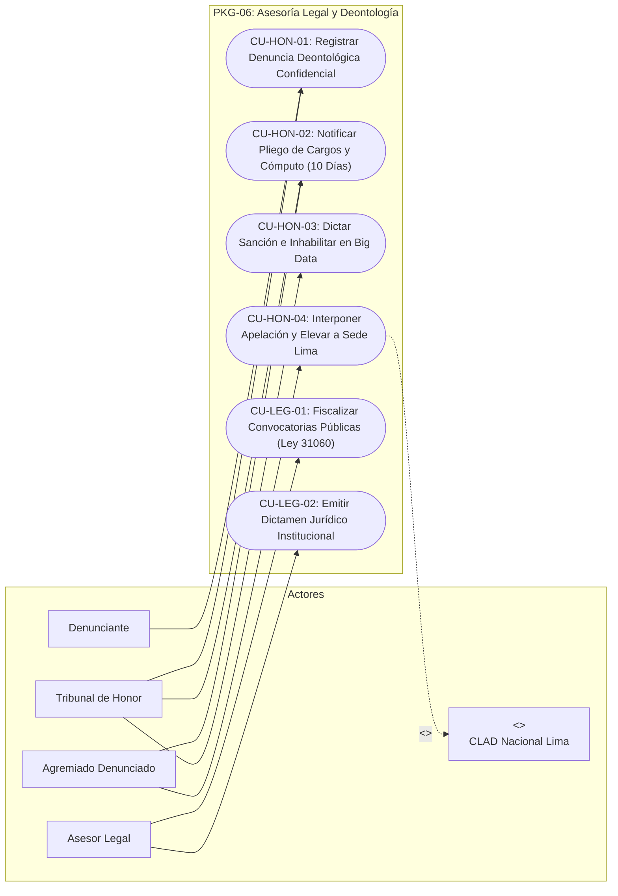
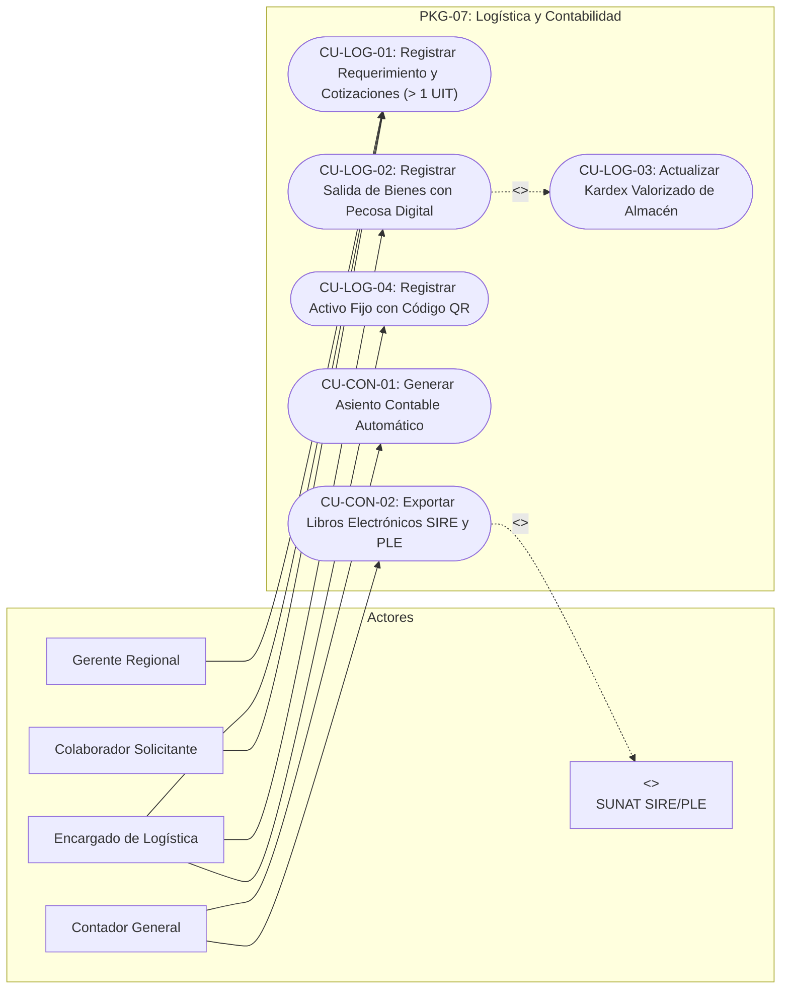
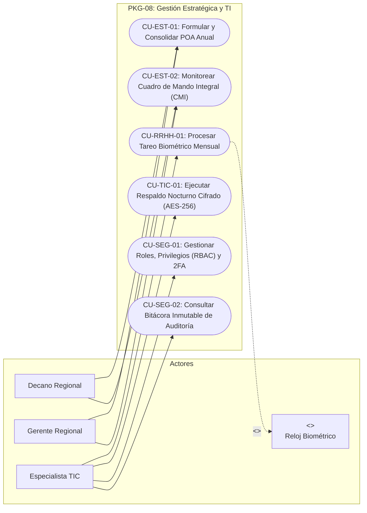

# ESPECIFICACIÓN FORMAL DEL MODELO DE CASOS DE USO (UML / RUP)
## Sistema Integrado de Gestión Institucional y Transformación Digital
### Colegio Regional de Licenciados en Administración – CORLAD Junín

---

> **Documento Base para Tesis de Ingeniería de Sistemas y Desarrollo de Software**  
> **Entidad:** Colegio Regional de Licenciados en Administración – Sede Regional Junín  
> **Marco Metodológico:** Proceso Unificado de Desarrollo (RUP) / Notación UML 2.5 (OMG) / Plantilla de Cockburn  
> **Fuentes Integradas:**
> 1. `HISTORIAS_DE_USUARIO_SISTEMA_INTEGRAL_CORLAD.md` (Product Backlog de 45 HUs).
> 2. `REQUERIMIENTOS_FUNCIONALES_SISTEMA_INTEGRAL_CORLAD.md` (Catálogo de Requerimientos Funcionales ERS).
> 3. `ANALISIS_PROCESOS_CORLAD_BIZAGI_SOFTWARE.md` (Modelos BPMN 2.0 y Arquitectura de Procesos).
> 4. `distribucion de funciones.md` y `corlad procesos institucionales.md` (SIPOC y Matriz de Responsabilidades).
> 5. `Marco Normativo Vinculante:` Ley N° 31060, D.L. N° 22087, TUO Ley N° 27444 y Estatuto Nacional del CLAD.

---

## 1. INTRODUCCIÓN Y MODELO DE ACTORES

El Modelo de Casos de Uso describe el comportamiento del sistema desde el punto de vista de los usuarios e interacciones externas, estableciendo el puente formal entre el modelado de negocio (BPMN) y el diseño arquitectónico orientado a objetos.

### 1.1 Taxonomía y Jerarquía de Actores (UML)

```mermaid
classDiagram
    class UsuarioSistema {
        <<Actor Abstracto>>
        +Autenticarse()
        +CambiarClave()
        +ConsultarNotificaciones()
    }

    class PersonalAdministrativo {
        <<Actor Generalizado>>
    }

    class AutoridadDirectiva {
        <<Actor Generalizado>>
    }

    class UsuarioExterno {
        <<Actor Generalizado>>
    }

    class SistemaExterno {
        <<Actor Sistema>>
    }

    UsuarioSistema <|-- PersonalAdministrativo
    UsuarioSistema <|-- AutoridadDirectiva
    UsuarioSistema <|-- UsuarioExterno

    PersonalAdministrativo <|-- SecretariaRegional : ROL-SEC
    PersonalAdministrativo <|-- Tesorera : ROL-TES
    PersonalAdministrativo <|-- AsistenteContable : ROL-CON
    PersonalAdministrativo <|-- EncargadoLogistica : ROL-LOG
    PersonalAdministrativo <|-- EspecialistaTIC : ROL-TIC

    AutoridadDirectiva <|-- DecanoRegional : ROL-DEC
    AutoridadDirectiva <|-- GerenteRegional : ROL-GER
    AutoridadDirectiva <|-- ConsejoDirectivo : ROL-CDIR
    AutoridadDirectiva <|-- DirectorAcademico : ROL-DAC
    AutoridadDirectiva <|-- DirectorBienestar : ROL-DBS
    AutoridadDirectiva <|-- DirectorCientifico : ROL-DIC
    AutoridadDirectiva <|-- TribunalDeHonor : ROL-HON
    AutoridadDirectiva <|-- AsesorLegal : ROL-LEG

    UsuarioExterno <|-- PostulanteColegiatura : ROL-POS
    UsuarioExterno <|-- ColegiadoAgremiado : ROL-AGR
    UsuarioExterno <|-- CiudadanoEntidad : ROL-CIU

    SistemaExterno <|-- ApiSUNEDU : Grados y Títulos
    SistemaExterno <|-- ApiSUNAT : Facturación SIRE/OSE
    SistemaExterno <|-- PasarelaPagos : Webhooks/Tarjetas
    SistemaExterno <|-- RelojBiometrico : Marcaciones TCP/IP
    SistemaExterno <|-- SistemaCLADNacional : Padrón Central
```

### 1.2 Definición de Actores del Sistema

| Código | Actor | Tipo | Rol y Ámbito Operativo en el Sistema |
| :---: | :--- | :---: | :--- |
| `ACT-DEC` | **Decano Regional** | Humano / Directivo | Máxima autoridad ejecutiva. Firma digitalmente resoluciones, constancias, diplomas y supervisa el CMI. |
| `ACT-GER` | **Gerente Regional** | Humano / Administrativo | Conduce la operatividad interna, autoriza compras, ejecuta arqueos inopinados y monitorea convenios. |
| `ACT-SEC` | **Secretaria Regional** | Humano / Operativo | Gestiona Mesa de Partes física/virtual, foliatura, armado de legajos de colegiatura y custodia del archivo central. |
| `ACT-TES` | **Tesorera / Cobranzas** | Humano / Financiero | Opera la caja POS, emite comprobantes electrónicos, efectúa depósitos bancarios $< 48$h y liquida eventos. |
| `ACT-DAC` | **Director Académico** | Humano / Académico | Diseña cursos, tarifas, registra actas de notas y emite certificados digitales con QR curricular. |
| `ACT-DBS` | **Director de Bienestar**| Humano / Social | Evalúa solicitudes de auxilio mutuo, valida carencia y administra el fondo de previsión social. |
| `ACT-DIC` | **Director Científico** | Humano / Académico | Asigna asesores de tesis, gestiona la revista científica y supervisa el repositorio institucional OAI-PMH. |
| `ACT-LEG` | **Asesor Legal** | Humano / Jurídico | Emite dictámenes legales y fiscaliza convocatorias laborales públicas por intrusismo (Ley N° 31060). |
| `ACT-CON` | **Contador General** | Humano / Contable | Valida asientos automáticos, exporta estructuras PLE/SIRE y elabora balances anuales. |
| `ACT-LOG` | **Encargado de Logística**| Humano / Operativo | Controla el inventario Kardex de almacén, pecosas de salida y requerimientos $> 1$ UIT con cotizaciones. |
| `ACT-HON` | **Tribunal de Honor** | Humano / Deontológico | Califica denuncias éticas, notifica pliegos de cargo y registra sanciones firmes inhabilitantes. |
| `ACT-TIC` | **Especialista TIC** | Humano / Soporte | Administra roles (RBAC), monitorea telemetría de servidores y configura backups automáticos AES-256. |
| `ACT-AGR` | **Colegiado / Agremiado**| Humano / Cliente | Titular adscrito. Consulta estado de cuenta, paga cuotas, descarga constancias de habilidad y certificados. |
| `ACT-POS` | **Postulante a Colegiatura**| Humano / Externo | Titulado universitario que ingresa su expediente y da seguimiento a su trámite de colegiatura. |
| `ACT-CIU` | **Ciudadano / Reclutador**| Humano / Público | Consulta el buscador público de habilidad profesional y presenta trámites en mesa de partes virtual. |
| `SYS-SUNEDU`| **Servicio Web SUNEDU**| Sistema Externo | API REST de interoperabilidad para consultar el Registro Nacional de Grados y Títulos. |
| `SYS-SUNAT` | **Servicio OSE / SUNAT**| Sistema Externo | Plataforma web de timbrado de comprobantes electrónicos (CPE) y validación de estructuras SIRE. |
| `SYS-PAY` | **Pasarela de Pagos** | Sistema Externo | Proveedor de recaudación digital (Visa, Mastercard, billeteras digitales) con confirmación vía Webhook. |
| `SYS-BIO` | **Reloj Biométrico** | Dispositivo Externo | Dispositivo biométrico de control de asistencia de la sede con comunicación TCP/IP o exportación de marcas. |

---

## 2. PAQUETES DE CASOS DE USO Y DIAGRAMAS UML

El sistema se estructura en **8 Paquetes de Casos de Uso (Subsistemas)** que abarcan las operaciones misionales, estratégicas y de soporte:

---

### 2.1 Diagrama de Casos de Uso: PKG-01 Colegiatura y Habilitación Profesional (Core)

---

### 2.2 Diagrama de Casos de Uso: PKG-02 Recaudación, Caja y Facturación Electrónica

---

### 2.3 Diagrama de Casos de Uso: PKG-03 Trámite Documentario (SGD) y Mesa de Partes

---

### 2.4 Diagrama de Casos de Uso: PKG-04 Gestión Académica y Aula Virtual

---

### 2.5 Diagrama de Casos de Uso: PKG-05 Previsión Social (Fondo de Auxilio Mutuo)

---

### 2.6 Diagrama de Casos de Uso: PKG-06 Deontología, Asesoría Legal y Defensa Profesional

---

### 2.7 Diagrama de Casos de Uso: PKG-07 Logística, Kardex y Contabilidad SUNAT

---

### 2.8 Diagrama de Casos de Uso: PKG-08 Gestión Estratégica, CMI y Administración TI

---

## 3. CATÁLOGO MAESTRO DE CASOS DE USO (45 CASOS DE USO)

| Código CU | Nombre del Caso de Uso | Paquete | Actor Primario | Actores Secundarios | Requerimiento Funcional |
| :---: | :--- | :---: | :--- | :--- | :---: |
| `CU-COL-01` | Solicitar Pre-inscripción y Cargar Expediente | `PKG-01` | Postulante | Secretaria Regional | `RF-COL-01` |
| `CU-COL-02` | Validar Título Profesional en SUNEDU | `PKG-01` | Secretaria Regional | `SYS-SUNEDU` | `RF-COL-02` |
| `CU-COL-03` | Asignar Matrícula Regional y Emitir Carnet | `PKG-01` | Decano Regional | Secretaria Regional, `SYS-CLAD` | `RF-COL-03` |
| `CU-HAB-01` | Evaluar Condición de Habilidad Financiera | `PKG-01` | Sistema (Automático) | Tesorera | `RF-HAB-01` |
| `CU-HAB-02` | Emitir Constancia de Habilidad Digital | `PKG-01` | Colegiado Agremiado | Decano, Secretaria | `RF-HAB-02` |
| `CU-HAB-03` | Validar Autenticidad de Constancia y QR | `PKG-01` | Ciudadano / Reclutador | Servidor Público | `RF-HAB-03` |
| `CU-TES-01` | Registrar Cobro en Ventanilla (POS) | `PKG-02` | Tesorera / Cajera | Colegiado / Cliente | `RF-TES-01` |
| `CU-TES-02` | Emitir Comprobante Electrónico | `PKG-02` | Sistema (Automático) | `SYS-SUNAT` | `RF-TES-01` |
| `CU-TES-03` | Conciliar Depósito Bancario (< 48 Horas) | `PKG-02` | Tesorera | Gerente Regional | `RF-TES-02` |
| `CU-TES-04` | Ejecutar Arqueo de Caja Inopinado | `PKG-02` | Gerente Regional | Tesorera | `RF-TES-03` |
| `CU-TES-05` | Pagar Cuotas y Trámites en Línea | `PKG-02` | Colegiado Agremiado | `SYS-PAY` | `RF-TES-01` |
| `CU-TD-01` | Registrar Expediente en Mesa de Partes | `PKG-03` | Secretaria Regional | Ciudadano / Agremiado | `RF-TD-01` |
| `CU-TD-02` | Consultar Trazabilidad de Trámite en Línea| `PKG-03` | Ciudadano / Agremiado | Sistema | `RF-TD-02` |
| `CU-TD-03` | Derivar Expediente Interno con Proveído | `PKG-03` | Decano / Gerente | Directores de Área | `RF-TD-03` |
| `CU-TD-04` | Monitorear Semáforo de Plazos Legales | `PKG-03` | Gerente Regional | Directores de Área | `RF-TD-03` |
| `CU-TD-05` | Archivar Expediente y Asignar Topografía | `PKG-03` | Secretaria Regional | Archivo Central | `RF-TD-04` |
| `CU-ACA-01` | Catalogar Evento Académico y Tarifario | `PKG-04` | Director Académico | Marketing | `RF-ACA-01` |
| `CU-ACA-02` | Inscribirse a Evento Académico en Línea | `PKG-04` | Participante / Estudiante | `SYS-PAY` | `RF-ACA-02` |
| `CU-ACA-03` | Auto-Matricular Participante en LMS | `PKG-04` | Sistema (Automático) | Participante | `RF-ACA-02` |
| `CU-ACA-04` | Registrar Calificaciones y Asistencias | `PKG-04` | Docente / Ponente | Director Académico | `RF-ACA-03` |
| `CU-ACA-05` | Expedir Certificado con QR y Créditos | `PKG-04` | Director Académico | Decano Regional | `RF-ACA-03` |
| `CU-ACA-06` | Liquidar Rentabilidad Económica de Evento | `PKG-04` | Tesorera | Contador General | `RF-ACA-04` |
| `CU-BS-01` | Solicitar Subsidio de Auxilio Mutuo | `PKG-05` | Colegiado / Deudo | Director de Bienestar | `RF-BS-01` |
| `CU-BS-02` | Validar Carencia ($\ge 6$m) y Habilidad | `PKG-05` | Director de Bienestar | Sistema (Big Data) | `RF-BS-02` |
| `CU-BS-03` | Deliberar y Aprobar Auxilio en Sesión | `PKG-05` | Consejo Directivo | Decano Regional | `RF-BS-03` |
| `CU-BS-04` | Asentar en Libro de Actas y Desembolsar | `PKG-05` | Tesorera | Beneficiario | `RF-BS-03` |
| `CU-INV-01` | Postular y Asignar Asesoría de Tesis | `PKG-05` | Tesista / Egresado | Director Científico | `RF-INV-01` |
| `CU-INV-02` | Gestionar Arbitraje a Doble Ciego (APA)| `PKG-05` | Comité Editorial | Dictaminadores Pares | `RF-INV-02` |
| `CU-INV-03` | Indexar y Publicar en Repositorio OAI-PMH| `PKG-05` | Director Científico | Comunidad Académica | `RF-INV-03` |
| `CU-IMG-01` | Gestionar Contenidos Web y Prensa | `PKG-05` | Encargado Marketing | Gerente Regional | `RF-IMG-01` |
| `CU-IMG-02` | Visar y Publicar Comunicado Oficial | `PKG-05` | Decano Regional | Marketing | `RF-IMG-02` |
| `CU-HON-01` | Registrar Denuncia Deontológica Reservada | `PKG-06` | Denunciante | Tribunal de Honor | `RF-HON-01` |
| `CU-HON-02` | Notificar Pliego de Cargos (10 Días) | `PKG-06` | Tribunal de Honor | Agremiado Denunciado | `RF-HON-02` |
| `CU-HON-03` | Dictar Sanción e Inhabilitar en Big Data | `PKG-06` | Tribunal de Honor | Sistema (Big Data) | `RF-HON-03` |
| `CU-HON-04` | Interponer Apelación y Elevar a Sede Lima | `PKG-06` | Agremiado Sancionado | `SYS-CLAD` | `RF-HON-04` |
| `CU-LEG-01` | Fiscalizar Convocatorias (Ley N° 31060) | `PKG-06` | Asesor Legal | Entidades Públicas | `RF-LEG-02` |
| `CU-LEG-02` | Emitir Dictamen Jurídico Institucional | `PKG-06` | Asesor Legal | Decano Regional | `RF-LEG-01` |
| `CU-LOG-01` | Registrar Requerimiento y Cotizaciones | `PKG-07` | Encargado Logística | Gerente Regional | `RF-LOG-01` |
| `CU-LOG-02` | Registrar Salida de Bienes con Pecosa | `PKG-07` | Encargado Logística | Colaborador Receptor | `RF-LOG-02` |
| `CU-LOG-03` | Catalogar Inventario Patrimonial con QR | `PKG-07` | Secretaria Regional | Encargado Logística | `RF-LOG-03` |
| `CU-CON-01` | Generar Asientos Contables Automáticos | `PKG-07` | Sistema (Automático) | Contador General | `RF-CON-01` |
| `CU-CON-02` | Exportar Libros Electrónicos SIRE y PLE | `PKG-07` | Contador General | `SYS-SUNAT` | `RF-CON-02` |
| `CU-EST-01` | Formular y Consolidar POA y Presupuesto | `PKG-08` | Gerente Regional | Decano, Consejo Directivo| `RF-EST-01` |
| `CU-EST-02` | Monitorear Tablero de Mando CMI y KPIs | `PKG-08` | Decano Regional | Gerente Regional | `RF-EST-02` |
| `CU-CAL-01` | Registrar Queja en Libro de Reclamaciones | `PKG-08` | Ciudadano / Agremiado | Gerente Regional | `RF-CAL-01` |
| `CU-RRHH-01`| Procesar Tareo Biométrico Mensual | `PKG-08` | Secretaria / Admin | `SYS-BIO` | `RF-RRHH-02` |
| `CU-TIC-01` | Ejecutar Respaldo Nocturno Cifrado | `PKG-08` | Sistema (Batch 23:00) | Especialista TIC | `RF-TIC-02` |
| `CU-SEG-01` | Gestionar Matriz RBAC y Doble Factor (2FA)| `PKG-08` | Especialista TIC | Autoridades Directivas | `RF-SEG-01` |
| `CU-SEG-02` | Auditar Logs Inmutables de Transacciones | `PKG-08` | Auditor Interno | Especialista TIC | `RF-SEG-02` |

---

## 4. ESPECIFICACIÓN DETALLADA DE CASOS DE USO CRÍTICOS (PLANTILLA FORMAL RUP)

A continuación se detallan exhaustivamente los casos de uso con mayor impacto operativo, legal y financiero para el desarrollo del software.

---

### 4.1 `CU-COL-01`: Solicitar Pre-inscripción y Cargar Expediente de Colegiatura

| Atributo | Detalle |
| :--- | :--- |
| **Código:** | `CU-COL-01` |
| **Nombre:** | Solicitar Pre-inscripción y Cargar Expediente de Colegiatura |
| **Paquete:** | `PKG-01: Gestión de Colegiatura, Padrón y Habilitación` |
| **Actores:** | **Primario:** Postulante a Colegiatura (`ACT-POS`) \| **Secundario:** Secretaria Regional (`ACT-SEC`) |
| **Tipo:** | Primario / Esencial |
| **Propósito:** | Permitir al titulado universitario registrar sus datos y adjuntar digitalmente los requisitos para su incorporación formal al CORLAD Junín sin acudir presencialmente. |
| **Precondición:** | 1. El postulante debe contar con Título Profesional de Licenciado en Administración emitido por universidad peruana o revalidado. 2. Disponer de comprobante de pago por derecho de colegiatura emitido por CORLAD Junín o entidad bancaria. |
| **Poscondición:** | **Éxito:** Se crea el legajo digital con código correlativo (`COL-YYYY-XXXX`), se asigna estado "PENDIENTE DE REVISIÓN", se generan credenciales de seguimiento y se notifica al postulante y a Mesa de Partes. **Fallo:** No se crea ningún registro si faltan documentos obligatorios o si los archivos exceden el tamaño máximo. |
| **Requerimientos:**| `RF-COL-01`, `RF-COL-02` |
| **Reglas de Negocio:**| `RN-COL-01` (Archivos obligatorios: DNI, Título ambas caras, fotos, antecedentes penales y voucher), `RN-COL-02` (Límite de tamaño: máx. 5 MB por archivo en formato PDF/JPG). |

#### Flujo Básico de Eventos (Camino Feliz):
1. El Postulante accede al portal web institucional del CORLAD Junín y selecciona "Trámite de Colegiatura en Línea".
2. El sistema presenta el formulario de pre-inscripción solicitando: DNI, nombres completos, universidad de origen, fecha de expedición del título, domicilio, correo electrónico y número telefónico.
3. El Postulante completa la información personal y académica.
4. El sistema valida el formato del DNI (8 dígitos numéricos) y correo electrónico válido.
5. El Postulante carga los archivos digitales obligatorios:
   - Documento de Identidad (DNI) legible.
   - Título Profesional escaneado por el anverso y reverso.
   - Certificado de Antecedentes Penales vigente ($< 90$ días).
   - Dos fotografías tamaño pasaporte con fondo blanco.
   - Voucher o comprobante de pago por derecho de colegiatura.
6. El Postulante lee y acepta la Declaración Jurada de veracidad de la información y pulsa en "Enviar Solicitud de Incorporación".
7. El sistema ejecuta el caso de uso `CU-COL-02: Validar Título Profesional en SUNEDU` mediante el servicio web.
8. El sistema recibe respuesta positiva de SUNEDU, confirmando la existencia del título a nombre del postulante.
9. El sistema genera el código único correlativo de trámite:
   $$\text{Código Legajo: } \mathbf{COL-YYYY-XXXX} \quad (\text{ejemplo: } \text{COL-2026-00128})$$
10. El sistema bloquea la edición del legajo, graba la fecha/hora con sello temporal criptográfico y remite al correo del postulante la constancia de recepción digital con contraseña temporal para el seguimiento.
11. El caso de uso finaliza exitosamente.

#### Flujos Alternativos:
* **FA-1: Archivo digital no legible o excede tamaño permitido (Paso 5):**
  - Si un archivo cargado supera los 5 MB o no corresponde a formato PDF/JPG, el sistema muestra mensaje de error inline: *"El archivo [Nombre] excede el límite permitido de 5MB o formato no admitido"*. El sistema mantiene los datos ya ingresados y permite cargar el archivo correcto.
* **FA-2: Interrupción de conectividad durante la carga (Paso 6):**
  - El sistema guarda un borrador temporal en el navegador (local storage) por 24 horas, permitiendo al usuario reanudar el llenado al reconectarse.

#### Flujos de Excepción:
* **FE-1: Falta de coincidencia en SUNEDU (Paso 8):**
  - Si la consulta al API de SUNEDU retorna que el título no existe o no concuerda con el DNI ingresado:
    1. El sistema marca el legajo con estado "OBSERVADO POR SUNEDU".
    2. Registra el código de error retornado por la plataforma externa.
    3. Notifica automáticamente a la Secretaria Regional y al postulante indicando: *"El título registrado no figura en el Registro Nacional de Grados y Títulos de SUNEDU. Debe subsanar ante su universidad o presentar constancia original"*.
    4. El trámite queda suspendido hasta la subsanación.
* **FE-2: Postulante ya figura matriculado en el Padrón Regional (Paso 4):**
  - Si el DNI ya existe en la base de datos con una matrícula activa, el sistema bloquea el registro y emite alerta: *"El profesional ya se encuentra inscrito en el CORLAD Junín con Matrícula N° [XXXX]. Si desea tramitar habilidad o carnet, ingrese al Portal del Agremiado"*.

---

### 4.2 `CU-HAB-01`: Evaluar y Actualizar Condición de Habilidad Financiera

| Atributo | Detalle |
| :--- | :--- |
| **Código:** | `CU-HAB-01` |
| **Nombre:** | Evaluar y Actualizar Condición de Habilidad Financiera |
| **Paquete:** | `PKG-01: Gestión de Colegiatura, Padrón y Habilitación` |
| **Actores:** | **Primario:** Sistema (Motor de Reglas / Job Nocturno) \| **Secundario:** Tesorera (`ACT-TES`) |
| **Tipo:** | Secundario / Automático / Invocado |
| **Propósito:** | Evaluar en tiempo real la situación de morosidad en cuotas ordinarias de los agremiados y determinar su condición legal de HÁBIL o INHABILITADO conforme a la Ley N° 31060. |
| **Precondición:** | El colegiado debe existir en el Padrón Regional con número de matrícula asignado. |
| **Poscondición:** | El estado de habilidad en la Big Data regional queda actualizado de forma inmutable, reflejándose en el portal de autoservicio y en el validador público. |
| **Requerimientos:**| `RF-HAB-01`, `RF-HAB-03`, `RF-HON-03` |
| **Reglas de Negocio:**| `RN-HAB-01` (Condición Hábil: adeuda $\le 2$ cuotas mensuales ordinarias), `RN-HAB-02` (Inhabilitado por Morosidad: adeuda $\ge 3$ cuotas mensuales), `RN-HAB-03` (Inhabilitado por Sanción: resolución firme del Tribunal de Honor). |

#### Flujo Básico de Eventos:
1. El caso de uso se activa por dos disparadores:
   - *Disparador Automático:* Proceso batch nocturno programado a las 00:01 hrs de cada día.
   - *Disparador Transaccional:* Al registrarse un cobro de cuotas en caja o confirmarse un pago web.
2. El sistema consulta la cuenta corriente individual de cada colegiado adscrito.
3. El sistema calcula la cantidad de cuotas ordinarias mensuales vencidas no canceladas a la fecha de corte.
4. El sistema verifica si el colegiado registra sanciones disciplinarias activas del Tribunal de Honor.
5. El sistema aplica las reglas de negocio vinculantes:
   - **Caso A (Al día o deuda leve):** Si Cuotas Adeudadas $\le 2$ y No Sanción $\rightarrow$ Asigna Condición **"HÁBIL"** (Flag = 1).
   - **Caso B (Morosidad):** Si Cuotas Adeudadas $\ge 3$ y No Sanción $\rightarrow$ Asigna Condición **"INHABILITADO POR DEUDA"** (Flag = 0).
   - **Caso C (Sanción Ética):** Si registra Sanción Vigente $\rightarrow$ Asigna Condición **"INHABILITADO POR SANCIÓN ÉTICA"** (Flag = 2).
6. El sistema graba el nuevo estado con marca temporal en la Big Data institucional.
7. Si el estado cambió respecto al día anterior, el sistema genera un asiento en el log de auditoría inmutable (`CU-SEG-02`).
8. El caso de uso finaliza.

---

### 4.3 `CU-HAB-02`: Emitir Constancia de Habilidad Profesional Digital

| Atributo | Detalle |
| :--- | :--- |
| **Código:** | `CU-HAB-02` |
| **Nombre:** | Emitir Constancia de Habilidad Profesional Digital |
| **Paquete:** | `PKG-01: Gestión de Colegiatura, Padrón y Habilitación` |
| **Actores:** | **Primario:** Colegiado Agremiado (`ACT-AGR`) \| **Secundarios:** Decano Regional, Secretaria |
| **Tipo:** | Primario / Esencial |
| **Propósito:** | Permitir al agremiado hábil descargar en PDF su Constancia de Habilidad Profesional oficial dotada de firma digital X.509 y código QR de validación curricular. |
| **Precondición:** | El usuario debe estar autenticado en el Portal del Agremiado y encontrarse en condición de "HÁBIL". |
| **Poscondición:** | Se genera el documento PDF oficial con código hash SHA-256, registrado en la tabla de constancias emitidas con vigencia perentoria de 3 meses. |
| **Requerimientos:**| `RF-HAB-01`, `RF-HAB-02`, `RF-HAB-03` |
| **Reglas de Negocio:**| `RN-HAB-04` (Vigencia máxima de la constancia: 90 días calendario), `RN-HAB-05` (Inclusión obligatoria de código QR dinámico y hash criptográfico). |

#### Flujo Básico de Eventos:
1. El Colegiado ingresa al Portal de Autoservicio con su DNI y clave.
2. Selecciona la opción "Generar Constancia de Habilidad Profesional".
3. El sistema invoca al caso de uso `CU-HAB-01` para certificar la condición de habilidad en el instante exacto.
4. El sistema confirma que el agremiado adeuda $\le 2$ cuotas y no posee inhabilitación deontológica.
5. El sistema solicita seleccionar el motivo del trámite (Entidad pública, privada, judicial, docencia o licitación OSCE).
6. El sistema compila la plantilla oficial de la Constancia de Habilidad incorporando:
   - Datos del profesional: Nombres, DNI, Número de Matrícula Regional y Nacional.
   - Universidad y fecha de incorporación.
   - Período de validez (Desde [Fecha Emisión] hasta [Fecha + 90 días]).
   - Código hash único (SHA-256) y código QR dinámico que apunta a la URL del validador público.
7. El sistema invoca el componente de firma digital centralizada estampando el certificado digital oficial X.509 de la Decanatura y Secretaría Regional.
8. El sistema guarda el registro de la constancia en base de datos (`CONST-YYYY-XXXXXX`).
9. El sistema entrega el documento PDF al navegador del usuario para su descarga o impresión directa.
10. Se remite una copia idéntica al casillero virtual y correo electrónico del agremiado.
11. El caso de uso finaliza exitosamente.

#### Flujos de Excepción:
* **FE-1: Colegiado en condición de Inhábil por Deuda (Paso 4):**
  1. El sistema deniega la expedición del documento.
  2. Muestra ventana modal: *"Usted registra [N] cuotas ordinarias pendientes por un monto total de S/. [Monto]. Conforme al Estatuto, debe regularizar sus pagos para emitir la constancia"*.
  3. Muestra botón de acción inmediata: "Cancelar Cuotas en Línea con Pasarela de Pagos".
* **FE-2: Colegiado con Sanción Ética Vigente (Paso 4):**
  1. El sistema bloquea taxativamente el botón de emisión.
  2. Muestra mensaje restrictivo: *"El profesional se encuentra inhabilitado por resolución sancionatoria del Tribunal de Honor hasta el [Fecha]. No procede la emisión de habilidad profesional"*.

---

### 4.4 `CU-TES-01`: Registrar Cobro en Ventanilla y Emitir Comprobante Electrónico (POS)

| Atributo | Detalle |
| :--- | :--- |
| **Código:** | `CU-TES-01` |
| **Nombre:** | Registrar Cobro en Ventanilla y Emitir Comprobante Electrónico (POS) |
| **Paquete:** | `PKG-02: Recaudación, Caja y Facturación Electrónica` |
| **Actores:** | **Primario:** Tesorera / Cajera (`ACT-TES`) \| **Secundarios:** Cliente/Colegiado, `SYS-SUNAT` |
| **Tipo:** | Primario / Transaccional |
| **Propósito:** | Registrar ingresos arancelarios en caja física y generar en tiempo real el comprobante de pago electrónico timbrado ante la SUNAT. |
| **Precondición:** | La caja física del día debe estar abierta con saldo inicial verificado por Gerencia. |
| **Poscondición:** | Se emite la Boleta o Factura Electrónica (PDF/XML), se actualiza la cuenta corriente del agremiado, se actualiza el efectivo en caja y se genera el asiento contable en el Libro Diario. |
| **Requerimientos:**| `RF-TES-01`, `RF-CON-01` |
| **Reglas de Negocio:**| `RN-TES-01` (Numeración correlativa inalterable por serie electrónica B001/F001), `RN-TES-02` (Timbrado obligatorio ante OSE/SUNAT en menos de 24 horas). |

#### Flujo Básico de Eventos:
1. La Cajera selecciona el módulo "Punto de Venta - Recaudación".
2. Ingresa el número de DNI o RUC del cliente/agremiado.
3. El sistema recupera los datos del titular y su estado de cuenta corriente detallado.
4. La Cajera selecciona los conceptos a cancelar (ej. Cuotas ordinarias mensuales, derecho de constancia de habilidad, inscripción a curso o alquiler de auditorio).
5. El sistema calcula los subtotales, tasa de IGV (cuando aplique) y el importe total a cobrar.
6. La Cajera selecciona el medio de pago: Efectivo, Tarjeta (POS físico), Yape/Plin o Transferencia bancaria.
   - Si es transferencia/depósito: Registra el número de operación bancaria.
7. La Cajera pulsa en "Procesar y Emitir Comprobante".
8. El sistema invoca al servicio web de la OSE/SUNAT remitiendo la trama XML firmada digitalmente.
9. La OSE retorna la Constancia de Recepción (CDR) con estado "ACEPTADA".
10. El sistema imprime el comprobante fiscal en impresora térmica o láser y envía el PDF + XML al correo del cliente.
11. El sistema invoca automáticamente a `CU-HAB-01` para rehabilitar al colegiado si canceló su morosidad.
12. El sistema invoca a `CU-CON-01` para registrar el asiento contable automático en el Libro Diario.
13. El caso de uso finaliza exitosamente.

#### Flujos Alternativos:
* **FA-1: Rechazo de comunicación con SUNAT / Caída del servicio web (Paso 8):**
  - Si el servidor de SUNAT/OSE no responde en 5 segundos, el sistema emite el comprobante bajo modalidad "CONTINGENCIA OFFLINE", almacena la trama localmente y encola el envío automático cada 15 minutos hasta obtener el CDR.

---

### 4.5 `CU-TES-04`: Ejecutar Arqueo de Caja Inopinado

| Atributo | Detalle |
| :--- | :--- |
| **Código:** | `CU-TES-04` |
| **Nombre:** | Ejecutar Arqueo de Caja Inopinado |
| **Paquete:** | `PKG-02: Recaudación, Caja y Facturación Electrónica` |
| **Actores:** | **Primario:** Gerente Regional (`ACT-GER`) \| **Secundario:** Tesorera / Cajera (`ACT-TES`) |
| **Tipo:** | Primario / Control y Fiscalización |
| **Propósito:** | Permitir al Gerente suspender de improviso las operaciones de caja para verificar la coincidencia matemática exacta entre el efectivo físico custodiado y las cobranzas registradas en sistema. |
| **Precondición:** | La caja evaluada debe registrar movimientos u operaciones activas en la jornada. |
| **Poscondición:** | Se genera el Acta Oficial de Arqueo firmada digitalmente por ambas partes, registrando sobrantes, faltantes o conformidad absoluta. |
| **Requerimientos:**| `RF-TES-03` |
| **Reglas de Negocio:**| `RN-TES-03` (Bloqueo transitorio de nuevas ventas mientras dura el conteo), `RN-TES-04` (Inmutabilidad del Acta de Arqueo generada). |

#### Flujo Básico de Eventos:
1. El Gerente Regional ingresa a la oficina de tesorería y accede al sistema con credenciales de alta jerarquía.
2. Selecciona la opción "Ejecutar Arqueo de Caja Inopinado" y elige el terminal de caja en operación.
3. El sistema bloquea de inmediato la emisión de nuevos comprobantes en ese terminal, congelando la fecha/hora y los saldos del sistema.
4. El sistema presenta la interfaz de conteo de papel moneda y circulante estructurada por denominaciones (Billetes de 200, 100, 50, 20, 10 y monedas de 5, 2, 1, 0.50, 0.20, 0.10).
5. En presencia de la cajera, el Gerente realiza el conteo físico e ingresa la cantidad de piezas por cada denominación.
6. El sistema totaliza el dinero físico contado:
   $$\text{Total Físico} = \sum (\text{Denominación} \times \text{Cantidad})$$
7. El sistema desoculta el saldo virtual registrado en base de datos (Ventas en efectivo del día + saldo inicial de caja chica).
8. El sistema ejecuta el cálculo diferencial:
   $$\Delta = \text{Total Físico Contado} - \text{Total Virtual en Sistema}$$
9. El sistema tipifica el resultado:
   - Si $\Delta = 0.00 \rightarrow$ **"CONFORME (CUADRE EXACTO)"**.
   - Si $\Delta > 0.00 \rightarrow$ **"INCONSISTENCIA: SOBRANTE DE CAJA (+S/.)"**.
   - Si $\Delta < 0.00 \rightarrow$ **"INCONSISTENCIA: FALTANTE DE CAJA (-S/.)"**.
10. La cajera y el Gerente ingresan sus observaciones y descargos en los campos de texto habilitados.
11. Ambos usuarios estampan su firma digital o credencial biométrica en el sistema.
12. El sistema emite el Acta Oficial de Arqueo Inopinado en formato PDF inalterable, enviando copia al Decano y al Contador General.
13. El sistema levanta el bloqueo de la caja permitiendo continuar con la atención ordinaria.
14. El caso de uso finaliza exitosamente.

---

### 4.6 `CU-TD-01`: Registrar Expediente en Mesa de Partes (Presencial y Virtual)

| Atributo | Detalle |
| :--- | :--- |
| **Código:** | `CU-TD-01` |
| **Nombre:** | Registrar Expediente en Mesa de Partes (Presencial y Virtual) |
| **Paquete:** | `PKG-03: Trámite Documentario (SGD) y Mesa de Partes` |
| **Actores:** | **Primario:** Secretaria Regional (`ACT-SEC`) o Ciudadano (`ACT-CIU`) \| **Secundario:** Administrado |
| **Tipo:** | Primario / Transaccional |
| **Propósito:** | Formalizar el ingreso de documentos externos al CORLAD Junín asignando un código correlativo inmutable y cargo electrónico de recepción legal. |
| **Precondición:** | El administrado debe presentar el escrito con número de folios y datos de contacto legibles. |
| **Poscondición:** | Se genera el expediente `EXP-YYYY-XXXXX` con sello de tiempo, código de verificación y cargo en PDF. |
| **Requerimientos:**| `RF-TD-01`, `RF-TD-02` |
| **Reglas de Negocio:**| `RN-TD-01` (Numeración inmutable bajo formato `EXP-YYYY-XXXXX`), `RN-TD-02` (Obligatoriedad de cargo de recepción con código de seguridad según TUO Ley 27444). |

#### Flujo Básico de Eventos:
1. El Administrado presenta su documento (físicamente en ventanilla o virtualmente en la web 24/7).
2. El operador (o el usuario web) registra en el sistema: Tipo de documento (Oficio, Carta, Solicitud), entidad remitente, DNI/RUC, asunto detallado, número de folios y correo electrónico de notificación.
3. Se escanean y cargan los anexos sustentatorios en formato PDF.
4. El sistema valida la integridad de los archivos y campos requeridos.
5. El sistema genera el código de expediente correlativo inalterable:
   $$\text{Código Único: } \mathbf{EXP-2026-00341}$$
6. El sistema genera un código hash de seguridad y una clave alfanumérica de 6 dígitos para consulta pública.
7. El sistema imprime el sello de recepción digitalizado en la primera página del documento y emite el **Cargo Electrónico de Recepción Oficial**.
8. El sistema remite el cargo en PDF al correo del usuario y coloca el expediente en la bandeja de entrada del despacho de Decanatura para su proveído de derivación (`CU-TD-03`).
9. El caso de uso finaliza exitosamente.

---

### 4.7 `CU-TD-03`: Derivar Expediente Interno y Controlar Plazos Legales (30 Días)

| Atributo | Detalle |
| :--- | :--- |
| **Código:** | `CU-TD-03` |
| **Nombre:** | Derivar Expediente Interno y Controlar Plazos Legales (30 Días) |
| **Paquete:** | `PKG-03: Trámite Documentario (SGD) y Mesa de Partes` |
| **Actores:** | **Primario:** Decano Regional (`ACT-DEC`) / Gerente (`ACT-GER`) \| **Secundario:** Directores de Área |
| **Tipo:** | Primario / Workflow |
| **Propósito:** | Canalizar los expedientes recibidos hacia las áreas operativas con instrucciones precisas y activar el monitoreo del plazo perentorio legal de 30 días hábiles (Ley N° 27444). |
| **Precondición:** | El expediente debe encontrarse registrado y admitido en el sistema. |
| **Poscondición:** | El expediente pasa a la bandeja del área de destino y se actualiza la línea de tiempo pública. |
| **Requerimientos:**| `RF-TD-03` |
| **Reglas de Negocio:**| `RN-TD-03` (Plazo máximo perentorio de 30 días hábiles para pronunciamiento), `RN-TD-04` (Semáforo de plazos: Verde $\le 15$d, Amarillo 16-25d, Rojo $> 25$d). |

#### Flujo Básico de Eventos:
1. El Decano Regional (o Gerente) abre la bandeja de "Expedientes Pendientes de Despacho".
2. Selecciona un expediente registrado y visualiza el texto del asunto y anexos digitalizados.
3. Pulsa en la opción "Generar Proveído de Derivación".
4. Selecciona el área de destino (ej. Dirección Académica, Asesoría Legal, Tesorería o Bienestar).
5. Selecciona la instrucción administrativa (ej. Para informe técnico, Para ejecución y pago, Para dictamen legal, Para archivo).
6. Asigna el plazo de atención específico (por defecto: 30 días hábiles según Ley N° 27444).
7. El sistema aplica la fecha y hora, sella el proveído digital y mueve el expediente a la bandeja del funcionario receptor.
8. El sistema activa el contador regresivo de días hábiles (excluyendo sábados, domingos y feriados oficiales de Junín).
9. El sistema actualiza el estado visible en la consulta web ciudadana a "DERIVADO A [ÁREA]".
10. El caso de uso finaliza exitosamente.

---

### 4.8 `CU-HON-03`: Registrar Sanción Disciplinaria y Bloquear Habilidad en Big Data

| Atributo | Detalle |
| :--- | :--- |
| **Código:** | `CU-HON-03` |
| **Nombre:** | Registrar Sanción Disciplinaria y Bloquear Habilidad en Big Data |
| **Paquete:** | `PKG-06: Asesoría Legal, Deontología y Tribunal de Honor` |
| **Actores:** | **Primario:** Tribunal de Honor (`ACT-HON`) \| **Secundario:** Sistema (Big Data Regional) |
| **Tipo:** | Primario / Mandatorio |
| **Propósito:** | Inscribir resoluciones sancionatorias consentidas en el Registro de Sanciones Disciplinarias y bloquear inmediatamente la emisión de constancias de habilidad profesional. |
| **Precondición:** | El proceso deontológico sumario debe contar con Resolución Final consentida o ejecutoriada. |
| **Poscondición:** | El estado del agremiado cambia de inmediato a "INHABILITADO POR SANCIÓN ÉTICA", publicándose la alerta en el validador web público. |
| **Requerimientos:**| `RF-HON-03`, `RF-HAB-01` |
| **Reglas de Negocio:**| `RN-HON-01` (Tipología de sanción: Amonestación, Suspensión de 1 a 36 meses, Expulsión), `RN-HON-02` (La suspensión o expulsión bloquea el 100% de servicios y trámites de habilidad). |

#### Flujo Básico de Eventos:
1. El Presidente del Tribunal de Honor accede al módulo restringido de Deontología.
2. Localiza el expediente disciplinario correspondiente al agremiado denunciado.
3. Selecciona la opción "Registrar Sentencia / Sanción Firme".
4. Carga la Resolución del Tribunal de Honor escaneada y firmada.
5. Selecciona la tipología de sanción aplicada:
   - Amonestación escrita privada o pública.
   - Suspensión temporal de la colegiatura (ingresa fecha inicio y fin: ej. 12 meses).
   - Expulsión definitiva de la orden profesional.
6. El sistema solicita confirmación mediante clave de seguridad o 2FA.
7. Al confirmar, el sistema ejecuta un trigger automático en la base de datos:
   - Actualiza el campo `estado_habilidad` del profesional a **"INHABILITADO POR SANCIÓN ÉTICA"**.
   - Asigna fecha de inhabilitación y fecha de rehabilitación automática (si es suspensión).
   - Bloquea de inmediato la descarga de constancias de habilidad en el portal de autoservicio.
   - Publica la advertencia en el validador web institucional: *"AGREMIADO SANCIONADO DISCIPLINARIAMENTE"*.
8. El sistema inscribe el asiento en el Registro Regional de Sanciones Éticas y despacha oficio electrónico al CLAD Nacional (Lima) para su registro en el Padrón Central.
9. El caso de uso finaliza exitosamente.

---

### 4.9 `CU-BS-02`: Validar Carencia y Condición de Habilidad para Auxilio Mutuo

| Atributo | Detalle |
| :--- | :--- |
| **Código:** | `CU-BS-02` |
| **Nombre:** | Validar Carencia y Condición de Habilidad para Auxilio Mutuo |
| **Paquete:** | `PKG-05: Previsión y Seguridad Social` |
| **Actores:** | **Primario:** Director de Bienestar Social (`ACT-DBS`) \| **Secundario:** Sistema Automático |
| **Tipo:** | Primario / Validación de Negocio |
| **Propósito:** | Contrastar automáticamente si el solicitante de auxilio mutuo económico cumple con el tiempo mínimo de aportaciones y la condición de hábil antes de elevar el caso a Consejo Directivo. |
| **Precondición:** | Solicitud de auxilio mutuo registrada en sistema con sustento médico o de defunción. |
| **Poscondición:** | Se genera el Dictamen Técnico de Procedencia o Resolución de Denegatoria por Incumplimiento Estatutario. |
| **Requerimientos:**| `RF-BS-01`, `RF-BS-02` |
| **Reglas de Negocio:**| `RN-BS-01` (Tiempo de carencia obligatorio: antigüedad ininterrumpida $\ge 6$ meses en el CORLAD Junín), `RN-BS-02` (Habilidad estricta: encontrarse hábil a la fecha del siniestro o fallecimiento). |

#### Flujo Básico de Eventos:
1. El Director de Bienestar Social ingresa a la bandeja de "Solicitudes de Auxilio Mutuo".
2. Selecciona una solicitud pendiente e inicia la evaluación técnica.
3. El sistema ejecuta la validación cruzada automática en la Big Data regional:
   - Calcula la antigüedad: $\text{Antigüedad} = \text{Fecha Ocurrencia} - \text{Fecha Incorporación}$.
   - Evalúa el estado de cuenta a la fecha exacta de ocurrencia del hecho.
4. El sistema compara contra las reglas estatutarias:
   - Valida que la antigüedad sea mayor o igual a 6 meses ininterrumpidos.
   - Valida que a la fecha del evento el titular no adeudara más de 2 cuotas ordinarias.
5. El sistema emite el resultado preliminar:
   - **Conforme:** *"Cumple con período de carencia (Antigüedad: [N] meses) y condición de HÁBIL a la fecha del evento"*.
6. El Director de Bienestar Social evalúa los certificados médicos o de defunción anexos y redacta el informe favorable.
7. El sistema marca el expediente como "PROCEDENTE - LISTO PARA SESIÓN DE CONSEJO DIRECTIVO" y lo agenda en la siguiente orden del día.
8. El caso de uso finaliza exitosamente.

#### Flujos de Excepción:
* **FE-1: Falta de período de carencia (Antigüedad $< 6$ meses) (Paso 4):**
  - El sistema resalta en rojo la causal de improcedencia estatutaria y redacta automáticamente el borrador de resolución denegatoria por falta de carencia temporal.
* **FE-2: Titular inhábil por morosidad a la fecha del siniestro (Paso 4):**
  - El sistema certifica que a la fecha de ocurrencia el colegiado adeudaba 3 o más cuotas. Se bloquea el pase a Consejo y se notifica formalmente la improcedencia al solicitante.

---

### 4.10 `CU-SEG-01`: Gestionar Matriz de Control de Acceso (RBAC) y Doble Factor (2FA)

| Atributo | Detalle |
| :--- | :--- |
| **Código:** | `CU-SEG-01` |
| **Nombre:** | Gestionar Matriz de Control de Acceso (RBAC) y Doble Factor (2FA) |
| **Paquete:** | `PKG-08: Gestión Estratégica, CMI y Administración TI` |
| **Actores:** | **Primario:** Especialista TIC (`ACT-TIC`) \| **Secundario:** Todos los Usuarios del Sistema |
| **Tipo:** | Transversal / Seguridad Informática |
| **Propósito:** | Controlar el acceso seguro al ERP/BPM mediante asignación estricta de roles, permisos por módulo y exigencia de 2FA para cargos con facultades financieras o resolutivas. |
| **Precondición:** | El usuario administrador debe autenticarse con credenciales maestras y token de seguridad. |
| **Poscondición:** | Se aplican las políticas de seguridad en la capa de autorización del backend y en el middleware de autenticación. |
| **Requerimientos:**| `RF-SEG-01` |
| **Reglas de Negocio:**| `RN-SEG-01` (Principio de mínimo privilegio: ningún rol accede a vistas ajenas a su función), `RN-SEG-02` (Exigencia mandatoria de 2FA vía TOTP para Decano, Gerente y Tesorera). |

#### Flujo Básico de Eventos:
1. El Especialista TIC accede al panel de administración de seguridad del sistema.
2. Selecciona un usuario o rol institucional para configurar (ej. `ROL-TES`, `ROL-SEC`, `ROL-DEC`).
3. El sistema despliega la matriz granular de privilegios clasificada por módulos (Crear, Leer, Modificar, Anular, Exportar).
4. El Administrador activa o desactiva las casillas según el manual de distribución de funciones.
5. Si el perfil configurado corresponde a una autoridad con firma o manejo de dinero (Decano, Gerente, Tesorera):
   - El sistema marca de manera mandatoria e irreversible la casilla "Exigir Autenticación de Doble Factor (2FA)".
6. El Administrador pulsa en "Guardar Directiva de Seguridad".
7. El sistema invalida las sesiones activas del usuario para forzar la toma de los nuevos permisos en su siguiente inicio de sesión.
8. En el siguiente login del usuario directivo, el sistema solicita usuario y contraseña, y tras validarlos, exige escanear el código QR con una app de autenticación (Google Authenticator / FreeOTP) e ingresar el token temporal de 6 dígitos.
9. El caso de uso finaliza exitosamente.

---

## 5. MATRIZ DE TRAZABILIDAD INTEGRAL: CASOS DE USO VS. HISTORIAS DE USUARIO VS. REQUERIMIENTOS VS. PROCESOS

Esta matriz formal demuestra la cobertura absoluta del desarrollo de software frente al marco de procesos, requerimientos de tesis y product backlog:

| Caso de Uso (UML) | Historia de Usuario (HU) | Requerimiento Funcional (RF) | Proceso BPMN (Bizagi) | Módulo ERP Asignado |
| :---: | :---: | :---: | :---: | :---: |
| `CU-COL-01` | `HU-COL-01` | `RF-COL-01` | `PM-01` (Colegiatura y Habilitación) | Módulo de Colegiatura |
| `CU-COL-02` | `HU-COL-02` | `RF-COL-02` | `PM-01` (Colegiatura y Habilitación) | Interoperabilidad SUNEDU |
| `CU-COL-03` | `HU-COL-03` | `RF-COL-03` | `PM-01` (Colegiatura y Habilitación) | Padrón y Matrícula |
| `CU-HAB-01` | `HU-HAB-01` | `RF-HAB-01` | `PM-01` / `PM-06` (Habilidad y Caja) | Motor de Reglas Big Data |
| `CU-HAB-02` | `HU-HAB-02` | `RF-HAB-02` | `PM-01` (Colegiatura y Habilitación) | Portal del Agremiado |
| `CU-HAB-03` | `HU-HAB-03` | `RF-HAB-03` | `PM-01` (Colegiatura y Habilitación) | Validador Web Público |
| `CU-TES-01` | `HU-TES-01` | `RF-TES-01` | `PM-06` (Economía y Finanzas) | Módulo de Caja POS |
| `CU-TES-02` | `HU-TES-01` | `RF-TES-01` | `PM-06` (Economía y Finanzas) | Facturación Electrónica SUNAT|
| `CU-TES-03` | `HU-TES-02` | `RF-TES-02` | `PM-06` (Economía y Finanzas) | Conciliación Bancaria |
| `CU-TES-04` | `HU-TES-03` | `RF-TES-03` | `PM-06` (Economía y Finanzas) | Módulo de Arqueos |
| `CU-TES-05` | `HU-ACA-02` / `HU-SEG-03` | `RF-TES-01` | `PM-06` (Economía y Finanzas) | Pasarela de Pagos Web |
| `CU-TD-01` | `HU-TD-01` | `RF-TD-01` | `PM-07` (Secretaría y Actas) | Mesa de Partes (SGD) |
| `CU-TD-02` | `HU-TD-02` | `RF-TD-02` | `PM-07` (Secretaría y Actas) | Portal de Trámites Web |
| `CU-TD-03` | `HU-TD-03` | `RF-TD-03` | `PM-07` (Secretaría y Actas) | Módulo de Derivaciones |
| `CU-TD-04` | `HU-TD-03` | `RF-TD-03` | `PM-07` (Secretaría y Actas) | Semáforo de Plazos Legales |
| `CU-TD-05` | `HU-TD-04` | `RF-TD-04` | `PM-07` (Secretaría y Actas) | Archivo Central Topográfico |
| `CU-ACA-01` | `HU-ACA-01` | `RF-ACA-01` | `PM-02` (Eventos Académicos) | Módulo Académico |
| `CU-ACA-02` | `HU-ACA-02` | `RF-ACA-02` | `PM-02` (Eventos Académicos) | Portal Web de Cursos |
| `CU-ACA-03` | `HU-ACA-02` | `RF-ACA-02` | `PM-02` (Eventos Académicos) | Aula Virtual (LMS) |
| `CU-ACA-04` | `HU-ACA-03` | `RF-ACA-03` | `PM-02` (Eventos Académicos) | Actas de Calificaciones |
| `CU-ACA-05` | `HU-ACA-03` | `RF-ACA-03` | `PM-02` (Eventos Académicos) | Certificación con QR |
| `CU-ACA-06` | `HU-ACA-04` | `RF-ACA-04` | `PM-02` (Eventos Académicos) | Liquidación de Eventos |
| `CU-BS-01` | `HU-BS-01` | `RF-BS-01` | `PM-03` (Seguridad y Bienestar) | Previsión Social |
| `CU-BS-02` | `HU-BS-02` | `RF-BS-02` | `PM-03` (Seguridad y Bienestar) | Validación de Carencia |
| `CU-BS-03` | `HU-BS-03` | `RF-BS-03` | `PM-03` (Seguridad y Bienestar) | Sesiones de Consejo |
| `CU-BS-04` | `HU-BS-03` | `RF-BS-03` | `PM-03` (Seguridad y Bienestar) | Libro de Actas de Asistencia |
| `CU-INV-01` | `HU-INV-01` | `RF-INV-01` | `PM-04` (Información Científica) | Asesoría de Tesis |
| `CU-INV-02` | `HU-INV-02` | `RF-INV-02` | `PM-04` (Información Científica) | Gestión Editorial Revista |
| `CU-INV-03` | `HU-INV-03` | `RF-INV-03` | `PM-04` (Información Científica) | Repositorio OAI-PMH |
| `CU-IMG-01` | `HU-IMG-01` | `RF-IMG-01` | `PM-05` (Imagen Institucional) | CMS Portal Web Institucional |
| `CU-IMG-02` | `HU-IMG-02` | `RF-IMG-02` | `PM-05` (Imagen Institucional) | Comunicados Oficiales |
| `CU-HON-01` | `HU-HON-01` | `RF-HON-01` | `PA-05` (Deontología y Honor) | Mesa de Denuncias Éticas |
| `CU-HON-02` | `HU-HON-02` | `RF-HON-02` | `PA-05` (Deontología y Honor) | Notificación Pliego Cargos |
| `CU-HON-03` | `HU-HON-03` | `RF-HON-03` | `PA-05` (Deontología y Honor) | Registro de Sanciones |
| `CU-HON-04` | `HU-HON-04` | `RF-HON-04` | `PA-05` (Deontología y Honor) | Apelaciones ante Sede Lima |
| `CU-LEG-01` | `HU-LEG-02` | `RF-LEG-02` | `PA-01` (Asesoría Legal) | Observatorio Ley N° 31060 |
| `CU-LEG-02` | `HU-LEG-01` | `RF-LEG-01` | `PA-01` (Asesoría Legal) | Dictámenes Legales |
| `CU-LOG-01` | `HU-LOG-01` | `RF-LOG-01` | `PA-03` (Logística y Abastecimiento)| Requerimientos y Cotizaciones|
| `CU-LOG-02` | `HU-LOG-02` | `RF-LOG-02` | `PA-03` (Logística y Abastecimiento)| Kardex y Pecosas Digitales |
| `CU-LOG-03` | `HU-LOG-03` | `RF-LOG-03` | `PA-03` (Logística y Abastecimiento)| Inventario Patrimonial QR |
| `CU-CON-01` | `HU-CON-01` | `RF-CON-01` | `PA-02` (Gestión Contable) | Contabilidad PCGE |
| `CU-CON-02` | `HU-CON-02` | `RF-CON-02` | `PA-02` (Gestión Contable) | Libros Electrónicos SIRE/PLE |
| `CU-EST-01` | `HU-EST-01` | `RF-EST-01` | `PE-01` (Gestión Estratégica) | Formulación POA y Gasto |
| `CU-EST-02` | `HU-EST-02` | `RF-EST-02` | `PE-01` (Gestión Estratégica) | Cuadro de Mando Integral CMI |
| `CU-CAL-01` | `HU-CAL-01` | `RF-CAL-01` | `PE-02` (Gestión de la Calidad) | Libro de Reclamaciones |
| `CU-RRHH-01`| `HU-RRHH-02` | `RF-RRHH-02` | `PE-03` (Gestión de Personal) | Asistencia y Reloj Biométrico|
| `CU-TIC-01` | `HU-TIC-02` | `RF-TIC-02` | `PA-04` (Tecnologías TIC) | Backups Automáticos AES-256 |
| `CU-SEG-01` | `HU-SEG-01` | `RF-SEG-01` | Transversal | Módulo RBAC y Doble Factor |
| `CU-SEG-02` | `HU-SEG-02` | `RF-SEG-02` | Transversal | Pistas de Auditoría |

---
