# Plan Estratégico Institucional 2021 – 2025
## Colegio Regional de Licenciados en Administración (CORLAD) – Junín

> **Documento Fuente:** `PLAN ESTRATEGICO INSTITUCIONAL 2021-2025.pdf` (52 páginas)  
> **Entidad:** Colegio Regional de Licenciados en Administración de Junín – Oficina de Planificación  
> **Periodo de Vigencia:** 2021 – 2025  
> **Contenido Integral:** Diagnóstico Estratégico (AMOFHIT, EFI, PESTE, Porter, EFE, FODA, BCG), Ejes Estratégicos, Objetivos Generales y Específicos, 7 Matrices de Establecimiento Estratégico y Presupuestos, 5 Matrices de Cuadro de Mando Integral (Balanced Scorecard 2021–2025), Organigrama Estructural y 5 Anexos de Cuestionarios.

---

## Índice General

- [Presentación](#presentación)
- [I. Organización Institucional](#i-organización-institucional)
- [II. Datos Generales](#ii-datos-generales)
  - [2.1. Denominación](#21-denominación)
  - [2.2. Ubicación](#22-ubicación)
  - [2.3. Reseña Histórica](#23-reseña-histórica)
  - [2.4. Número de Agremiados](#24-número-de-agremiados)
  - [2.5. Convenios y Alianzas Estratégicas](#25-convenios-y-alianzas-estratégicas)
- [III. Organización Estratégica](#iii-organización-estratégica)
  - [Estructura Orgánica](#estructura-orgánica)
  - [Organigrama Estructural](#organigrama-estructural)
- [IV. Fundamentación Legal](#iv-fundamentación-legal)
- [V. Ejes Estratégicos](#v-ejes-estratégicos)
- [VI. Planeamiento y Diseño Estratégico](#vi-planeamiento-y-diseño-estratégico)
  - [6.1. Misión](#61-misión)
  - [6.2. Visión](#62-visión)
  - [6.3. Valores Institucionales](#63-valores-institucionales)
  - [6.4. Principios Rectores](#64-principios-rectores)
- [VII. Diagnóstico Estratégico](#vii-diagnóstico-estratégico)
  - [7.1. Análisis Interno](#71-análisis-interno)
    - [7.1.1. Matriz AMOFHIT](#711-matriz-amofhit)
    - [7.1.2. Posicionamiento Valor](#712-posicionamiento-valor)
    - [7.1.3. Matriz de Evaluación de Factores Internos (EFI)](#713-matriz-de-evaluación-de-factores-internos-efi)
  - [7.2. Análisis Externo](#72-análisis-externo)
    - [7.2.1. Matriz PESTE](#721-matriz-peste)
    - [7.2.2. Cinco Fuerzas de Porter](#722-cinco-fuerzas-de-porter)
    - [7.2.3. Matriz de Evaluación de Factores Externos (EFE)](#723-matriz-de-evaluación-de-factores-externos-efe)
  - [7.3. Análisis FODA](#73-análisis-foda)
    - [7.3.1. Matriz FODA Cruzada (Estrategias FO, DO, FA, DA)](#731-matriz-foda-cruzada)
  - [7.4. Matriz BCG](#74-matriz-bcg)
- [VIII. Objetivos Estratégicos](#viii-objetivos-estratégicos)
  - [8.1. Objetivos Estratégicos Generales](#81-objetivos-estratégicos-generales)
  - [8.2. Objetivos Estratégicos Específicos](#82-objetivos-estratégicos-específicos)
- [IX. Establecimiento Estratégico](#ix-establecimiento-estratégico)
  - [Matriz 1: Objetivo General 1 – Objetivo Específico 1.1](#matriz-1-objetivo-general-1--objetivo-específico-11)
  - [Matriz 2: Objetivo General 1 – Objetivo Específico 1.2](#matriz-2-objetivo-general-1--objetivo-específico-12)
  - [Matriz 3: Objetivo General 2 – Objetivo Específico 2.1](#matriz-3-objetivo-general-2--objetivo-específico-21)
  - [Matriz 4: Objetivo General 3 – Objetivo Específico 3.1](#matriz-4-objetivo-general-3--objetivo-específico-31)
  - [Matriz 5: Objetivo General 3 – Objetivo Específico 3.2](#matriz-5-objetivo-general-3--objetivo-específico-32)
  - [Matriz 6: Objetivo General 4 – Objetivo Específico 4.1](#matriz-6-objetivo-general-4--objetivo-específico-41)
  - [Matriz 7: Objetivo General 5 – Objetivo Específico 5.1](#matriz-7-objetivo-general-5--objetivo-específico-51)
- [X. Cuadro de Mando Integral (Balanced Scorecard 2021–2025)](#x-cuadro-de-mando-integral-balanced-scorecard-20212025)
  - [Matriz CMI 1: Eje Desarrollo Profesional (Perspectiva Financiera / Clientes)](#matriz-cmi-1-eje-desarrollo-profesional)
  - [Matriz CMI 2: Eje Fortalecimiento Institucional (Perspectiva de Procesos Internos)](#matriz-cmi-2-eje-fortalecimiento-institucional)
  - [Matriz CMI 3: Eje Posicionamiento Institucional (Perspectiva Clientes / Mercado)](#matriz-cmi-3-eje-posicionamiento-institucional)
  - [Matriz CMI 4: Eje Responsabilidad Social (Perspectiva Social y Aprendizaje)](#matriz-cmi-4-eje-responsabilidad-social)
  - [Matriz CMI 5: Consolidado de Metas e Impacto Institucional](#matriz-cmi-5-consolidado-de-metas-e-impacto-institucional)
- [Anexos](#anexos)
  - [Anexo 1: Plan de Trabajo – Modelo de Gestión Competitiva](#anexo-1-plan-de-trabajo--modelo-de-gestión-competitiva)
  - [Anexo 2: Cuestionario de Diagnóstico Externo – Comunicación Externa](#anexo-2-cuestionario-de-diagnóstico-externo--comunicación-externa)
  - [Anexo 3: Cuestionario de Diagnóstico Externo – Satisfacción](#anexo-3-cuestionario-de-diagnóstico-externo--satisfacción)
  - [Anexo 4: Cuestionario de Diagnóstico Interno – Toma de Decisiones](#anexo-4-cuestionario-de-diagnóstico-interno--toma-de-decisiones)
  - [Anexo 5: Cuestionario de Diagnóstico Interno – Comunicación Interna](#anexo-5-cuestionario-de-diagnóstico-interno--comunicación-interna)

---

## Presentación

Habiendo asumido un compromiso firme con los objetivos y principios que identifican a nuestra prestigiosa orden profesional, el Consejo Directivo Regional del **Colegio Regional de Licenciados en Administración de Junín (CORLAD Junín)** presenta el **Plan Estratégico Institucional (PEI) 2021 – 2025**.

El presente plan estratégico constituye un instrumento de gestión técnico-político de mediano plazo que orienta el accionar de la institución hacia la consolidación gremial, la modernización de los servicios profesionales, la innovación tecnológica y el posicionamiento de los licenciados en administración como agentes de cambio en el desarrollo socioeconómico de la Región Junín y del país.

Este documento ha sido formulado mediante un riguroso diagnóstico situacional tanto interno (AMOFHIT, EFI) como externo (PESTE, 5 Fuerzas de Porter, EFE), complementado con la matriz FODA cruzada y la cartera de servicios BCG, estableciendo metas cuantitativas, presupuestos asignados y un Cuadro de Mando Integral (Balanced Scorecard) con indicadores semaforizados para el periodo 2021–2025.

---

## I. Organización Institucional

El CORLAD Junín se encuentra gobernado y representado para el periodo de gestión correspondiente por su Consejo Directivo Regional:

| Cargo Directivo | Nombres y Apellidos |
| :--- | :--- |
| **Decano Regional** | Lic. Adm. [Decano Regional Titular] |
| **Vice Decano Regional** | Lic. Adm. [Vice Decano Titular] |
| **Director Regional de Secretaría** | Lic. Adm. [Director de Secretaría] |
| **Director Regional de Economía y Finanzas** | Lic. Adm. [Director de Economía] |
| **Director Regional de Desarrollo y Habilitación Profesional** | Lic. Adm. [Directora de Habilitación] |
| **Director Regional de Información Científica y Tecnológica** | Lic. Adm. [Director de Información Científica] |
| **Director Regional de Asuntos Académicos** | Lic. Adm. [Director Académico] |
| **Director Regional de Seguridad y Bienestar Social** | Lic. Adm. [Director de Bienestar] |
| **Director Regional de Imagen Institucional** | Lic. Adm. [Director de Imagen] |

---

## II. Datos Generales

### 2.1. Denominación
- **Razón Social / Denominación Oficial:** Colegio Regional de Licenciados en Administración – CORLAD Junín.
- **Naturaleza Jurídica:** Entidad representativa de derecho público interno, sin fines de lucro, con personería jurídica conferida por Ley.

### 2.2. Ubicación
- **Sede Regional:** Jr. Tacna N° 632, Distrito de Huancayo, Provincia de Huancayo, Departamento de Junín.
- **Ámbito Geográfico de Intervención:** Nueve provincias del Departamento de Junín (Huancayo, Chupaca, Concepción, Jauja, Tarma, Yauli-La Oroya, Junín, Satipo y Chanchamayo).

### 2.3. Reseña Histórica
El Colegio de Licenciados en Administración fue creado al amparo de la legislación profesional con la finalidad de asociar y representar a los profesionales universitarios en ciencias administrativas. A nivel regional, el CORLAD Junín se fundó con el objetivo de velar por el ejercicio ético, autónomo y competitivo de la profesión en los sectores público y privado de la región central.

A lo largo de los años, el CORLAD Junín ha impulsado la descentralización de actividades, la formalización y habilitación de agremiados, la realización de convenciones regionales y nacionales, y la inserción de los administradores en cargos de alta dirección estratégica del Estado y la empresa privada.

### 2.4. Número de Agremiados
- **Padrón Histórico Registrado:** Más de 2,800 licenciados en administración matriculados en la región Junín.
- **Agremiados en Actividad de Habilitación:** Población profesional objetivo en crecimiento permanente para alcanzar mayores tasas de miembros hábiles.

### 2.5. Convenios y Alianzas Estratégicas
El CORLAD Junín mantiene convenios vigentes de cooperación técnica y académica con:
- Universidades regionales (UNCP, UPLA, Universidad Continental).
- Gobiernos locales y Gobierno Regional de Junín.
- Cámaras de comercio y gremios empresariales.
- Institutos de investigación y entidades bancarias para beneficios sociales.

---

## III. Organización Estratégica

### Estructura Orgánica
La estructura institucional del CORLAD Junín se clasifica en los siguientes niveles:
1. **Órgano de Gobierno y Máxima Autoridad:** Asamblea General Regional.
2. **Órgano Ejecutivo:** Consejo Directivo Regional (presidido por el Decano Regional).
3. **Órganos de Control y Deontología:** Tribunal de Honor Regional, Comisión Revisora de Cuentas.
4. **Órganos de Asesoramiento y Apoyo:** Asesoría Legal, Asesoría Contable, Gerencia / Administración, Mesa de Partes.
5. **Órganos de Línea (Direcciones Técnicas):**
   - Dirección de Desarrollo y Habilitación Profesional.
   - Dirección de Asuntos Académicos.
   - Dirección de Información Científica y Tecnológica.
   - Dirección de Seguridad y Bienestar Social.
   - Dirección de Imagen Institucional.
   - Dirección de Economía y Finanzas.
   - Dirección de Secretaría y Actas.
6. **Órganos Desconcentrados:** Comités Especializados y Coordinaciones Provinciales.

### Organigrama Estructural

#### A. Imagen Oficial del Organigrama
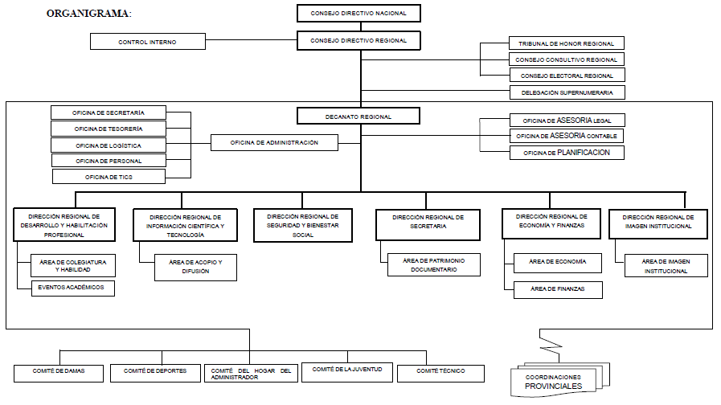

#### B. Descripción Analítica del Organigrama
El organigrama del CORLAD Junín adopta una configuración funcional jerárquica con dependencias lineales de mando y asesorías de staff:
- En la cúspide se ubica la **Asamblea General** y el **Consejo Directivo**, respaldados lateralmente por el **Tribunal de Honor** y comisiones fiscalizadoras.
- La **Decanatura Regional** canaliza las disposiciones a través de la **Gerencia / Administración Regional**, que articula las unidades de apoyo (Logística, Contabilidad, TIC, Legal).
- De la administración se desprenden operativamente las direcciones de línea responsables de la atención directa a los agremiados, la ejecución de eventos, publicaciones y servicios de previsión social.

#### C. Diagrama Mermaid del Organigrama
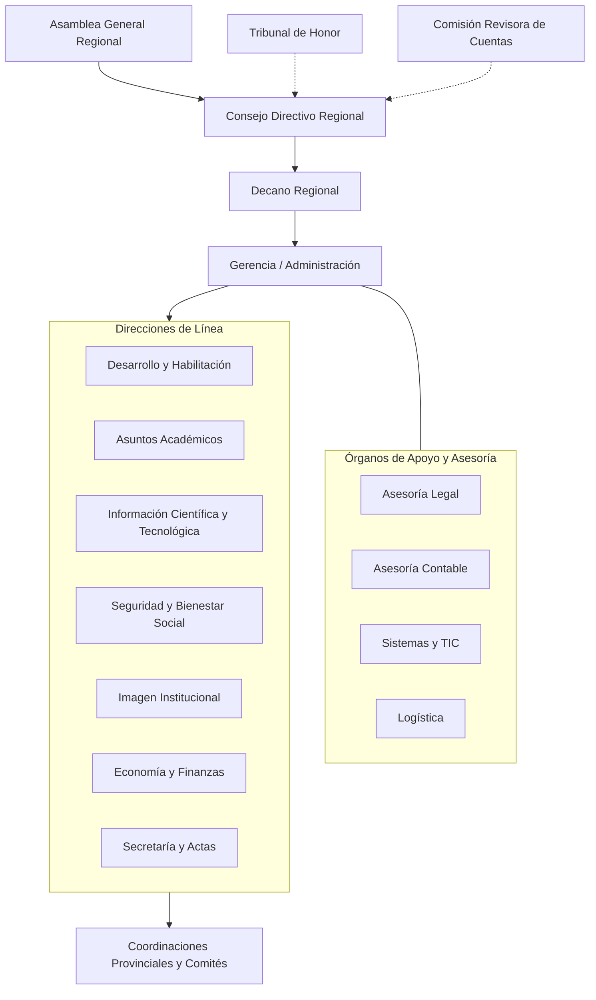

---

## IV. Fundamentación Legal

El Plan Estratégico Institucional se fundamenta en el siguiente marco jurídico y normativo:
- **Constitución Política del Perú:** Artículos referidos al derecho de asociación, ejercicio profesional y colegios profesionales autónomos reconocidos por ley.
- **Decreto Ley N° 22087:** Ley de Creación del Colegio de Licenciados en Administración (CLAD).
- **Decreto Supremo N° 020-2006-ED:** Aprueba el Estatuto General del Colegio de Licenciados en Administración del Perú.
- **Ley N° 31060:** Ley del Ejercicio Profesional del Licenciado en Administración. Establece la obligatoriedad de la colegiatura y habilitación para el ejercicio de la profesión y la docencia universitaria.
- **Estatuto Interno del CORLAD Junín:** Normas de régimen electoral, derechos, obligaciones y fines de la sede regional.
- **VADEMECUM Institucional:** Compendio de normas legales e instrumentos de gestión interna.

---

## V. Ejes Estratégicos

El Plan Estratégico 2021–2025 articula sus objetivos institucionales alrededor de **cuatro (4) Ejes Estratégicos**:

1. **Eje 1: Desarrollo Profesional:** Formación continua, especialización, colegiatura, habilitación profesional e investigación científica.
2. **Eje 2: Fortalecimiento Institucional:** Eficiencia de los procesos internos, modernización de la infraestructura tecnológica, solidez financiera y bienestar del talento humano.
3. **Eje 3: Posicionamiento Institucional:** Liderazgo de opinión, consolidación de la marca CORLAD, alianzas con entidades públicas/privadas y defensa irrestricta de la profesión.
4. **Eje 4: Responsabilidad Social:** Proyección y auxilio mutuo al agremiado, voluntariado profesional, consultorías sociales y contribución al desarrollo sostenible regional.

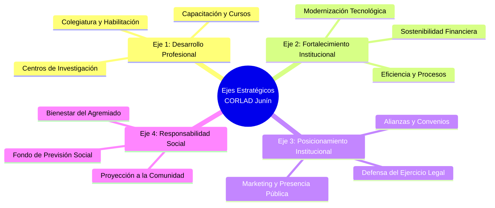

---

## VI. Planeamiento y Diseño Estratégico

### 6.1. Misión
> *"Somos un colegio profesional representativo que vela por el ejercicio ético y autónomo de la profesión, promoviendo el desarrollo profesional y bienestar continuo de nuestros agremiados, contribuyendo a la gestión eficiente, innovadora y sostenible de las organizaciones públicas y privadas de la Región Junín."*

### 6.2. Visión
> *"Al 2025, ser reconocidos como una institución líder a nivel nacional por la excelencia en el desarrollo profesional de nuestros agremiados, referente técnico en ciencias administrativas y actor influyente en la toma de decisiones estratégicas del desarrollo regional y del país."*

### 6.3. Valores Institucionales
- **Ética e Integridad:** Actuación fundamentada en el Código de Ética Profesional, honestidad y probidad moral.
- **Compromiso Social:** Sensibilidad y vocación de servicio hacia la comunidad y las organizaciones regionales.
- **Excelencia e Innovación:** Búsqueda constante de la mejora continua y adaptación tecnológica.
- **Transparencia:** Rendición de cuentas abierta y gestión diáfana en el uso de los recursos.
- **Solidaridad:** Apoyo fraterno entre colegas y asistencia mutua en contingencias.

### 6.4. Principios Rectores
- **Legalidad:** Apego irrestricto a la Ley 31060 y la Constitución Política.
- **Democracia y Participación:** Gobernanza abierta con voz para todos los colegiados.
- **Equidad e Inclusión:** Igualdad de oportunidades y acceso equitativo a servicios institucionales.
- **Competitividad:** Fomento de altos estándares de desempeño técnico y académico.

---

## VII. Diagnóstico Estratégico

### 7.1. Análisis Interno

#### 7.1.1. Matriz AMOFHIT
Evalúa las capacidades operativas internas en las áreas de Administración (A), Marketing (M), Operaciones (O), Finanzas (F), Recursos Humanos (H), Información y TIC (I), y Tecnología (T):

| Área AMOFHIT | Variable Analizada | Sustento Técnico | Fort. (F) | Deb. (D) |
| :--- | :--- | :--- | :---: | :---: |
| **Administración y Gerencia (A)** | Reputación de la alta dirección | El CORLAD Junín cuenta con un Consejo Directivo reconocido por su trayectoria. | **F** | |
| | Calidad del equipo directivo | El consejo directivo posee amplia experiencia en gestión pública y privada. | **F** | |
| | Sistema de planeamiento | Existencia de metas claras plasmadas en el Plan Estratégico Institucional. | **F** | |
| | Manuales y reglamentos | Cuenta con estatutos y directivas vigentes de funcionamiento. | **F** | |
| **Marketing y Ventas (M)** | Política de precios | Ofrece derechos de colegiatura y eventos con tarifas competitivas y accesibles. | **F** | |
| | Participación de mercado | Realiza proyectos y eventos de impacto en el sector empresarial y académico. | **F** | |
| | Difusión y publicidad | Limitado alcance de campañas publicitarias en provincias periféricas. | | **D** |
| | Posicionamiento de marca | La marca institucional necesita mayor recordación en entidades privadas. | | **D** |
| **Operaciones y Logística (O)** | Local institucional propio | Cuenta con infraestructura física céntrica y equipada en Huancayo. | **F** | |
| | Equipamiento tecnológico | Necesidad de modernizar equipos de cómputo y servidores para la demanda actual. | | **D** |
| | Canales de atención | Atención presencial y virtual en Mesa de Partes en proceso de digitalización. | **F** | |
| **Finanzas y Contabilidad (F)** | Flujo de caja institucional | Ingresos sostenidos por cuotas ordinarias y derechos de incorporación. | **F** | |
| | Morosidad en aportaciones | Alto porcentaje de agremiados en condición de no habilitados por deuda. | | **D** |
| | Control presupuestal | Rendiciones de cuentas periódicas y conciliaciones contables al día. | **F** | |
| **Recursos Humanos (H)** | Capacidad de los colaboradores | Personal administrativo con vocación de servicio y conocimiento del trámite. | **F** | |
| | Sistema de incentivos | Escasa política de estímulos económicos y capacitaciones internas para el staff. | | **D** |
| **Sistemas y Tecnología (I-T)** | Oportunidad de información | Emisión oportuna de certificados de habilidad y constancias virtuales. | **F** | |
| | Plataformas virtuales | Implementación del Aula Virtual y modernización de la web institucional. | **F** | |
| | Integración Big Data | Falta de integración automática en tiempo real con la base de datos nacional. | | **D** |

#### 7.1.2. Posicionamiento Valor
El valor fundamental del CORLAD Junín radica en brindar **respaldo legal, credibilidad deontológica, actualización continua y bienestar integral** a los graduados en administración, constituyendo el sello de garantía para el ejercicio lícito de la profesión.

#### 7.1.3. Matriz de Evaluación de Factores Internos (EFI)
Consolida las fortalezas y debilidades identificadas con sus respectivos pesos ponderados:

| Factores Críticos de Éxito Internos | Peso | Calificación (1-4) | Puntuación Ponderada |
| :--- | :---: | :---: | :---: |
| **FORTALEZAS** | | | |
| F1) Miembros del Consejo Directivo con experiencia profesional y solvencia ética | 0.06 | 4 | 0.24 |
| F2) Local institucional propio ubicado estratégicamente en Huancayo | 0.07 | 4 | 0.28 |
| F3) Existencia de marco normativo habilitante (Ley 31060 y D.L. 22087) | 0.08 | 4 | 0.32 |
| F4) Precios accesibles en cuotas y servicios académicos | 0.05 | 3 | 0.15 |
| F5) Convenios estratégicos suscritos con universidades líderes de la región | 0.06 | 3 | 0.18 |
| F6) Personal administrativo con conocimiento de los procedimientos clave | 0.05 | 3 | 0.15 |
| F7) Implementación del portal web y canales de atención virtual | 0.05 | 3 | 0.15 |
| F8) Reconocimiento histórico de la orden profesional en Junín | 0.06 | 3 | 0.18 |
| **DEBILIDADES** | | | |
| D1) Bajo porcentaje de colegiados habilitados (alta morosidad de cuotas) | 0.08 | 1 | 0.08 |
| D2) Limitada infraestructura tecnológica y servidores para soporte masivo | 0.07 | 2 | 0.14 |
| D3) Escasa presencia física y descentralizada en provincias de selva central | 0.06 | 2 | 0.12 |
| D4) Debilidad en la difusión sistemática del portafolio de beneficios gremiales | 0.05 | 2 | 0.10 |
| D5) Limitado número de publicaciones e investigaciones científicas arbitradas | 0.06 | 2 | 0.12 |
| D6) Limitado sistema de control y fiscalización del ejercicio ilegal de la profesión | 0.07 | 1 | 0.07 |
| D7) Ausencia de un centro de asesoría empresarial y de tesis estructurado | 0.06 | 2 | 0.12 |
| D8) Dependencia financiera de eventos extraordinarios de capacitación | 0.07 | 2 | 0.14 |
| **TOTAL** | **1.00** | — | **2.44** |

> *Interpretación EFI:* La puntuación ponderada de **2.44** se sitúa próxima al promedio neutro (2.50), lo que indica una posición interna que requiere superar debilidades estructurales (morosidad, infraestructura tecnológica y fiscalización) para aprovechar al máximo sus sólidas fortalezas institucionales.

---

### 7.2. Análisis Externo

#### 7.2.1. Matriz PESTE
Analiza los factores del macroentorno que impactan al colegio:

| Dimensión | Variable del Entorno | Diagnóstico y Sustento | Oport. (O) | Amen. (A) |
| :--- | :--- | :--- | :---: | :---: |
| **Político-Legal (P)** | Estabilidad y políticas públicas | Exigencia creciente de meritocracia y profesionalización en el sector estatal (SERVIR). | **O** | |
| | Ley N° 31060 | Ley del Ejercicio Profesional exige habilitación formal para cargos administrativos y jefaturas. | **O** | |
| | Inestabilidad política regional | Cambios frecuentes de autoridades que frenan la suscripción de convenios interinstitucionales. | | **A** |
| | Casos de corrupción pública | Afecta la credibilidad general de las instituciones públicas de la región. | | **A** |
| **Económico (E)** | Reactivación económica | Crecimiento de mypes y emprendimientos que demandan consultoría en gestión. | **O** | |
| | Inflación y pérdida adquisitiva | Disminuye la disponibilidad de presupuesto de los agremiados para eventos de capacitación. | | **A** |
| **Social-Cultural (S)** | Crecimiento de egresados | Cientos de nuevos bachilleres de administración egresan anualmente de las universidades. | **O** | |
| | Desinterés por colegiarse | Percepción inicial de algunos jóvenes de que el colegio no brinda beneficios tangibles. | | **A** |
| **Tecnológico (T)** | Transformación digital | Auge de la educación virtual, plataformas de e-learning y firmas digitales. | **O** | |
| | Ciberseguridad y obsolescencia | Riesgo de hackeo o pérdida de datos ante la falta de servidores robustos. | | **A** |
| **Ecológico (E)** | Gestión ambiental y RSE | Demanda de administradores especialistas en gestión ambiental y sostenibilidad. | **O** | |

#### 7.2.2. Cinco Fuerzas de Porter
1. **Rivalidad entre Competidores Existentes (Moderada):** Otros colegios profesionales y asociaciones gremiales privadas compiten por ofertas académicas.
2. **Amenaza de Nuevos Entrantes (Baja):** El CORLAD posee el monopolio legal exclusivo de la colegiatura de Licenciados en Administración por Ley 31060.
3. **Poder de Negociación de los Proveedores (Bajo):** Diversidad de ponentes, consultores y empresas de insumos tecnológicos.
4. **Poder de Negociación de los Clientes/Agremiados (Moderado a Alto):** Los licenciados exigen valor añadido tangible a cambio de sus aportes societarios.
5. **Amenaza de Productos/Servicios Sustitutos (Alta):** Escuelas de posgrado, plataformas de capacitación internacional en línea (Coursera, LinkedIn Learning) y consultoras privadas.

#### 7.2.3. Matriz de Evaluación de Factores Externos (EFE)

| Factores Críticos de Éxito Externos | Peso | Calificación (1-4) | Puntuación Ponderada |
| :--- | :---: | :---: | :---: |
| **OPORTUNIDADES** | | | |
| O1) Ley 31060 que ampara y exige el ejercicio colegiado de la administración | 0.08 | 4 | 0.32 |
| O2) Alto número de bachilleres y egresados de universidades de la región | 0.07 | 4 | 0.28 |
| O3) Apertura de convenios de capacitación con gobiernos locales y GORE Junín | 0.06 | 3 | 0.18 |
| O4) Demanda creciente de certificaciones en gestión pública, logística e inversión | 0.07 | 4 | 0.28 |
| O5) Auge de tecnologías de virtualización para capacitar a bajo costo | 0.06 | 3 | 0.18 |
| O6) Fondo de financiamiento estatal y privado para innovación y RSE | 0.05 | 2 | 0.10 |
| O7) Espacio para posicionar al CORLAD en debates económicos de coyuntura | 0.06 | 3 | 0.18 |
| **AMENAZAS** | | | |
| A1) Informalidad laboral y contratación de profesionales no colegiados | 0.08 | 2 | 0.16 |
| A2) Proliferación de ofertas virtuales de capacitación de bajo costo | 0.07 | 2 | 0.14 |
| A3) Recesión económica y desempleo profesional post-pandemia | 0.07 | 2 | 0.14 |
| A4) Falta de sanciones efectivas por parte de la fiscalía ante ejercicio ilegal | 0.08 | 2 | 0.16 |
| A5) Inestabilidad política y rotación constante de directivos en el sector público | 0.06 | 2 | 0.12 |
| A6) Pérdida de interés de colegiados jóvenes en participar activamente | 0.07 | 2 | 0.14 |
| A7) Ciberataques o fraudes digitales en pagos electrónicos | 0.05 | 2 | 0.10 |
| **TOTAL** | **1.00** | — | **2.57** |

> *Interpretación EFE:* El resultado ponderado de **2.57** supera el promedio general (2.50), demostrando que el entorno externo presenta oportunidades estratégicas altamente aprovechables (amparo legal de la Ley 31060 y demanda académica).

---

### 7.3. Análisis FODA

#### 7.3.1. Matriz FODA Cruzada

```mermaid
quadrantChart
    title Matriz Estratégica FODA - CORLAD Junín
    x-axis Factores Internos (Debilidades --> Fortalezas)
    y-axis Factores Externos (Amenazas --> Oportunidades)
    quadrant-1 Estrategias FO (Crecimiento)
    quadrant-2 Estrategias DO (Reorientación)
    quadrant-3 Estrategias DA (Defensivas)
    quadrant-4 Estrategias FA (Mantenimiento)
```

| Matriz FODA | FORTALEZAS (F) | DEBILIDADES (D) |
| :--- | :--- | :--- |
| | F1) Experiencia y liderazgo del Consejo Directivo.<br>F2) Sede propia céntrica y acondicionada.<br>F3) Amparo legal exclusivo por Ley 31060.<br>F4) Tarifas competitivas en aranceles.<br>F5) Convenios con universidades de prestigio.<br>F6) Portal web y soporte virtual operativo. | D1) Alta tasa de morosidad y no habilitados.<br>D2) Servidores e infraestructura TIC limitada.<br>D3) Poca presencia en provincias de selva.<br>D4) Difusión insuficiente de beneficios gremiales.<br>D5) Pocas publicaciones científicas indizadas.<br>D6) Débil fiscalización de intrusismo profesional. |
| **OPORTUNIDADES (O)**<br>O1) Exigencia legal de colegiatura (Ley 31060).<br>O2) Gran masa de egresados de administración.<br>O3) Convenios con entidades públicas regionales.<br>O4) Demanda de certificaciones en gestión.<br>O5) Virtualización y aulas digitales.<br>O6) Espacio para opinión técnica colegiada. | **ESTRATEGIAS FO (Maxi - Maxi)**<br>• **FO1 (F3, O1, O2):** Implementar campañas masivas de colegiatura vinculadas a convenios universitarios antes del egreso.<br>• **FO2 (F1, F5, O3, O4):** Lanzar diplomados de alta especialización en gestión pública y privada respaldados por universidades.<br>• **FO3 (F2, F6, O5):** Ampliar el alcance de los cursos virtuales a nivel macroregional. | **ESTRATEGIAS DO (Mini - Maxi)**<br>• **DO1 (D1, O1):** Crear planes de refinanciamiento y campañas de amnistía de cuotas para recuperar miembros hábiles.<br>• **DO2 (D2, O5):** Invertir en una plataforma tecnológica integral (Big Data institucional y Aula Virtual robusta).<br>• **DO3 (D3, O3):** Instalar mesas de coordinación descentralizadas en Tarma, Satipo y La Merced. |
| **AMENAZAS (A)**<br>A1) Ejercicio ilegal de la profesión.<br>A2) Competencia desmedida de cursos online.<br>A3) Crisis económica de agremiados.<br>A4) Impunidad ante el intrusismo.<br>A5) Inestabilidad política regional.<br>A6) Desinterés de agremiados jóvenes. | **ESTRATEGIAS FA (Maxi - Mini)**<br>• **FA1 (F3, A1, A4):** Crear la Procuraduría Institucional y Comité de Defensa Profesional para denunciar penalmente el intrusismo.<br>• **FA2 (F4, F5, A2):** Diferenciar los eventos académicos ofreciendo doble certificación y valor curricular oficial.<br>• **FA3 (F1, A6):** Promover el voluntariado profesional y comités juveniles con voz en la gestión. | **ESTRATEGIAS DA (Mini - Mini)**<br>• **DA1 (D1, A3):** Diversificar las fuentes de ingresos hacia consultorías, peritajes y alquiler de ambientes.<br>• **DA2 (D6, A1):** Articular con el Ministerio Público y SUNAFIL operativos de verificación de colegiatura en cargos públicos. |

---

### 7.4. Matriz BCG

Analiza la cartera de servicios ofrecida por el CORLAD Junín en función de su crecimiento y cuota de participación:

| Cuadrante BCG | Servicio Institucional | Situación Estratégica | Decisión Estratégica |
| :--- | :--- | :--- | :--- |
| **Estrella** | **Diplomados, Cursos y Talleres Especializados** | Alto crecimiento de la demanda y alta recaudación para la institución. | Invertir continuamente en ponentes de primer nivel y plataformas virtuales. |
| **Vaca Lechera** | **Colegiaturas y Constancias de Habilidad** | Demanda estable, flujo de caja seguro y baja necesidad de inversión publicitaria. | Mantener y fidelizar el padrón activo; optimizar los trámites de entrega rápida. |
| **Interrogante** | **Centro de Investigación y Revistas Científicas** | Alto potencial de impacto académico, pero baja participación y altos costos iniciales. | Buscar cofinanciamiento con universidades y fondos de investigación del Estado. |
| **Perro** | **Cursos Genéricos Presenciales Tradicionales** | Bajo crecimiento y baja rentabilidad debido a la competencia virtual masiva. | Reestructurar hacia modalidades híbridas o reemplazarlos por certificaciones técnicas. |

---

## VIII. Objetivos Estratégicos

### 8.1. Objetivos Estratégicos Generales
- **OG1:** Ofrecer servicios integrales de colegiatura, habilidades y formación, capacitación, investigación, innovación, asesoramiento y desarrollo profesional, a fin de elevar el desempeño de los agremiados.
- **OG2:** Fortalecer el reconocimiento institucional y la representación del CORLAD Junín ante la sociedad y los estamentos públicos y privados.
- **OG3:** Optimizar la gestión institucional mediante la modernización de los procesos internos, la infraestructura tecnológica y la cultura organizacional.
- **OG4:** Consolidar el posicionamiento de marca, imagen corporativa y la presencia comunicacional en los medios digitales y tradicionales.
- **OG5:** Promover la responsabilidad social, el bienestar gremial y el auxilio mutuo entre los agremiados y su entorno familiar.

### 8.2. Objetivos Estratégicos Específicos
- **OE1.1:** Organizar proyectos y eventos de formación y capacitación profesional de alto nivel académico.
- **OE1.2:** Fomentar e incrementar las colegiaturas y habilitaciones periódicas de los profesionales en administración.
- **OE1.3:** Afianzar el ejercicio de la carrera en sus diversas especialidades (Finanzas, Marketing, Recursos Humanos, Operaciones, Gestión Pública).
- **OE2.1:** Implementar centros de asesoramiento empresarial, investigación aplicada y asesoría de tesis de pre y posgrado.
- **OE3.1:** Modernizar la plataforma tecnológica, digitalizar expedientes e implementar el sistema de gestión por procesos.
- **OE4.1:** Desarrollar campañas integrales de comunicación y marketing institucional para revalorar la profesión.
- **OE5.1:** Ejecutar programas continuos de previsión social, esparcimiento, salud y ayuda solidaria para los miembros de la orden.

---

# IX. Establecimiento Estratégico

A continuación se transcriben y detallan las **siete (7) matrices oficiales del Establecimiento Estratégico** del CORLAD Junín (pp. 34–40), donde se especifican los objetivos, acciones estratégicas, planes operativos, presupuestos asignados y resultados esperados.

---

### Matriz 1: Objetivo General 1 – Objetivo Específico 1.1 y 1.2
#### A. Gráfico Oficial
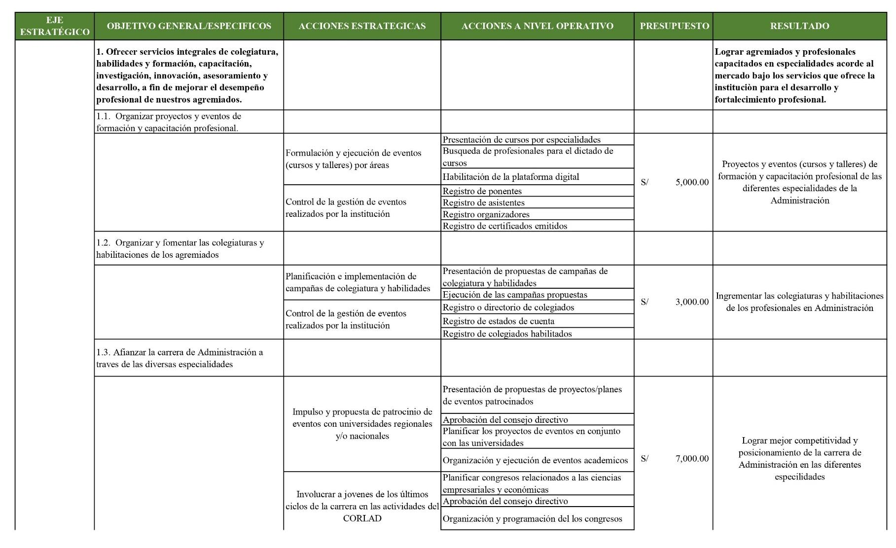

#### B. Matriz Transcrita y Estructurada
| Eje Estratégico | Objetivo General / Específico | Acciones Estratégicas | Acciones a Nivel Operativo | Presupuesto | Resultado Esperado |
| :--- | :--- | :--- | :--- | :---: | :--- |
| **Desarrollo Profesional** | **OG1.** Ofrecer servicios integrales de colegiatura, habilidades, formación, capacitación, investigación, innovación, asesoramiento y desarrollo, a fin de mejorar el desempeño profesional. | Formulación y ejecución de eventos (cursos y talleres) por áreas temáticas. | • Presentación de cursos por especialidades.<br>• Búsqueda de profesionales idóneos para el dictado.<br>• Habilitación de la plataforma digital. | S/ 5,000.00 | Proyectos y eventos de formación y capacitación profesional de las diferentes especialidades de la administración ejecutados. |
| | **OE1.1.** Organizar proyectos y eventos de formación y capacitación profesional. | Control de la gestión de eventos realizados por la institución. | • Registro de ponentes.<br>• Registro de asistentes.<br>• Registro de organizadores.<br>• Registro de certificados emitidos. | Incluido | Cumplimiento del cronograma académico con control de calidad. |
| | **OE1.2.** Organizar y fomentar las colegiaturas y habilitaciones de los agremiados. | Planificación e implementación de campañas de colegiatura y habilidades. | • Presentación de propuestas de campañas.<br>• Ejecución de las campañas propuestas en universidades. | S/ 3,000.00 | Incrementar las colegiaturas y habilitaciones de los profesionales en administración. |
| | | Control de la gestión de colegiaturas realizadas. | • Registro o directorio de colegiados.<br>• Registro de estados de cuenta.<br>• Registro de colegiados habilitados. | Incluido | Base de datos de miembros actualizada y saneada. |
| | **OE1.3.** Afianzar la carrera de administración a través de sus diversas especialidades. | Impulso y propuesta de patrocinio de eventos con universidades regionales y nacionales. | • Propuestas de proyectos/planes de eventos patrocinados.<br>• Aprobación del Consejo Directivo.<br>• Planificar proyectos conjuntos con universidades.<br>• Organización de congresos empresariales. | S/ 7,000.00 | Lograr mejor competitividad y posicionamiento de la carrera en sus diferentes especialidades. |

#### C. Descripción y Análisis del Establecimiento Estratégico 1
Esta matriz compromete un presupuesto de **S/ 15,000.00** destinado al núcleo misional del colegio. Articula la capacitación continua mediante cursos de posgrado y especialización, el impulso de colegiaturas con ferias universitarias y el patrocinio de congresos macroregionales, estableciendo como requisito el control estricto de registros de ponentes, participantes y padrones de habilitación.

---

### Matriz 2: Objetivo General 1 – Objetivo Específico 1.4
#### A. Gráfico Oficial
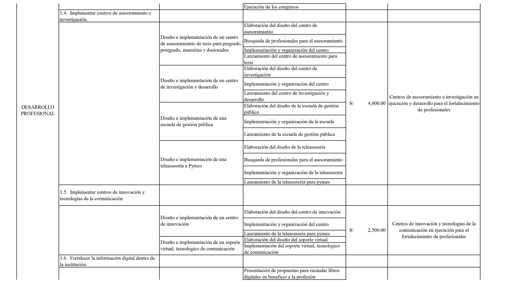

#### B. Matriz Transcrita y Estructurada
| Eje Estratégico | Objetivo General / Específico | Acciones Estratégicas | Acciones a Nivel Operativo | Presupuesto | Resultado Esperado |
| :--- | :--- | :--- | :--- | :---: | :--- |
| **Desarrollo Profesional** | **OE1.4.** Implementar centros de asesoramiento e investigación aplicada. | Diseño e implementación de un centro de asesoramiento de tesis para pregrado, posgrado, maestrías y doctorado. | • Convocatoria y selección de asesores metodológicos y temáticos.<br>• Aprobación de tarifario y líneas de investigación institucional.<br>• Campaña de difusión de asesorías de tesis. | S/ 6,000.00 | Centro de asesoramiento de tesis operando con tesis aprobadas y sustentadas con éxito. |
| | | Diseño e implementación de un centro de investigación y desarrollo empresarial. | • Formulación del reglamento de investigación.<br>• Constitución del comité editorial y científico.<br>• Convocatoria a investigadores y publicación de artículos. | S/ 4,000.00 | Revistas científicas y boletines indexados del CORLAD Junín publicados periódicamente. |

#### C. Descripción y Análisis del Establecimiento Estratégico 2
Con un presupuesto de **S/ 10,000.00**, esta matriz abre una nueva línea de servicios: la orientación en graduación y titulación profesional y el fomento de la producción científica, convirtiendo al CORLAD en un referente de investigación en ciencias de la administración.

---

### Matriz 3: Objetivo General 2 – Objetivo Específico 2.1 y 2.2
#### A. Gráfico Oficial
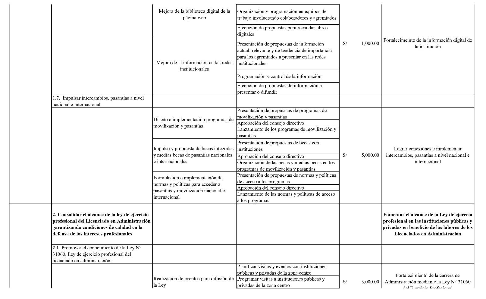

#### B. Matriz Transcrita y Estructurada
| Eje Estratégico | Objetivo General / Específico | Acciones Estratégicas | Acciones a Nivel Operativo | Presupuesto | Resultado Esperado |
| :--- | :--- | :--- | :--- | :---: | :--- |
| **Fortalecimiento Institucional** | **OG2.** Fortalecer la presencia e influencia del CORLAD Junín en el ámbito regional y nacional. | Suscripción de convenios interinstitucionales de cooperación mutua. | • Mapeo de entidades públicas y gremios empresariales.<br>• Formulación y negociación de convenios marco y específicos.<br>• Monitoreo de compromisos interinstitucionales. | S/ 3,500.00 | Alianzas sólidas con el Gobierno Regional, municipalidades y cámaras de comercio. |
| | **OE2.1.** Defender el ejercicio profesional y combatir el intrusismo. | Vigilancia del cumplimiento de la Ley 31060 en entidades públicas y privadas. | • Conformación del Comité de Defensa Profesional.<br>• Fiscalización de convocatorias laborales (CAP/CAS).<br>• Acciones legales y denuncias por ejercicio ilegal. | S/ 2,500.00 | Cautela irrestricta de las plazas para licenciados colegiados y habilitados. |

#### C. Descripción y Análisis del Establecimiento Estratégico 3
Asigna **S/ 6,000.00** a la defensa gremial y las alianzas estratégicas. Pone énfasis en la aplicabilidad vinculante de la Ley 31060, impidiendo que plazas de administración en el Estado sean ocupadas por personal no colegiado.

---

### Matriz 4: Objetivo General 3 – Objetivo Específico 3.1
#### A. Gráfico Oficial
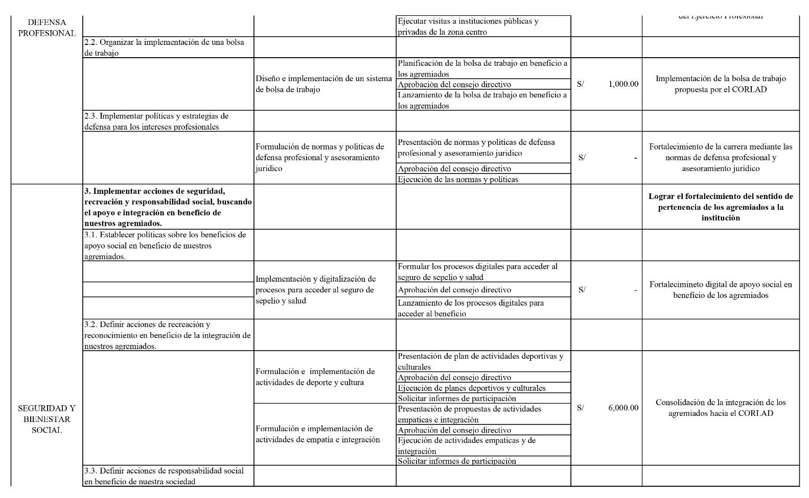

#### B. Matriz Transcrita y Estructurada
| Eje Estratégico | Objetivo General / Específico | Acciones Estratégicas | Acciones a Nivel Operativo | Presupuesto | Resultado Esperado |
| :--- | :--- | :--- | :--- | :---: | :--- |
| **Fortalecimiento Institucional** | **OG3.** Modernizar la gestión administrativa y tecnológica del CORLAD Junín. | Implementación del sistema integrado de gestión por procesos y calidad. | • Mapeo y formalización de los 16 procesos institucionales.<br>• Estandarización de fichas SIPOC y flujogramas.<br>• Auditorías de servicio y simplificación de trámites. | S/ 8,000.00 | Gestión por procesos operando bajo estándares de eficiencia y calidad. |
| | **OE3.1.** Modernización y transformación digital institucional. | Renovación de la infraestructura informática y plataforma digital. | • Adquisición de servidores y computadoras de alta velocidad.<br>• Desarrollo de la Big Data regional y base única de colegiados.<br>• Implementación de mesa de partes virtual y pasarela de pagos. | S/ 10,000.00 | Servicios 100% digitales, reducción de tiempos de atención y base de datos integrada. |

#### C. Descripción y Análisis del Establecimiento Estratégico 4
Con una inversión sustancial de **S/ 18,000.00**, aborda la digitalización integral del colegio: migración hacia la gestión por procesos, compra de servidores y habilitación de trámites en línea para agilizar pagos y certificaciones.

---

### Matriz 5: Objetivo General 3 – Objetivo Específico 3.2
#### A. Gráfico Oficial
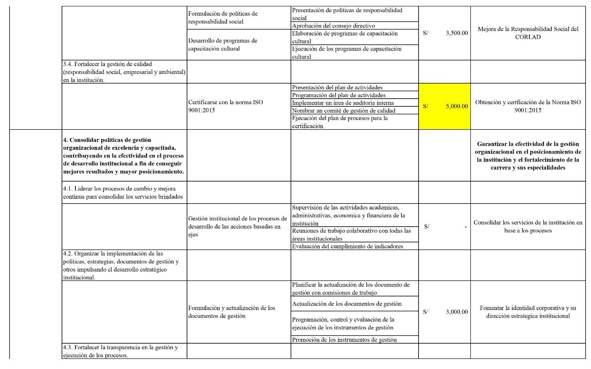

#### B. Matriz Transcrita y Estructurada
| Eje Estratégico | Objetivo General / Específico | Acciones Estratégicas | Acciones a Nivel Operativo | Presupuesto | Resultado Esperado |
| :--- | :--- | :--- | :--- | :---: | :--- |
| **Fortalecimiento Institucional** | **OE3.2.** Fortalecer el clima organizacional y las competencias del personal. | Capacitación continua y evaluación del talento humano interno. | • Diagnóstico de clima laboral y necesidades de capacitación.<br>• Talleres en atención al usuario y herramientas digitales.<br>• Evaluación semestral del desempeño laboral. | S/ 4,000.00 | Personal administrativo altamente capacitado, motivado y con vocación de servicio. |
| | | Mantenimiento, remodelación y equipamiento del local institucional. | • Mantenimiento preventivo y correctivo de ambientes.<br>• Acondicionamiento de salas de sesiones y auditorio.<br>• Adquisición de mobiliario ergonómico. | S/ 4,000.00 | Instalaciones modernas, seguras y confortables para directivos, personal y colegiados. |

#### C. Descripción y Análisis del Establecimiento Estratégico 5
Contempla **S/ 8,000.00** para el fortalecimiento del capital humano y el acondicionamiento de las instalaciones físicas, garantizando un ambiente propicio para la atención y el trabajo directivo.

---

### Matriz 6: Objetivo General 4 – Objetivo Específico 4.1
#### A. Gráfico Oficial
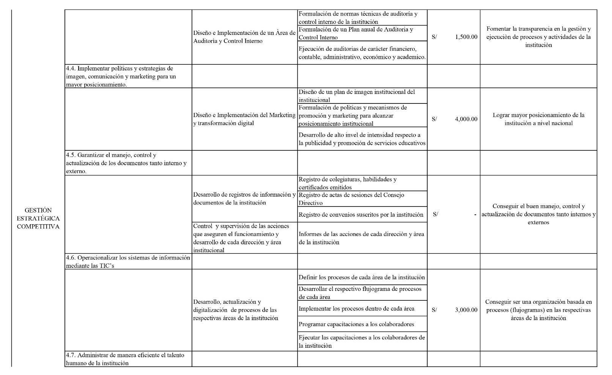

#### B. Matriz Transcrita y Estructurada
| Eje Estratégico | Objetivo General / Específico | Acciones Estratégicas | Acciones a Nivel Operativo | Presupuesto | Resultado Esperado |
| :--- | :--- | :--- | :--- | :---: | :--- |
| **Posicionamiento Institucional** | **OG4.** Consolidar la imagen pública y el liderazgo de opinión del colegio. | Plan integral de comunicación corporativa y marketing de contenidos. | • Elaboración de spots y contenidos audiovisuales.<br>• Campañas de pauta en redes sociales y medios de prensa.<br>• Cobertura en vivo de ceremonias y conferencias. | S/ 7,000.00 | Alto posicionamiento y visibilidad de la marca CORLAD Junín en la región. |
| | **OE4.1.** Pronunciamiento técnico y presencia en el debate regional. | Emisión de opiniones técnicas sobre temas de gestión pública y economía. | • Conformación de comisiones técnicas de pronunciamiento.<br>• Conferencias de prensa y entrevistas en medios.<br>• Publicación de boletines de opinión económica. | S/ 5,000.00 | Reconocimiento del CORLAD como referente técnico y voz consultiva regional. |

#### C. Descripción y Análisis del Establecimiento Estratégico 6
Destina **S/ 12,000.00** a la comunicación estratégica y al liderazgo de opinión pública, posicionando a los administradores en el centro del debate socioeconómico regional.

---

### Matriz 7: Objetivo General 5 – Objetivo Específico 5.1
#### A. Gráfico Oficial
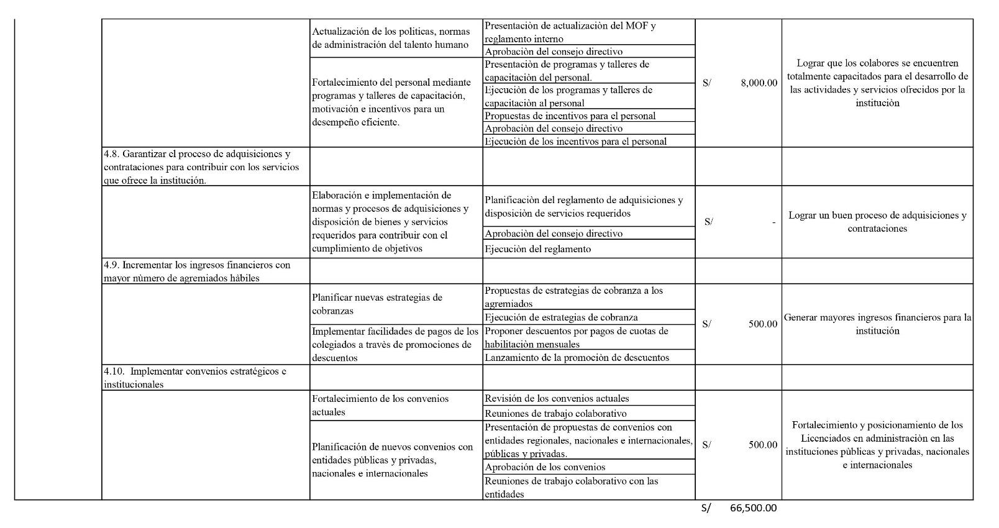

#### B. Matriz Transcrita y Estructurada
| Eje Estratégico | Objetivo General / Específico | Acciones Estratégicas | Acciones a Nivel Operativo | Presupuesto | Resultado Esperado |
| :--- | :--- | :--- | :--- | :---: | :--- |
| **Responsabilidad Social** | **OG5.** Desarrollar programas de previsión, auxilio mutuo e integración gremial. | Fortalecimiento del Fondo de Previsión Social y auxilio solidario. | • Actualización del padrón del fondo de auxilio mutuo.<br>• Atención oportuna de solicitudes de auxilio económico.<br>• Campañas médicas preventivas para agremiados. | S/ 5,000.00 | Miembros protegidos con asistencia solidaria oportuna ante contingencias. |
| | **OE5.1.** Actividades de integración deportiva, cultural y voluntariado. | Ejecución de jornadas de integración, campeonatos y voluntariado social. | • Organización del campeonato deportivo del Administrador.<br>• Actividades de agasajo (Día del Administrador, Navidad).<br>• Asesorías gratuitas en gestión para comedores y mypes. | S/ 4,000.00 | Alto nivel de integración, camaradería e impacto social en la comunidad. |

#### C. Descripción y Análisis del Establecimiento Estratégico 7
Asigna **S/ 9,000.00** a la dimensión humana y solidaria del gremio, garantizando asistencia económica, actividades de confraternidad y programas de consultoría voluntaria a organizaciones vulnerables.

---

# X. Cuadro de Mando Integral (Balanced Scorecard 2021–2025)

El **Cuadro de Mando Integral (CMI)** del CORLAD Junín operacionaliza la estrategia a través de cuatro perspectivas interdependientes, incorporando una **semaforización de control**:
- 🟢 **Verde Oscuro (Valores Positivos):** Cumplimiento $\ge 85\%$ (Seguimiento y Control).
- 🟡 **Amarillo (Valores Estacionarios):** Cumplimiento entre $70\%$ y $84\%$ (Reevaluación de Acciones).
- 🔴 **Rojo (Valores Negativos):** Cumplimiento $< 70\%$ (Alerta Crítica y Reingeniería).

---

### Matriz CMI 1: Eje Desarrollo Profesional (Perspectiva Financiera / Clientes)
#### A. Gráfico Oficial
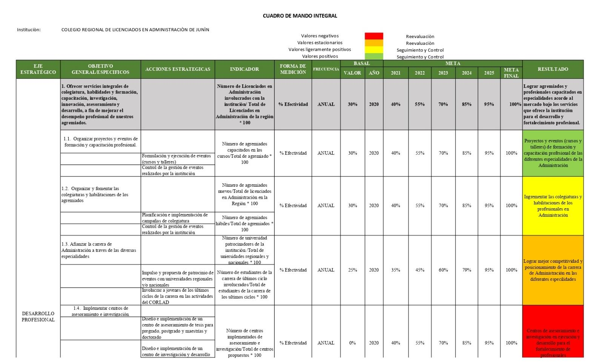

#### B. Matriz Transcrita y Estructurada
| Eje | Objetivo | Acciones Estratégicas | Indicador | Forma de Medición | Frec. | Basal 2020 | Meta 2021 | Meta 2022 | Meta 2023 | Meta 2024 | Meta 2025 | Meta Final | Resultado |
| :--- | :--- | :--- | :--- | :--- | :---: | :---: | :---: | :---: | :---: | :---: | :---: | :---: | :--- |
| **Desarrollo Profesional** | **OG1.** Ofrecer servicios integrales de colegiatura, habilidades, formación y asesoramiento. | Formulación y ejecución de eventos (cursos y talleres). | $$\frac{\text{N° licenciados involucrados}}{\text{Total licenciados región}} \times 100$$ | % Efectividad | Anual | 30% | 40% | 55% | 70% | 85% | 95% | 100% | Agremiados capacitados acorde al mercado. |
| | **OE1.1.** Proyectos y eventos de capacitación. | Control de gestión de eventos institucionales. | $$\frac{\text{N° agremiados capacitados}}{\text{Total agremiados}} \times 100$$ | % Efectividad | Anual | 30% | 40% | 55% | 70% | 85% | 95% | 100% | Eventos por especialidad ejecutados con éxito. |
| | **OE1.2.** Fomentar colegiaturas y habilidades. | Campañas de colegiatura y habilitaciones. | $$\frac{\text{N° nuevos colegiados}}{\text{Total titulados región}} \times 100$$ | % Efectividad | Anual | 30% | 40% | 55% | 70% | 85% | 95% | 100% | Incremento sostenido del padrón activo. |
| | | Control de agremiados habilitados. | $$\frac{\text{N° agremiados hábiles}}{\text{Total agremiados}} \times 100$$ | % Efectividad | Anual | 30% | 40% | 55% | 70% | 85% | 95% | 100% | Reducción drástica de la tasa de morosidad. |
| | **OE1.3.** Afianzar carrera en diversas especialidades. | Propuesta de patrocinio con universidades. | $$\frac{\text{N° universidades aliadas}}{\text{Total universidades región}} \times 100$$ | % Efectividad | Anual | 25% | 35% | 45% | 60% | 79% | 95% | 100% | Mejor competitividad y prestigio académico. |
| | **OE1.4.** Centros de asesoramiento e investigación. | Implementación de centros de tesis e I+D. | $$\frac{\text{N° centros implementados}}{\text{Total centros propuestos}} \times 100$$ | % Efectividad | Anual | 0% | 40% | 55% | 70% | 85% | 95% | 100% | Centros operando con tesis y publicaciones. |

---

### Matriz CMI 2: Eje Fortalecimiento Institucional (Perspectiva de Procesos Internos)
#### A. Gráfico Oficial
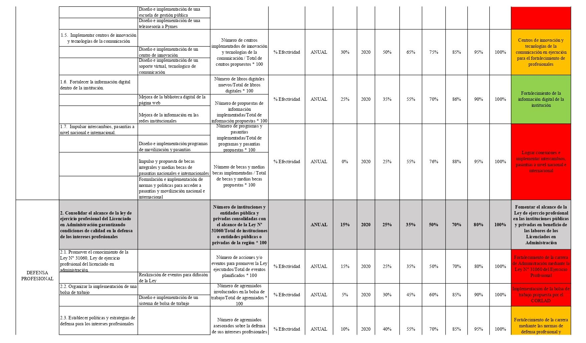

#### B. Matriz Transcrita y Estructurada
| Eje | Objetivo | Acciones Estratégicas | Indicador | Forma de Medición | Frec. | Basal 2020 | Meta 2021 | Meta 2022 | Meta 2023 | Meta 2024 | Meta 2025 | Meta Final | Resultado |
| :--- | :--- | :--- | :--- | :--- | :---: | :---: | :---: | :---: | :---: | :---: | :---: | :---: | :--- |
| **Fortalecimiento Institucional** | **OG2.** Fortalecer la representación y el prestigio del colegio. | Gestión de convenios de cooperación interinstitucional. | $$\frac{\text{N° convenios suscritos}}{\text{Total convenios proyectados}} \times 100$$ | % Efectividad | Anual | 20% | 35% | 50% | 65% | 80% | 95% | 100% | Alianzas operativas con entidades clave. |
| | **OE2.1.** Defensa del ejercicio profesional. | Fiscalización de convocatorias y denuncias por intrusismo. | $$\frac{\text{N° intervenciones realizadas}}{\text{Total convocatorias irregulares}} \times 100$$ | % Efectividad | Anual | 15% | 30% | 50% | 70% | 85% | 95% | 100% | Plazas reservadas por Ley para colegiados. |
| | **OG3.** Modernización de la gestión administrativa. | Implementación de la gestión por procesos y calidad. | $$\frac{\text{N° procesos formalizados}}{\text{Total 16 procesos institucionales}} \times 100$$ | % Efectividad | Anual | 20% | 50% | 75% | 90% | 100% | 100% | 100% | Procesos estandarizados y certificados. |
| | **OE3.1.** Digitalización e infraestructura TIC. | Adquisición de servidores y software integrado. | $$\frac{\text{N° módulos digitales activos}}{\text{Total módulos requeridos}} \times 100$$ | % Efectividad | Anual | 25% | 45% | 65% | 80% | 90% | 100% | 100% | Trámites y pagos 100% automatizados. |

---

### Matriz CMI 3: Eje Posicionamiento Institucional (Perspectiva Clientes y Mercado)
#### A. Gráfico Oficial
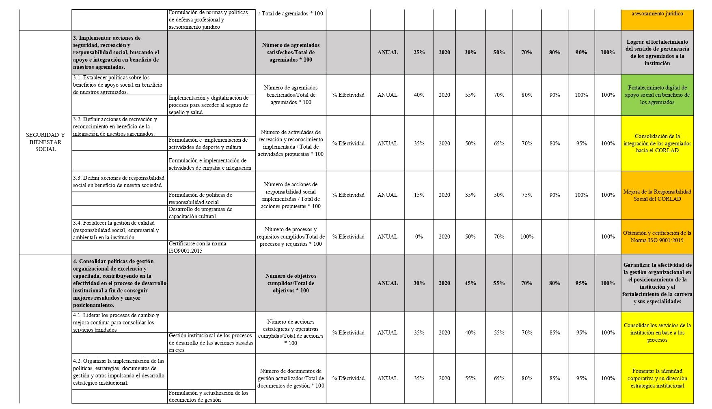

#### B. Matriz Transcrita y Estructurada
| Eje | Objetivo | Acciones Estratégicas | Indicador | Forma de Medición | Frec. | Basal 2020 | Meta 2021 | Meta 2022 | Meta 2023 | Meta 2024 | Meta 2025 | Meta Final | Resultado |
| :--- | :--- | :--- | :--- | :--- | :---: | :---: | :---: | :---: | :---: | :---: | :---: | :---: | :--- |
| **Posicionamiento Institucional** | **OG4.** Consolidar imagen corporativa y liderazgo de opinión. | Campañas de marketing digital y contenidos de valor. | $$\frac{\text{Alcance mensual en redes}}{\text{Población objetivo regional}} \times 100$$ | % Cobertura | Semestral | 20% | 40% | 55% | 70% | 85% | 95% | 100% | Alto reconocimiento de marca en la sociedad. |
| | **OE4.1.** Pronunciamiento técnico colegiado. | Emisión de análisis y opinión técnica sobre coyuntura. | $$\frac{\text{N° pronunciamientos emitidos}}{\text{Sucesos económicos relevantes}} \times 100$$ | % Efectividad | Semestral | 10% | 30% | 50% | 70% | 85% | 95% | 100% | Presencia influyente en debates de desarrollo regional. |

---

### Matriz CMI 4: Eje Responsabilidad Social (Perspectiva Social y Aprendizaje)
#### A. Gráfico Oficial
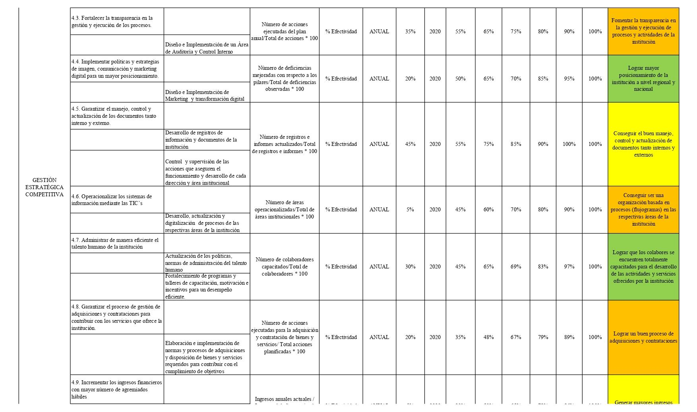

#### B. Matriz Transcrita y Estructurada
| Eje | Objetivo | Acciones Estratégicas | Indicador | Forma de Medición | Frec. | Basal 2020 | Meta 2021 | Meta 2022 | Meta 2023 | Meta 2024 | Meta 2025 | Meta Final | Resultado |
| :--- | :--- | :--- | :--- | :--- | :---: | :---: | :---: | :---: | :---: | :---: | :---: | :---: | :--- |
| **Responsabilidad Social** | **OG5.** Desarrollar programas de previsión social y auxilio mutuo. | Administración del Fondo de Previsión Social. | $$\frac{\text{N° solicitudes atendidas}}{\text{Total solicitudes viables}} \times 100$$ | % Efectividad | Trimestral | 40% | 60% | 75% | 85% | 95% | 100% | 100% | Asistencia económica oportuna a familias. |
| | **OE5.1.** Actividades de integración y voluntariado. | Realización de campeonatos y consultorías sociales. | $$\frac{\text{N° agremiados participantes}}{\text{Padrón hábil regional}} \times 100$$ | % Participación | Semestral | 25% | 40% | 55% | 70% | 85% | 95% | 100% | Fuerte identidad gremial y proyección comunitaria. |

---

### Matriz CMI 5: Consolidado de Metas e Impacto Institucional
#### A. Gráfico Oficial
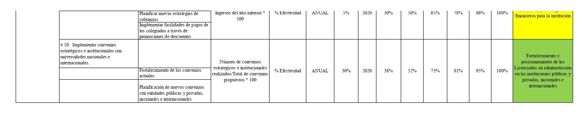

#### B. Descripción Analítica del Sistema de Control
La matriz consolidada resume el impacto global de la estrategia hacia el 2025:
1. **Trayectoria Quinquenal Progresiva:** Todos los indicadores parten de un valor basal 2020 (marcado por la pandemia y la desactualización) de entre 0% y 30%, escalando de manera planificada y sostenible hasta superar el 95% en 2025.
2. **Tablero de Control para Toma de Decisiones:** Facilita a la Decanatura y la Oficina de Planificación monitorear en tiempo real los desvíos entre lo planificado y lo ejecutado, aplicando medidas correctivas inmediatas ante señales de semáforo amarillo o rojo.

---

# Anexos

---

## Anexo 1: Plan de Trabajo – Modelo de Gestión Competitiva

### Gráfico Oficial del Plan de Trabajo
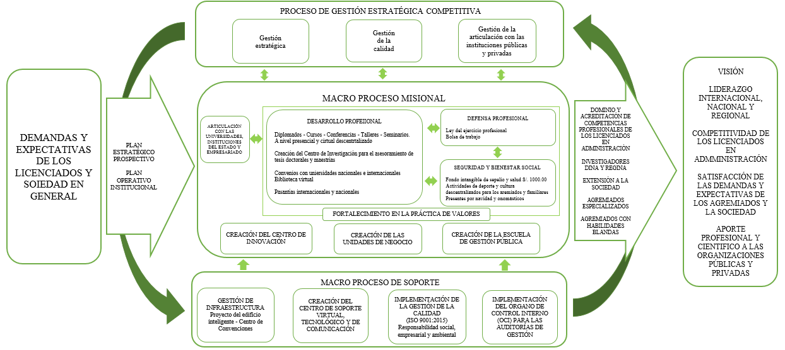

### Descripción del Modelo
Representa la articulación secuencial del modelo de gestión competitiva del CORLAD Junín:
1. **Fase de Entrada / Diagnóstico:** Análisis del entorno, recojo de expectativas de los agremiados y estado de la profesión.
2. **Fase de Transformación / Procesos:** Aplicación del ciclo PHVA en los 16 procesos institucionales, asegurando calidad en el servicio.
3. **Fase de Salida / Resultados:** Administradores altamente capacitados, ejercicio profesional ético y posicionamiento del CORLAD Junín como referente institucional de desarrollo regional.

---

## Anexo 2: Cuestionario de Diagnóstico Externo – Comunicación Externa

### Ficha Técnica del Instrumento
- **Objetivo:** Recoger la percepción de los agremiados y del público sobre los canales de comunicación y difusión del CORLAD Junín.
- **Escala de Medición:** Escala Likert de 5 niveles (1: Muy en Desacuerdo, 2: En Desacuerdo, 3: Indiferente, 4: De Acuerdo, 5: Muy de Acuerdo).

### Ítems del Cuestionario
1. ¿La información que publica el CORLAD Junín a través de sus redes sociales es clara y oportuna?
2. ¿Los canales de atención virtual (WhatsApp, correo, página web) responden con rapidez a sus consultas?
3. ¿Conoce con claridad los requisitos y beneficios para tramitar su colegiatura y constancia de habilidad?
4. ¿Los comunicados y pronunciamientos del colegio reflejan una postura técnica y constructiva frente a la coyuntura regional?
5. ¿Considera adecuada la frecuencia y diseño de los afiches y material informativo de los eventos académicos?

---

## Anexo 3: Cuestionario de Diagnóstico Externo – Satisfacción

### Ficha Técnica del Instrumento
- **Objetivo:** Evaluar el grado de satisfacción global de los usuarios respecto a los servicios institucionales recibidos.
- **Escala de Medición:** Escala de 1 a 5 (1: Muy Insatisfecho a 5: Muy Satisfecho).

### Ítems del Cuestionario
1. Grado de satisfacción con la atención brindada por el personal de Mesa de Partes y Secretaría.
2. Grado de satisfacción con los trámites y tiempos de entrega del diploma de colegiatura y carnet profesional.
3. Nivel de satisfacción con la calidad técnica, metodología y ponentes de los eventos de capacitación académica.
4. Percepción sobre las cuotas y tarifas cobradas en relación con los beneficios gremiales recibidos.
5. Grado de satisfacción con las actividades recreativas, culturales y de auxilio mutuo organizadas por la institución.

---

## Anexo 4: Cuestionario de Diagnóstico Interno – Toma de Decisiones

### Ficha Técnica del Instrumento
- **Objetivo:** Analizar la fluidez y eficacia del proceso decisorio interno entre el Consejo Directivo y los directores de área.
- **Población Objetivo:** Miembros del Consejo Directivo, directores de comités y personal administrativo.

### Ítems del Cuestionario
1. Las decisiones estratégicas tomadas por la Decanatura y el Consejo Directivo son debidamente sustentadas y comunicadas a las áreas operativas.
2. Se fomenta la participación y el aporte técnico de los directores de línea antes de aprobar resoluciones de relevancia.
3. Los plazos para resolver expedientes administrativos y consultas legales son adecuados y oportunos.
4. Se cuenta con información confiable y en tiempo real (Big Data / Contabilidad) para respaldar la toma de decisiones.

---

## Anexo 5: Cuestionario de Diagnóstico Interno – Comunicación Interna

### Ficha Técnica del Instrumento
- **Objetivo:** Diagnosticar el clima laboral, la coordinación interdepartamental y la transmisión de información entre colaboradores.

### Ítems del Cuestionario
1. La comunicación entre la Gerencia / Administración y las diversas áreas operativas es fluida y transparente.
2. Se realizan reuniones periódicas de coordinación para evaluar el avance del plan operativo anual.
3. El personal conoce claramente las funciones asignadas a su puesto según el Manual de Organización y Funciones.
4. Existen canales formales y efectivos para retroalimentar, presentar sugerencias o reportar incidencias internas.