# Propuesta de Modelo de Gestión por Procesos del CORLAD Junín
## Anexo 6: Caracterización y Flujogramas de los Procesos Institucionales

> **Institución:** Colegio Regional de Licenciados en Administración (CORLAD) Junín  
> **Documento Original:** `corlad procesos institucionales.pdf` (pp. 132–180)  
> **Estructura:** 16 Procesos Institucionales organizados en 3 Macroprocesos (Estratégicos, Misionales/Principales y de Apoyo).  
> **Componentes por Proceso:** Ficha de Identificación, Matriz de Caracterización (Ciclo PHVA / SIPOC), Recursos, Documentos Asociados, Registros, Indicadores de Gestión, Flujograma Oficial en Alta Resolución (.jpeg), Descripción Secuencial Detallada del Proceso y Diagrama Interactivo Mermaid.

---

## Tabla de Contenidos

### I. Procesos Estratégicos
- [01. Proceso de Gestión Estratégica](#01-proceso-de-gestión-estratégica)
- [02. Proceso de Gestión de Calidad](#02-proceso-de-gestión-de-calidad)
- [03. Proceso de Gestión de Personal](#03-proceso-de-gestión-de-personal)
- [04. Proceso de Gestión de Articulación con las Instituciones Públicas](#04-proceso-de-gestión-de-articulación-con-las-instituciones-públicas)

### II. Procesos Misionales y/o Principales
- [05. Proceso de Colegiatura y Habilitación Profesional](#05-proceso-de-colegiatura-y-habilitación-profesional)
- [06. Proceso de Eventos Académicos](#06-proceso-de-eventos-académicos)
- [07. Proceso de Seguridad y Bienestar Social](#07-proceso-de-seguridad-y-bienestar-social)
- [08. Proceso de Información Científica y Tecnológica](#08-proceso-de-información-científica-y-tecnológica)
- [09. Proceso de Imagen Institucional](#09-proceso-de-imagen-institucional)
- [10. Proceso de Economía y Finanzas](#10-proceso-de-economía-y-finanzas)
- [11. Proceso de Secretaría y Actas](#11-proceso-de-secretaría-y-actas)

### III. Procesos de Apoyo
- [12. Proceso de Gestión Asesoría Legal](#12-proceso-de-gestión-asesoría-legal)
- [13. Proceso de Gestión Contable](#13-proceso-de-gestión-contable)
- [14. Proceso de Gestión Logística](#14-proceso-de-gestión-logística)
- [15. Proceso de Tecnología de la Información y Comunicación](#15-proceso-de-tecnología-de-la-información-y-comunicación)
- [16. Proceso de Tribunal de Honor](#16-proceso-de-tribunal-de-honor)

---

# I. PROCESOS ESTRATÉGICOS

---

## 01. Proceso de Gestión Estratégica

### 1. Ficha de Identificación del Proceso
| Parámetro | Detalle |
| :--- | :--- |
| **Macroproceso:** | Procesos Estratégicos |
| **Nombre del Proceso:** | Gestión Estratégica |
| **Responsable del Proceso:** | Decano Regional de Junín |
| **Objetivo del Proceso:** | Direccionar y conducir a la institución hacia un desarrollo competitivo y profesional. |
| **Alcance del Proceso:** | El proceso inicia con la presentación de estrategias y culmina con la aplicación y análisis de resultados. |

### 2. Matriz de Caracterización (Ciclo PHVA / SIPOC)
| Entradas | Proveedor | PHVA | Actividad | Responsable | Salida | Beneficiarios |
| :--- | :--- | :---: | :--- | :--- | :--- | :--- |
| Solicitud | Asistente administrativo | **P** | El asistente administrativo recluta información de todas las áreas del CORLAD Junín y realiza un informe general. | Asistente administrativo / Encargado de cada área | De acuerdo al progreso de la institución | Administrador |
| Verificación de información y envío de datos | Administrador | **P** | El administrador verifica y corrige la información brindada por el asistente. | Administrador | Solicitud para generar estrategias de gestión | Decanatura |
| Formulación y presentación del plan de trabajo | Decanatura | **H** | Elaboración de estrategias para la dirección y mejoramiento del CORLAD Junín. Elaboración del plan de trabajo anual. | Decano / Consejo directivo | Plan de trabajo del decano | CORLAD Junín |
| Comunicación del plan de trabajo | Consejo directivo | **V** | Se elabora el plan de trabajo de cada dirección. La elaboración del plan operativo y el presupuesto para reenviar al administrador. | Administración / Directivos | Planes de trabajo de cada dirección | Administración |
| Realiza el envío y da a conocer los planes de trabajo y aplicar en cada dirección y área según corresponda | Administración | **A** | Da a conocer mediante un informe o una reunión los planes de trabajo y las estrategias elaboradas. | Directivos de cada área / Administrador | Aplicar en toda la institución | Áreas del CORLAD Junín |

### 3. Recursos del Proceso
- **Humano:** Decano, Consejo Directivo, Administrador, Asistente administrativo, Encargado de cada área.
- **Infraestructura:** Instalaciones del CORLAD Junín. Mobiliario, equipos y materiales de escritorio.
- **Ambiente de Trabajo:** Oficina de decanatura, Sala de sesiones, Oficinas administrativas.

### 4. Documentos Asociados
- **Internos:**
  - Estatuto del CORLAD Junín.
  - Plan estratégico del CORLAD Junín.
  - VADEMECUM (Normas legales e instrumentos de gestión).
  - Reglamento interno del CORLAD Junín.
- **Externos:**
  - Reglamento del CLAD (Colegio de Licenciados en Administración del Perú).

### 5. Registros
- Página web del CORLAD Junín.
- Documentación física archivada.

### 6. Indicadores de Gestión
| Nombre del Indicador | Fórmula del Indicador | Meta | Frecuencia de Medición |
| :--- | :--- | :---: | :---: |
| **Porcentaje de cumplimiento de objetivos** | $$\frac{\text{Objetivos cumplidos}}{\text{Objetivos planteados}} \times 100$$ | 80% | Anual |

### 7. Flujograma del Proceso

#### A. Gráfico Oficial del Flujograma
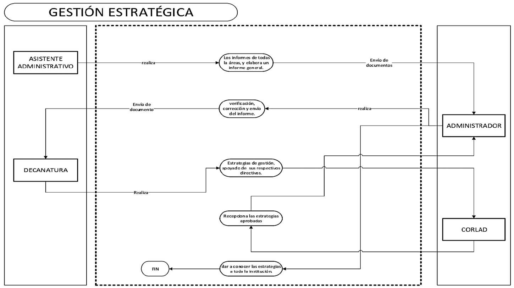

#### B. Descripción Detallada del Proceso y Flujo de Actividades
El proceso de **Gestión Estratégica** orienta el rumbo directivo y operativo del CORLAD Junín, asegurando que los lineamientos aprobados por el Consejo Directivo y la Decanatura se traduzcan en planes de acción coordinados en todas las áreas.

1. **Actores y Carriles de Responsabilidad (Swimlanes):**
   - **Asistente Administrativo:** Responsable de compilar y consolidar las necesidades y reportes de base de las áreas operativas.
   - **Administrador:** Actúa como articulador técnico; revisa, valida, presupuesta y coordina la ejecución de las disposiciones.
   - **Decanatura (y Consejo Directivo):** Máxima instancia ejecutiva regional que formula las directrices estratégicas y aprueba los planes de trabajo.
   - **CORLAD (Direcciones y Áreas Institucionales):** Unidades orgánicas beneficiarias y ejecutoras de los lineamientos.

2. **Narrativa Secuencial del Proceso (Paso a Paso):**
   - **Paso 1 (Recopilación Inicial):** El *Asistente Administrativo* recaba la información situacional y requerimientos de todas las áreas del CORLAD Junín, estructurando un informe general de diagnóstico.
   - **Paso 2 (Envío y Revisión Administrativa):** El *Asistente* envía el informe general al *Administrador*. Este último procede con la verificación, análisis cuantitativo, corrección de inconsistencias y validación técnica del expediente.
   - **Paso 3 (Elevación a Decanatura):** El *Administrador* remite el informe debidamente visado a la *Decanatura*, solicitando la fijación de las directrices y estrategias de gestión para el periodo correspondiente.
   - **Paso 4 (Formulación Estratégica):** La *Decanatura*, en estrecha coordinación y consulta con los Directivos de cada área y los miembros del Consejo Directivo, elabora el Plan de Trabajo Anual y formula las estrategias de mejoramiento institucional.
   - **Paso 5 (Recepción de Estrategias):** Las estrategias aprobadas por Decanatura son devueltas formalmente al *Administrador*, quien las recepciona para la programación presupuestal y operativa.
   - **Paso 6 (Despliegue y Comunicación Institucional):** El *Administrador* convoca a reuniones de coordinación y despacha memorandos informativos a todas las direcciones del CORLAD Junín, comunicando formalmente las metas y directivas aprobadas.
   - **Paso 7 (Ejecución y Cierre):** Las áreas del CORLAD implementan las estrategias encomendadas en sus planes operativos, concluyendo el ciclo con la aplicación integral de los planes de trabajo (**FIN**).

#### C. Diagrama de Flujo (Mermaid)
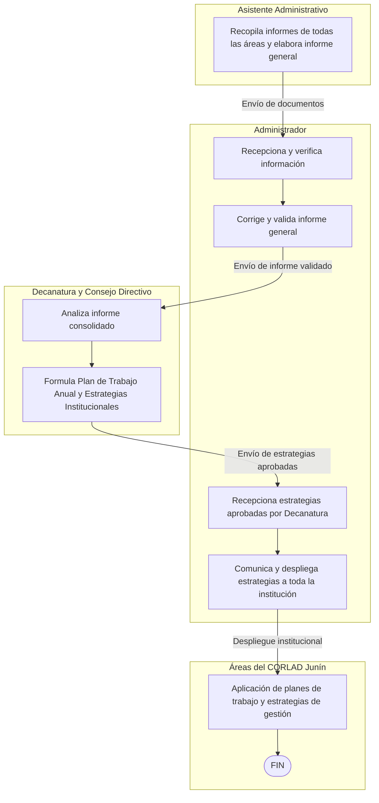
```mermaid
flowchart TD
    subgraph AsistenteAdmin ["Asistente Administrativo"]
        A1["Recopila informes de todas las áreas y elabora informe general"]
    end

    subgraph Administrador ["Administrador"]
        B1["Recepciona y verifica información"]
        B2["Corrige y valida informe general"]
        B3["Recepciona estrategias aprobadas por Decanatura"]
        B4["Comunica y despliega estrategias a toda la institución"]
    end

    subgraph Decanatura ["Decanatura y Consejo Directivo"]
        C1["Analiza informe consolidado"]
        C2["Formula Plan de Trabajo Anual y Estrategias Institucionales"]
    end

    subgraph CORLAD ["Áreas del CORLAD Junín"]
        D1["Aplicación de planes de trabajo y estrategias de gestión"]
        Fin(["FIN"])
    end

    A1 -->|Envío de documentos| B1
    B1 --> B2
    B2 -->|Envío de informe validado| C1
    C1 --> C2
    C2 -->|Envío de estrategias aprobadas| B3
    B3 --> B4
    B4 -->|Despliegue institucional| D1
    D1 --> Fin
```

---

## 02. Proceso de Gestión de Calidad

### 1. Ficha de Identificación del Proceso
| Parámetro | Detalle |
| :--- | :--- |
| **Macroproceso:** | Procesos Estratégicos |
| **Nombre del Proceso:** | Gestión de Calidad |
| **Responsable del Proceso:** | Encargado de Gestión de Calidad |
| **Objetivo del Proceso:** | Brindar calidad en todo el servicio académico y de colegiatura. |
| **Alcance del Proceso:** | La satisfacción frente al servicio brindado inicia con el informe de recopilación de fallas del servicio y culmina con la aplicación de estrategias de mejora continua. |

### 2. Matriz de Caracterización (Ciclo PHVA / SIPOC)
| Entradas | Proveedor | PHVA | Actividad | Responsable | Salida | Beneficiarios |
| :--- | :--- | :---: | :--- | :--- | :--- | :--- |
| Solicitud de informe de atención y servicio | Asistente administrativo | **P** | El asistente administrativo recluta información de todas las áreas del CORLAD Junín sobre quejas o sugerencias en la atención brindada. | Asistente administrativo / Encargado de área | Identificación de fallas y áreas críticas | Administrador |
| Evaluación e identificación de errores | Administrador | **H** | El administrador consolida y analiza las debilidades del servicio y elabora un balance general de calidad. | Administrador | Informe de balance general de calidad | Decanatura |
| Formulación de mejoras | Decanatura | **V** | La decanatura evalúa el balance y elabora estrategias de gestión para contrarrestar los errores identificados. | Decanatura / Encargado de cada área | Estrategias de mejora continua aprobadas | Administrador |
| Aplicación y seguimiento de estrategias | Administrador | **A** | Seguimiento del cumplimiento de estrategias de mejora para el alcance de estándares óptimos de calidad. | Administrador | Informes posteriores de calidad y satisfacción | Agremiados, Estudiantes, Profesionales Colegiados y Clientes |

### 3. Recursos del Proceso
- **Humano:** Encargado de gestión de calidad, Administrador, Asistente administrativo, Decano, Encargados de áreas.
- **Infraestructura:** Instalaciones del CORLAD Junín, mobiliario, equipos de cómputo y útiles de oficina.
- **Ambiente de Trabajo:** Sala de reuniones, oficinas administrativas.

### 4. Documentos Asociados
- **Internos:** Estatuto del CORLAD Junín, Plan estratégico, Vademécum institucional, Libro de reclamaciones, Políticas de calidad.
- **Externos:** Normas de calidad aplicables a colegios profesionales, directivas del CLAD.

### 5. Registros
- Libro de reclamaciones (físico y virtual).
- Informes de auditoría interna de calidad y encuestas de satisfacción.

### 6. Indicadores de Gestión
| Nombre del Indicador | Fórmula del Indicador | Meta | Frecuencia de Medición |
| :--- | :--- | :---: | :---: |
| **Nivel de satisfacción de los agremiados** | $$\text{Puntaje de satisfacción en encuestas}$$ | $\ge 80\%$ | Mensual |

### 7. Flujograma del Proceso

#### A. Gráfico Oficial del Flujograma
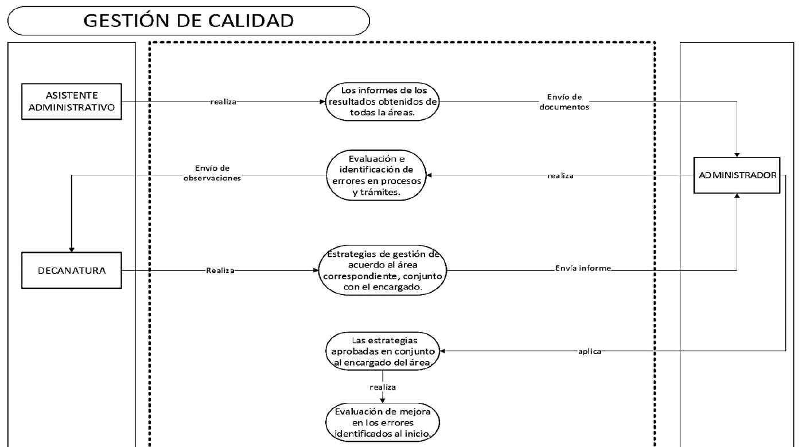

#### B. Descripción Detallada del Proceso y Flujo de Actividades
Este proceso garantiza que los servicios ofrecidos por el CORLAD Junín (colegiatura, eventos, asesoría, trámites) cumplan con altos estándares de satisfacción y eficacia.

1. **Actores Participantes (Swimlanes):**
   - **Asistente Administrativo:** Monitorea la recepción y recoge incidencias del servicio al usuario.
   - **Administrador:** Evalúa las no conformidades y coordina la ejecución de las mejoras.
   - **Decanatura:** Instancia directiva que valida y respalda formalmente los planes de optimización de calidad.

2. **Narrativa Secuencial del Proceso (Paso a Paso):**
   - **Paso 1 (Levantamiento de Información):** El *Asistente Administrativo* recopila los reportes de atención y resultados obtenidos en cada área, procesando quejas, sugerencias y tiempos de espera.
   - **Paso 2 (Remisión de Documentos):** Envía el consolidado de observaciones al *Administrador*.
   - **Paso 3 (Evaluación y Diagnóstico de Errores):** El *Administrador* realiza la evaluación técnica e identifica los cuellos de botella, errores en procesos y deficiencias en los trámites.
   - **Paso 4 (Envío de Observaciones a Decanatura):** Remite el diagnóstico detallado a *Decanatura* para la toma de decisiones estratégicas.
   - **Paso 5 (Diseño de Estrategias de Calidad):** *Decanatura*, de manera conjunta con los encargados de las áreas involucradas, diseña las estrategias de gestión correctiva y preventiva orientadas a superar las deficiencias detectadas.
   - **Paso 6 (Remisión de Estrategias Aprobadas):** Decanatura remite el informe final con las directivas aprobadas al *Administrador*.
   - **Paso 7 (Implementación Operativa):** El *Administrador* aplica las estrategias de mejora conjuntamente con el personal del área correspondiente.
   - **Paso 8 (Evaluación de Mejora y Cierre):** Se efectúa una evaluación periódica posterior para constatar el cierre de no conformidades y la superación de los errores iniciales (**FIN**).

#### C. Diagrama de Flujo (Mermaid)
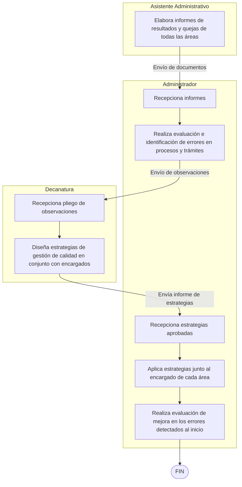
```mermaid
flowchart TD
    subgraph Asistente ["Asistente Administrativo"]
        A1["Elabora informes de resultados y quejas de todas las áreas"]
    end

    subgraph Admin ["Administrador"]
        B1["Recepciona informes"]
        B2["Realiza evaluación e identificación de errores en procesos y trámites"]
        B3["Recepciona estrategias aprobadas"]
        B4["Aplica estrategias junto al encargado de cada área"]
        B5["Realiza evaluación de mejora en los errores detectados al inicio"]
    end

    subgraph Decanato ["Decanatura"]
        C1["Recepciona pliego de observaciones"]
        C2["Diseña estrategias de gestión de calidad en conjunto con encargados"]
    end

    Fin(["FIN"])

    A1 -->|Envío de documentos| B1
    B1 --> B2
    B2 -->|Envío de observaciones| C1
    C1 --> C2
    C2 -->|Envía informe de estrategias| B3
    B3 --> B4
    B4 --> B5
    B5 --> Fin
```

---

## 03. Proceso de Gestión de Personal

### 1. Ficha de Identificación del Proceso
| Parámetro | Detalle |
| :--- | :--- |
| **Macroproceso:** | Procesos Estratégicos |
| **Nombre del Proceso:** | Gestión de Personal |
| **Responsable del Proceso:** | Administrador |
| **Objetivo del Proceso:** | Desarrollar actividades de reclutamiento, selección, contratación, inducción y evaluación del talento humano idóneo para el cumplimiento de las metas institucionales. |
| **Alcance del Proceso:** | Inicia con el requerimiento de personal y culmina con el control del desempeño y abono de remuneraciones. |

### 2. Matriz de Caracterización (Ciclo PHVA / SIPOC)
| Entradas | Proveedor | PHVA | Actividad | Responsable | Salida | Beneficiarios |
| :--- | :--- | :---: | :--- | :--- | :--- | :--- |
| Requerimiento de personal | Áreas solicitantes | **P** | Identificación de plazas vacantes y formulación de perfiles de puesto. | Administrador | Perfil de puesto / Solicitud de contratación | Decanatura |
| Aprobación de convocatoria | Decanatura | **P** | Autorización de la convocatoria y elaboración de materiales promocionales. | Decanatura / Marketing | Bases y flyers de convocatoria publicados | Público en general |
| Recepción de expedientes y selección | Postulantes | **H** | Evaluación curricular, entrevistas personales y selección de personal calificado. | Administrador / Comisión | Informe de candidatos seleccionados | Asesoría Legal |
| Formalización contractual | Asesoría Legal | **H** | Elaboración, visado y firma del contrato de trabajo o locación. | Asesor Legal / Personal | Contrato suscrito y legajo personal | Personal / Archivo |
| Cumplimiento de funciones y asistencia | Personal | **V** | Control diario de asistencia, desempeño de funciones asignadas y supervisión laboral. | Administrador | Registro de asistencias y tareo mensual | Tesorería |
| Cálculo y pago de haberes | Administración | **A** | Elaboración de planilla de haberes y pago de sueldos u honorarios. | Tesorería / Administrador | Boleta de pago / Transferencia efectiva | Personal del CORLAD |

### 3. Recursos del Proceso
- **Humano:** Administrador, Decano, Asesor Legal, Tesorero, Encargado de Marketing, Colaboradores.
- **Infraestructura:** Oficinas administrativas, equipos de cómputo, sistemas de control de asistencia biométrico.
- **Ambiente de Trabajo:** Oficinas administrativas del CORLAD Junín.

### 4. Documentos Asociados
- **Internos:** Reglamento Interno de Trabajo (RIT), Manual de Organización y Funciones (MOF), Escala de compensaciones.
- **Externos:** Normativa laboral nacional aplicable, Ley del Licenciado en Administración.

### 5. Registros
- Legajos personales de colaboradores.
- Registro de marcación de asistencia física y digital.
- Contratos de trabajo y planillas de haberes.

### 6. Indicadores de Gestión
| Nombre del Indicador | Fórmula del Indicador | Meta | Frecuencia de Medición |
| :--- | :--- | :---: | :---: |
| **Nivel de desempeño laboral** | $$\text{Calificación de evaluación de desempeño}$$ | $\ge 80\%$ | Mensual |

### 7. Flujograma del Proceso

#### A. Gráfico Oficial del Flujograma
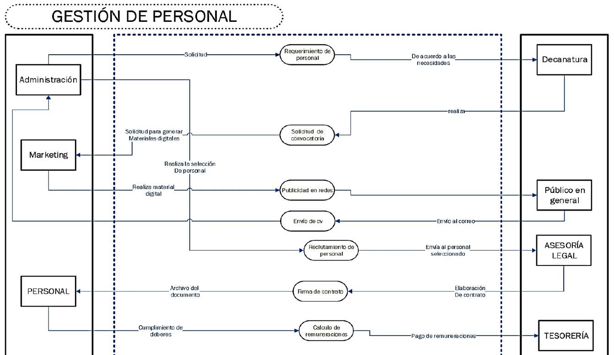

#### B. Descripción Detallada del Proceso y Flujo de Actividades
El flujo de **Gestión de Personal** abarca desde la identificación de la necesidad de contratación de colaboradores o practicantes hasta su vinculación legal y compensación económica.

1. **Actores y Carriles de Responsabilidad (Swimlanes):**
   - **Administración:** Detecta necesidades, conduce la selección y supervisa el desempeño.
   - **Marketing:** Diseña y difunde la convocatoria en redes institucionales.
   - **Personal / Postulantes:** Candidatos del público que aplican y personal contratado.
   - **Decanatura:** Autoriza la vacante según requerimiento presupuestal.
   - **Público en General:** Ecosistema externo de postulantes que envían CVs.
   - **Asesoría Legal:** Redacta y valida los contratos individuales de trabajo o locación.
   - **Tesorería:** Responsable del pago puntual de remuneraciones.

2. **Narrativa Secuencial del Proceso (Paso a Paso):**
   - **Paso 1 (Solicitud de Requerimiento):** *Administración* emite la solicitud formal de requerimiento de personal ante la necesidad de cubrir un puesto.
   - **Paso 2 (Evaluación en Decanatura):** La solicitud llega a *Decanatura*, quien evalúa la pertinencia de la necesidad y autoriza formalmente la convocatoria.
   - **Paso 3 (Convocatoria y Diseño):** Se genera la solicitud para elaborar material publicitario digital, derivada al área de *Marketing*.
   - **Paso 4 (Pauta y Publicidad en Redes):** *Marketing* produce el material gráfico oficial y publica la convocatoria en redes sociales dirigida al *Público en General*.
   - **Paso 5 (Recepción de CVs):** Los postulantes interesados envían sus hojas de vida al correo institucional.
   - **Paso 6 (Evaluación y Reclutamiento):** *Administración* procesa los CVs, filtra candidatos y efectúa el proceso de reclutamiento y selección de personal.
   - **Paso 7 (Pase a Asesoría Legal):** La relación de personal seleccionado es remitida a *Asesoría Legal*.
   - **Paso 8 (Redacción Contractual):** *Asesoría Legal* elabora los contratos correspondientes según el marco normativo vigente.
   - **Paso 9 (Suscripción y Legajo):** El colaborador suscribe el contrato de trabajo, el cual se archiva en su legajo personal.
   - **Paso 10 (Labores y Cumplimiento):** El colaborador asume sus deberes y tareas en su área asignada.
   - **Paso 11 (Cálculo de Haberes):** Administración realiza el cálculo mensual de remuneraciones y tareo de horas.
   - **Paso 12 (Pago y Cierre):** *Tesorería* ejecuta el desembolso de haberes y emisión de comprobantes de pago (**FIN**).

#### C. Diagrama de Flujo (Mermaid)
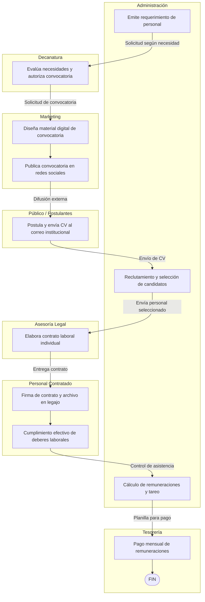
```mermaid
flowchart TD
    subgraph Admin ["Administración"]
        A1["Emite requerimiento de personal"]
        A2["Reclutamiento y selección de candidatos"]
        A3["Cálculo de remuneraciones y tareo"]
    end

    subgraph Decanatura ["Decanatura"]
        D1["Evalúa necesidades y autoriza convocatoria"]
    end

    subgraph Mkt ["Marketing"]
        M1["Diseña material digital de convocatoria"]
        M2["Publica convocatoria en redes sociales"]
    end

    subgraph Publico ["Público / Postulantes"]
        P1["Postula y envía CV al correo institucional"]
    end

    subgraph Legal ["Asesoría Legal"]
        L1["Elabora contrato laboral individual"]
    end

    subgraph Colab ["Personal Contratado"]
        C1["Firma de contrato y archivo en legajo"]
        C2["Cumplimiento efectivo de deberes laborales"]
    end

    subgraph Tesoreria ["Tesorería"]
        T1["Pago mensual de remuneraciones"]
        Fin(["FIN"])
    end

    A1 -->|Solicitud según necesidad| D1
    D1 -->|Solicitud de convocatoria| M1
    M1 --> M2
    M2 -->|Difusión externa| P1
    P1 -->|Envío de CV| A2
    A2 -->|Envía personal seleccionado| L1
    L1 -->|Entrega contrato| C1
    C1 --> C2
    C2 -->|Control de asistencia| A3
    A3 -->|Planilla para pago| T1
    T1 --> Fin
```

---

## 04. Proceso de Gestión de Articulación con las Instituciones Públicas

### 1. Ficha de Identificación del Proceso
| Parámetro | Detalle |
| :--- | :--- |
| **Macroproceso:** | Procesos Estratégicos |
| **Nombre del Proceso:** | Gestión de Articulación con las Instituciones Públicas y Privadas |
| **Responsable del Proceso:** | Responsable de Convenios y Relaciones Interinstitucionales / Decano |
| **Objetivo del Proceso:** | Generar alianzas estratégicas y acuerdos interinstitucionales que fortalezcan el posicionamiento gremial y generen beneficios directos para los miembros de la orden. |
| **Alcance del Proceso:** | Inicia con la identificación de convenios potenciales y culmina con la suscripción, aplicación y evaluación de compromisos interinstitucionales. |

### 2. Matriz de Caracterización (Ciclo PHVA / SIPOC)
| Entradas | Proveedor | PHVA | Actividad | Responsable | Salida | Beneficiarios |
| :--- | :--- | :---: | :--- | :--- | :--- | :--- |
| Requerimiento de convenios | Instituciones / CORLAD | **P** | Identificación y formulación de la propuesta de convenio interinstitucional. | Responsable de la gestión | Expediente de propuesta de convenio | Mesa de Partes |
| Recepción y derivación de propuesta | Mesa de Partes | **P** | Registro y canalización del proyecto de convenio al Consejo Directivo. | Mesa de partes | Proveído de pase | Consejo Directivo |
| Evaluación y deliberación | Consejo Directivo | **H** | Revisión legal, técnica y deliberación en sesión de consejo directivo. | Consejo directivo | Acuerdo de consejo aprobatorio | Administrador |
| Aprobación formal y emisión de resolución | Administrador | **V** | Preparación de la resolución decanal y coordinación de la suscripción. | Administrador / Decano | Documento de convenio y resolución aprobada | Responsable de la gestión |
| Ejecución y seguimiento | Responsable de la gestión | **A** | Coordinación con la entidad contraparte para el cumplimiento de compromisos y actividades del convenio. | Responsable de la gestión / Áreas | Informes de ejecución de convenio | Agremiados y sociedad |

### 3. Recursos del Proceso
- **Humano:** Decano, Consejo Directivo, Administrador, Responsable de convenios, Asesor Legal.
- **Infraestructura:** Instalaciones del CORLAD Junín, mobiliario, equipos y materiales de escritorio, plataforma de videoconferencias Zoom, movilidad.
- **Ambiente de Trabajo:** Oficina de decanatura y áreas administrativas.

### 4. Documentos Asociados
- **Internos:** Estatuto del CORLAD Junín, Plan Estratégico, Directiva de convenios.
- **Externos:** Ley de Procedimiento Administrativo General (Ley 27444), normativa de convenios del sector público.

### 5. Registros
- Libro de registro de convenios interinstitucionales.
- Resoluciones decanales de aprobación de convenios y copias autenticadas de actas.

### 6. Indicadores de Gestión
| Nombre del Indicador | Fórmula del Indicador | Meta | Frecuencia de Medición |
| :--- | :--- | :---: | :---: |
| **Número de convenios** | $$\text{N° de convenios celebrados en el periodo}$$ | 20 | Anual |

### 7. Flujograma del Proceso

#### A. Gráfico Oficial del Flujograma
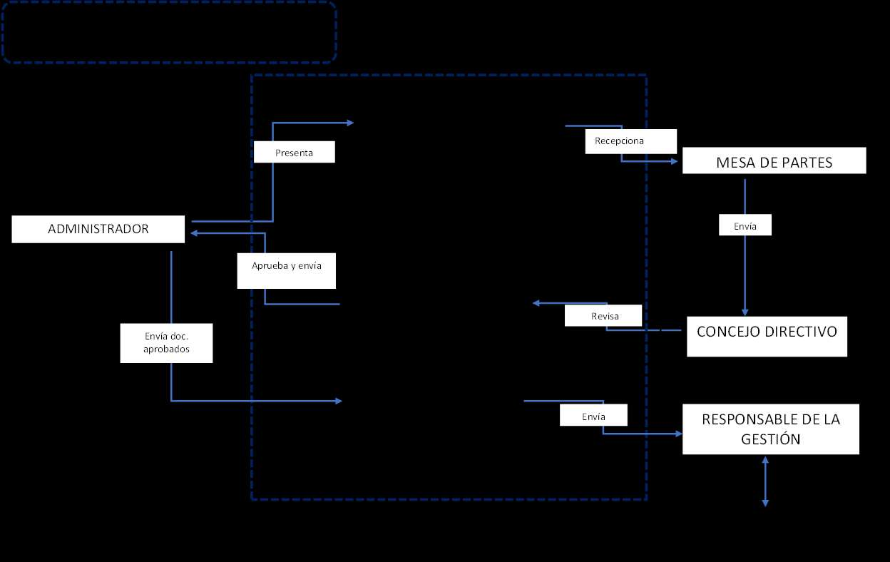

#### B. Descripción Detallada del Proceso y Flujo de Actividades
Este proceso establece los pasos necesarios para negociar, aprobar y formalizar alianzas con municipalidades, ministerios, universidades y empresas privadas.

1. **Actores y Carriles de Responsabilidad (Swimlanes):**
   - **Administrador:** Gestiona los trámites formales y la expedición de resoluciones.
   - **Mesa de Partes:** Recepciona la propuesta de convenio y registra el ingreso del expediente.
   - **Consejo Directivo:** Instancia deliberativa que analiza el impacto y aprueba el acuerdo.
   - **Responsable de la Gestión:** Encargado de coordinar operativamente con la entidad aliada y velar por el cumplimiento de las metas conjuntas.

2. **Narrativa Secuencial del Proceso (Paso a Paso):**
   - **Paso 1 (Presentación):** Se presenta la propuesta de convenio interinstitucional a través de los canales institucionales.
   - **Paso 2 (Recepción en Mesa de Partes):** *Mesa de Partes* recepciona el expediente, registra el sello de ingreso y foliatura.
   - **Paso 3 (Derivación a Consejo Directivo):** *Mesa de Partes* traslada formalmente la documentación al *Consejo Directivo*.
   - **Paso 4 (Revisión y Dictamen):** El *Consejo Directivo* revisa las cláusulas, objetivos, compromisos y aportes mutuos de ambas instituciones.
   - **Paso 5 (Aprobación y Remisión):** El Consejo aprueba la propuesta de convenio y emite el informe aprobatorio hacia el *Administrador*.
   - **Paso 6 (Trámite de Documentos Aprobados):** El *Administrador* emite las resoluciones pertinentes y remite los documentos debidamente firmados y aprobados al *Responsable de la Gestión*.
   - **Paso 7 (Ejecución y Monitoreo):** El *Responsable de la Gestión* lidera la puesta en marcha de las actividades pactadas en el convenio (**FIN**).

#### C. Diagrama de Flujo (Mermaid)
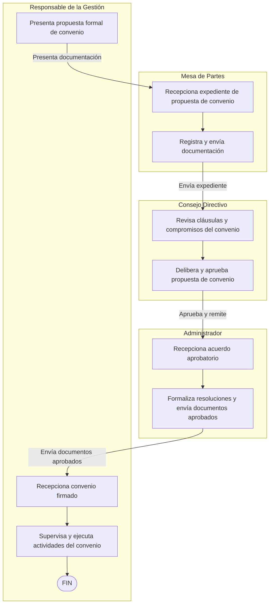
```mermaid
flowchart TD
    subgraph MesaPartes ["Mesa de Partes"]
        M1["Recepciona expediente de propuesta de convenio"]
        M2["Registra y envía documentación"]
    end

    subgraph Consejo ["Consejo Directivo"]
        C1["Revisa cláusulas y compromisos del convenio"]
        C2["Delibera y aprueba propuesta de convenio"]
    end

    subgraph Admin ["Administrador"]
        A1["Recepciona acuerdo aprobatorio"]
        A2["Formaliza resoluciones y envía documentos aprobados"]
    end

    subgraph RespGestion ["Responsable de la Gestión"]
        R1["Presenta propuesta formal de convenio"]
        R2["Recepciona convenio firmado"]
        R3["Supervisa y ejecuta actividades del convenio"]
        Fin(["FIN"])
    end

    R1 -->|Presenta documentación| M1
    M1 --> M2
    M2 -->|Envía expediente| C1
    C1 --> C2
    C2 -->|Aprueba y remite| A1
    A1 --> A2
    A2 -->|Envía documentos aprobados| R2
    R2 --> R3
    R3 --> Fin
```

---

# II. PROCESOS MISIONALES Y/O PRINCIPALES

---

## 05. Proceso de Colegiatura y Habilitación Profesional

### 1. Ficha de Identificación del Proceso
| Parámetro | Detalle |
| :--- | :--- |
| **Macroproceso:** | Procesos Misionales y/o Principales |
| **Nombre del Proceso:** | Colegiatura y Habilitación Profesional |
| **Responsable del Proceso:** | Directora Regional de Desarrollo y Habilitación Profesional |
| **Objetivo del Proceso:** | Captar nuevos agremiados que se colegien y mantener la habilitación profesional continua de los miembros de la orden. |
| **Alcance del Proceso:** | Inicia con la captación y/o invitación de posibles agremiados y culmina con la entrega de diplomas de colegiatura y la emisión periódica de constancias de habilidad. |

### 2. Matriz de Caracterización (Ciclo PHVA / SIPOC)
| Entradas | Proveedor | PHVA | Actividad | Responsable | Salida | Beneficiarios |
| :--- | :--- | :---: | :--- | :--- | :--- | :--- |
| Propuesta de trabajo y normatividad | Encargado de habilitación profesional | **P** | Cumplimiento del D.L. 22087, D.S. 020-2006-ED y Ley 31060. Presentación de beneficios, estrategias de persuasión y publicidad. | Encargado de colegiatura / Practicantes / Marketing | Plan de trabajo de colegiatura, flyer y base de datos | Licenciados en administración |
| Plan de desarrollo e inscripción | Encargado de habilitación profesional | **H** | Inscripción de licenciados, recaudación de pagos y validación del proceso de colegiatura. | Encargado de colegiatura / Practicantes / Tesorera | Lista de inscritos y expediente con requisitos | Licenciados en administración |
| Expedientes para matriculación nacional | Encargado de habilitación profesional | **H** | Envío de expedientes al Colegio Nacional (CLAD Nacional - Lima) para inscripción y expedición de número correlativo. | Encargado de colegiatura / Practicantes | Reporte de inscritos y registro de conformidad de datos | Licenciados en administración |
| Evaluación y asignación de matrícula | CLAD Nacional | **H** | Emisión de diplomas oficiales de colegiatura y resoluciones nacionales de incorporación. | Encargado de colegiatura | Diploma de colegiatura e informe quincenal | Licenciados en administración colegiados |
| Entrega de diplomas y resolución | CLAD Nacional | **V** | Recepción de diplomas y resoluciones emitidas por el CLAD Nacional; organización de la ceremonia solemne de colegiatura. | Encargada de colegiatura | Ceremonia de colegiatura y juramentación solemne | Colegiados |
| Cuotas y pagos de habilitación | Colegiados | **V** | Actualización de pagos y datos personales; habilitación en sistema y registro en la Big Data regional. | Gestora de cobranzas / Tesorería / Encargada de habilitación | Constancia de Habilitación Profesional | Agremiados |
| Entrega de constancia de habilidad | Agremiados | **A** | Seguimiento continuo a través de la Big Data regional para incentivar la habilitación oportuna. | Gestora de cobranzas / Big Data | Padrón de colegiados habilitados | Agremiados |

### 3. Recursos del Proceso
- **Humano:** Encargado de colegiatura y habilitación profesional, Encargado de marketing, Tesorera, Gestora de cobranza, Practicantes, Responsables de Big Data.
- **Infraestructura:** Instalaciones del CORLAD Junín, mobiliario, equipos y materiales de escritorio, sistema de registro del CLAD Nacional.
- **Ambiente de Trabajo:** Oficina de habilitación profesional y oficinas administrativas.

### 4. Documentos Asociados
- **Internos:** Estatuto del CORLAD Junín, Plan estratégico, Requisitos de colegiatura, Vademécum institucional.
- **Externos:** D.L. 22087, D.S. 020-2006-ED, Ley 31060 (Ley del Licenciado en Administración), Resoluciones del CLAD Nacional.

### 5. Registros
- Canales de comunicación oficiales (E-mail, WhatsApp, Facebook institucional).
- Padrón y libro de registro de licenciados colegiados.
- Libro de registro de entrega de diplomas y libro de emisión de constancias de habilidad.

### 6. Indicadores de Gestión
| Nombre del Indicador | Fórmula del Indicador | Meta | Frecuencia de Medición |
| :--- | :--- | :---: | :---: |
| **Cantidad de colegiados** | $$\text{N° de colegiados incorporados}$$ | $\ge 30$ | Mensual |
| **Cantidad de habilitados** | $$\text{N° de colegiados habilitados}$$ | $\ge 30$ | Mensual |

### 7. Flujograma del Proceso

#### A. Gráfico Oficial del Flujograma
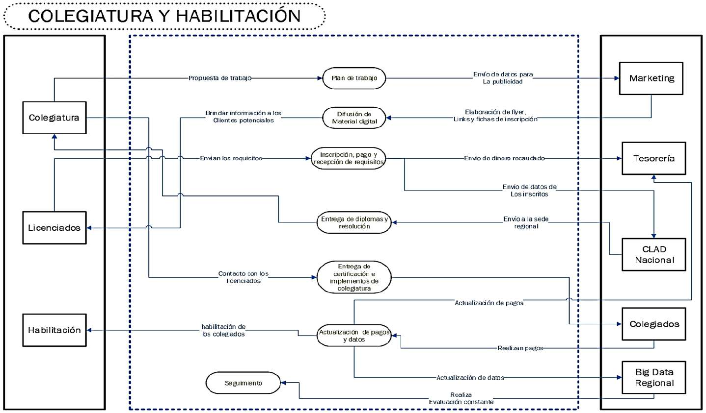

#### B. Descripción Detallada del Proceso y Flujo de Actividades
Este es el proceso misional central de la institución, compuesto por dos vertientes interconectadas: la **Incorporación/Colegiatura** de nuevos profesionales y el **Mantenimiento de la Habilidad Profesional**.

1. **Actores y Carriles de Responsabilidad (Swimlanes):**
   - **Colegiatura:** Gestiona las inscripciones y coordina los expedientes de incorporación.
   - **Licenciados:** Profesionales titulados que postulan para incorporarse a la orden.
   - **Habilitación:** Supervisa el estado de cumplimiento de los agremiados.
   - **Marketing:** Promociona las campañas de incorporación en medios digitales.
   - **Tesorería:** Recauda los derechos económicos por colegiatura y cuotas ordinarias.
   - **CLAD Nacional:** Sede nacional en Lima encargada de emitir las matrículas y diplomas oficiales.
   - **Colegiados:** Miembros con registro activo que renuevan periódicamente su constancia.
   - **Big Data Regional:** Sistema informático centralizado donde se gestiona el padrón regional.

2. **Narrativa Secuencial del Proceso (Paso a Paso):**
   - **Paso 1 (Plan de Trabajo de Colegiatura):** El área de *Colegiatura* elabora el plan de trabajo anual y establece los cronogramas de juramentación.
   - **Paso 2 (Campaña Publicitaria):** Se envían los datos y cronogramas a *Marketing*, quien diseña los flyers, formularios web y links de inscripción, difundiendo la información a los clientes potenciales (*Licenciados*).
   - **Paso 3 (Postulación y Recepción):** Los licenciados envían los requisitos documentarios exigidos (título registrado en SUNEDU, DNI, fotos, etc.).
   - **Paso 4 (Cobro y Tramitación):** Se formaliza la inscripción, se recepcionan los requisitos y se envía el dinero recaudado a *Tesorería*.
   - **Paso 5 (Remisión al CLAD Nacional):** Los expedientes validados son remitidos formalmente a la sede del *CLAD Nacional* en Lima.
   - **Paso 6 (Emisión de Diplomas):** El CLAD Nacional emite las resoluciones y diplomas oficiales de matrícula nacional y los despacha a la sede regional Junín.
   - **Paso 7 (Ceremonia de Incorporación):** El área de *Colegiatura* organiza la ceremonia protocolar de juramentación, haciendo entrega formal del diploma, medalla y constancia de incorporación al nuevo colegiado.
   - **Paso 8 (Trámite de Habilitación):** Los *Colegiados* realizan los pagos de cuotas societarias ante *Tesorería*.
   - **Paso 9 (Actualización y Emisión de Habilidad):** El área de *Habilitación* actualiza el estado del colegiado en el sistema y expide la Constancia de Habilidad Profesional.
   - **Paso 10 (Monitoreo en Big Data):** Los datos actualizados son sincronizados en la *Big Data Regional*, realizando evaluaciones continuas y seguimiento para mantener el padrón activo (**FIN**).

#### C. Diagrama de Flujo (Mermaid)
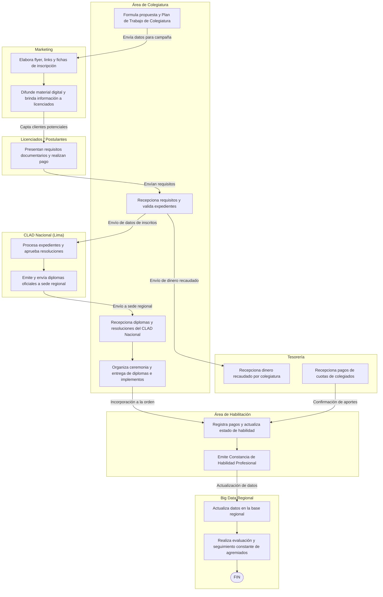
```mermaid
flowchart TD
    subgraph Colegiatura ["Área de Colegiatura"]
        C1["Formula propuesta y Plan de Trabajo de Colegiatura"]
        C2["Recepciona requisitos y valida expedientes"]
        C3["Recepciona diplomas y resoluciones del CLAD Nacional"]
        C4["Organiza ceremonia y entrega de diplomas e implementos"]
    end

    subgraph Mkt ["Marketing"]
        M1["Elabora flyer, links y fichas de inscripción"]
        M2["Difunde material digital y brinda información a licenciados"]
    end

    subgraph Licenciados ["Licenciados / Postulantes"]
        L1["Presentan requisitos documentarios y realizan pago"]
    end

    subgraph Tesoreria ["Tesorería"]
        T1["Recepciona dinero recaudado por colegiatura"]
        T2["Recepciona pagos de cuotas de colegiados"]
    end

    subgraph Nacional ["CLAD Nacional (Lima)"]
        N1["Procesa expedientes y aprueba resoluciones"]
        N2["Emite y envía diplomas oficiales a sede regional"]
    end

    subgraph Habilitacion ["Área de Habilitación"]
        H1["Registra pagos y actualiza estado de habilidad"]
        H2["Emite Constancia de Habilidad Profesional"]
    end

    subgraph BigData ["Big Data Regional"]
        B1["Actualiza datos en la base regional"]
        B2["Realiza evaluación y seguimiento constante de agremiados"]
        Fin(["FIN"])
    end

    C1 -->|Envía datos para campaña| M1
    M1 --> M2
    M2 -->|Capta clientes potenciales| L1
    L1 -->|Envían requisitos| C2
    C2 -->|Envío de dinero recaudado| T1
    C2 -->|Envío de datos de inscritos| N1
    N1 --> N2
    N2 -->|Envío a sede regional| C3
    C3 --> C4
    C4 -->|Incorporación a la orden| H1
    T2 -->|Confirmación de aportes| H1
    H1 --> H2
    H2 -->|Actualización de datos| B1
    B1 --> B2
    B2 --> Fin
```

---

## 06. Proceso de Eventos Académicos

### 1. Ficha de Identificación del Proceso
| Parámetro | Detalle |
| :--- | :--- |
| **Macroproceso:** | Procesos Misionales y/o Principales |
| **Nombre del Proceso:** | Eventos Académicos |
| **Responsable del Proceso:** | Director Regional de Asuntos Académicos |
| **Objetivo del Proceso:** | Desarrollar cursos, diplomados, talleres, conferencias y congresos que fortalezcan las competencias profesionales de los agremiados y estudiantes. |
| **Alcance del Proceso:** | Inicia con la identificación de requerimientos de capacitación y culmina con la certificación de los participantes y liquidación del evento. |

### 2. Matriz de Caracterización (Ciclo PHVA / SIPOC)
| Entradas | Proveedor | PHVA | Actividad | Responsable | Salida | Beneficiarios |
| :--- | :--- | :---: | :--- | :--- | :--- | :--- |
| Propuestas de eventos | Área académica | **P** | Planificación, diseño curricular, cotización de ponentes y cronograma del evento formativo. | Director de eventos académicos | Plan de trabajo del evento académico | Decanatura / Marketing |
| Aprobación y material publicitario | Decanatura / Marketing | **H** | Diseño de piezas publicitarias digitales, campañas en redes sociales y enlace de inscripción. | Encargado de marketing | Flyer digital, enlaces y campaña publicitaria | Estudiantes y profesionales |
| Registro de inscripciones | Estudiantes / Agremiados | **H** | Recepción de fichas de inscripción, recaudación de derechos de participación y validación de matrícula. | Big Data / Tesorería | Relación de participantes inscritos | Área académica |
| Ejecución y desarrollo del evento | Ponentes / Académica | **V** | Conducción de ponencias magistrales, talleres interactivos y control de asistencias. | Director académico / Ponentes | Registro de asistencia y evaluaciones | Participantes |
| Liquidación y certificación | Área académica | **A** | Liquidación administrativa y financiera, elaboración y entrega de certificados con valor académico. | Director académico / Tesorera / Decano | Certificados de participación e informe final | Participantes y CORLAD |

### 3. Recursos del Proceso
- **Humano:** Director regional de eventos académicos, Encargado de marketing, Soporte técnico, Tesorera, Expositores.
- **Infraestructura:** Instalaciones del CORLAD Junín, auditorio, equipos de proyección multimedia, plataforma virtual de videoconferencias (Zoom).
- **Ambiente de Trabajo:** Auditorio y salas virtuales de capacitación.

### 4. Documentos Asociados
- **Internos:** Estatuto del CORLAD Junín, Plan Estratégico, Directiva de eventos académicos institucional.
- **Externos:** Convenios académicos con universidades, directivas del CLAD.

### 5. Registros
- Base de datos de asistentes inscritos (formularios virtuales).
- Registro correlativo de certificados oficiales emitidos.
- Informes de liquidación económica del evento.

### 6. Indicadores de Gestión
| Nombre del Indicador | Fórmula del Indicador | Meta | Frecuencia de Medición |
| :--- | :--- | :---: | :---: |
| **Nivel de satisfacción del evento** | $$\text{Puntaje promedio en encuestas de satisfacción}$$ | $\ge 80\%$ | Mensual |
| **Número de eventos** | $$\text{N° de eventos desarrollados en el mes}$$ | 5 | Mensual |

### 7. Flujograma del Proceso

#### A. Gráfico Oficial del Flujograma
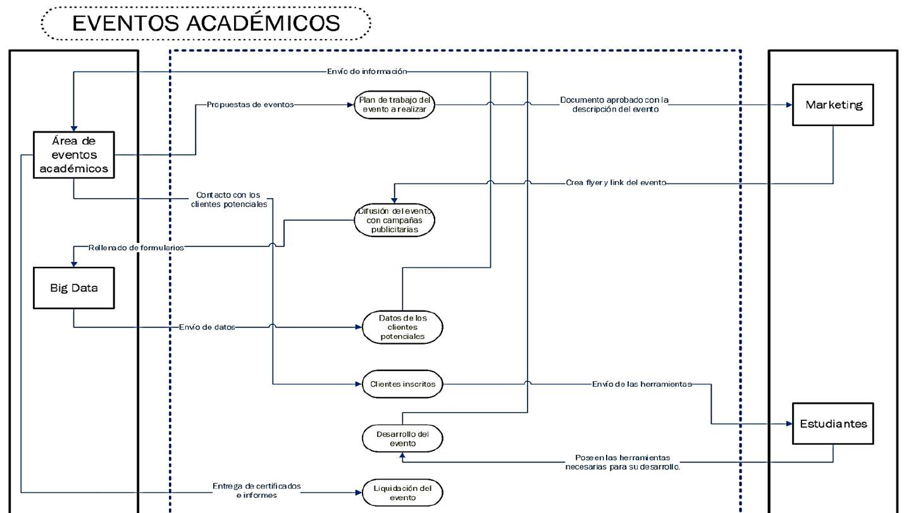

#### B. Descripción Detallada del Proceso y Flujo de Actividades
Garantiza una oferta formativa permanente, pertinente y de alto nivel técnico para el perfeccionamiento continuo de los profesionales en administración.

1. **Actores Participantes (Swimlanes):**
   - **Área de Eventos Académicos:** Formula y dirige las capacitaciones.
   - **Big Data:** Procesa y gestiona las bases de inscritos.
   - **Marketing:** Encargada del despliegue publicitario.
   - **Estudiantes y Participantes:** Asistentes beneficiarios de los eventos.

2. **Narrativa Secuencial del Proceso (Paso a Paso):**
   - **Paso 1 (Plan de Trabajo del Evento):** El *Área de Eventos Académicos* concibe las propuestas temáticas y estructura el plan de trabajo detallado del evento a realizar.
   - **Paso 2 (Aprobación y Remisión a Marketing):** Se remite el documento formal aprobado con la descripción curricular y operativa del evento al área de *Marketing*.
   - **Paso 3 (Publicidad y Difusión):** *Marketing* crea los flyers institucionales, enlaces de inscripción y ejecuta campañas publicitarias masivas para captar a los clientes potenciales.
   - **Paso 4 (Inscripción en Big Data):** Los interesados rellenan los formularios virtuales, enviando sus datos personales que son consolidados por el equipo de *Big Data*.
   - **Paso 5 (Entrega de Herramientas):** Con los datos de los clientes inscritos, se despachan los accesos, enlaces de plataforma virtual y materiales a los *Estudiantes/Participantes*.
   - **Paso 6 (Desarrollo del Evento):** Se ejecuta el evento académico con los ponentes designados, asegurando que los asistentes cuenten con las herramientas necesarias.
   - **Paso 7 (Liquidación y Certificados):** Finalizadas las sesiones académicas, se procede a la liquidación financiera del evento y se confeccionan los certificados oficiales e informes para su entrega formal (**FIN**).

#### C. Diagrama de Flujo (Mermaid)
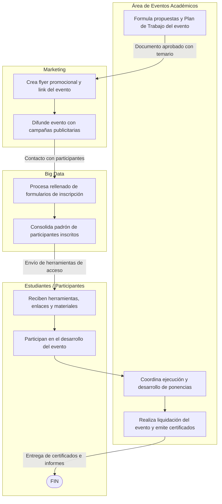
```mermaid
flowchart TD
    subgraph Academica ["Área de Eventos Académicos"]
        A1["Formula propuestas y Plan de Trabajo del evento"]
        A2["Coordina ejecución y desarrollo de ponencias"]
        A3["Realiza liquidación del evento y emite certificados"]
    end

    subgraph Mkt ["Marketing"]
        M1["Crea flyer promocional y link del evento"]
        M2["Difunde evento con campañas publicitarias"]
    end

    subgraph BigData ["Big Data"]
        B1["Procesa rellenado de formularios de inscripción"]
        B2["Consolida padrón de participantes inscritos"]
    end

    subgraph Estudiantes ["Estudiantes / Participantes"]
        E1["Reciben herramientas, enlaces y materiales"]
        E2["Participan en el desarrollo del evento"]
        Fin(["FIN"])
    end

    A1 -->|Documento aprobado con temario| M1
    M1 --> M2
    M2 -->|Contacto con participantes| B1
    B1 --> B2
    B2 -->|Envío de herramientas de acceso| E1
    E1 --> E2
    E2 --> A2
    A2 --> A3
    A3 -->|Entrega de certificados e informes| Fin
```

---

## 07. Proceso de Seguridad y Bienestar Social

### 1. Ficha de Identificación del Proceso
| Parámetro | Detalle |
| :--- | :--- |
| **Macroproceso:** | Procesos Misionales y/o Principales |
| **Nombre del Proceso:** | Seguridad y Bienestar Social |
| **Responsable del Proceso:** | Director Regional de Seguridad y Bienestar Social |
| **Objetivo del Proceso:** | Fomentar la integración, recreación, auxilio mutuo y el bienestar social integral de los agremiados y sus familias. |
| **Alcance del Proceso:** | Inicia con la identificación de necesidades sociales y culmina con la ejecución y evaluación de actividades de bienestar. |

### 2. Matriz de Caracterización (Ciclo PHVA / SIPOC)
| Entradas | Proveedor | PHVA | Actividad | Responsable | Salida | Beneficiarios |
| :--- | :--- | :---: | :--- | :--- | :--- | :--- |
| Necesidades de bienestar social | Agremiados | **P** | Planificación de actividades sociales, recreativas, culturales y de salud a favor de los agremiados. | Director de seguridad y bienestar social | Plan de actividades de bienestar | Administración / Consejo Directivo |
| Aprobación de planes | Consejo Directivo | **P** | Aprobación del cronograma anual y asignación de partidas presupuestales. | Consejo directivo | Resolución de aprobación y presupuesto | Dirección de bienestar |
| Coordinación operativa | Dirección de bienestar | **H** | Coordinación con la base de datos de agremiados y preparación logística de cada actividad. | Director de bienestar / Big Data / Comité de damas | Programa y logística preparada | Agremiados |
| Ejecución de actividades | Dirección de bienestar / Damas | **V** | Desarrollo efectivo de homenajes, jornadas deportivas, campañas médicas y actividades de confraternidad. | Comité de damas / Agremiados | Actividad ejecutada y participación activa | Agremiados y familiares |
| Evaluación de satisfacción | Agremiados | **A** | Aplicación de encuestas de percepción y reporte de impacto del programa social. | Director de bienestar social | Informe de balance social institucional | Consejo Directivo y Agremiados |

### 3. Recursos del Proceso
- **Humano:** Director regional de seguridad y bienestar social, Comité de damas, Administrador, Consejo Directivo.
- **Infraestructura:** Locales campestres, auditorio del CORLAD Junín, instalaciones de salud aliadas.
- **Ambiente de Trabajo:** Oficinas administrativas y ambientes recreativos.

### 4. Documentos Asociados
- **Internos:** Estatuto del CORLAD Junín, Plan Estratégico, Reglamento del Fondo de Previsión Social.
- **Externos:** Normativa de seguridad y bienestar social del CLAD.

### 5. Registros
- Padrón de participantes y beneficiarios de auxilio mutuo.
- Fichas de asistencia y archivo fotográfico de actividades sociales.

### 6. Indicadores de Gestión
| Nombre del Indicador | Fórmula del Indicador | Meta | Frecuencia de Medición |
| :--- | :--- | :---: | :---: |
| **Nivel de satisfacción del agremiado** | $$\text{Puntaje de satisfacción en encuestas}$$ | $\ge 80\%$ | Cada actividad |

### 7. Flujograma del Proceso

#### A. Gráfico Oficial del Flujograma
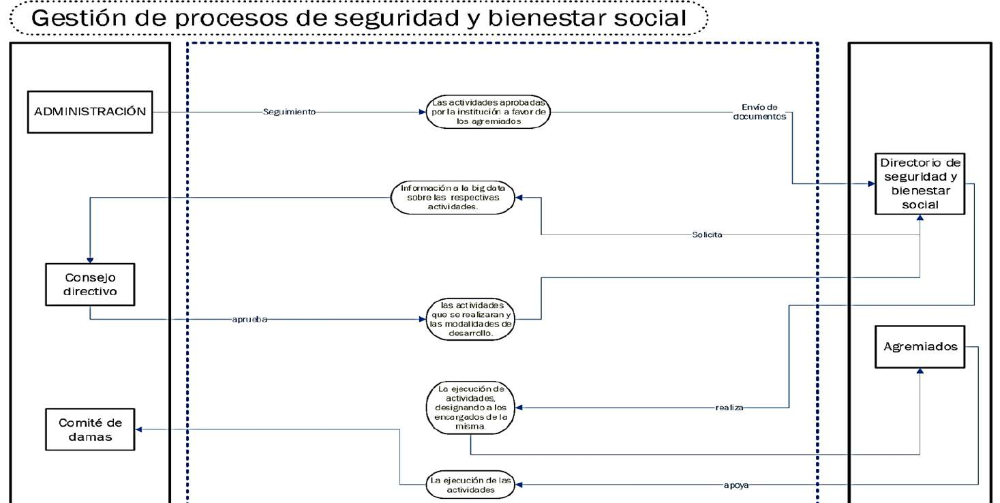

#### B. Descripción Detallada del Proceso y Flujo de Actividades
Atiende el aspecto humano y familiar de los licenciados en administración colegiados, promoviendo el compañerismo y la protección social.

1. **Actores y Carriles de Responsabilidad (Swimlanes):**
   - **Administración:** Hace seguimiento y canaliza la documentación.
   - **Consejo Directivo:** Autoriza las modalidades de desarrollo y aprueba los planes.
   - **Comité de Damas:** Brinda soporte y coadyuva en la logística y atención de los eventos.
   - **Directorio de Seguridad y Bienestar Social:** Formula y coordina los programas sociales.
   - **Agremiados:** Participantes y comisiones de base.

2. **Narrativa Secuencial del Proceso (Paso a Paso):**
   - **Paso 1 (Seguimiento de Iniciativas):** *Administración* realiza el seguimiento formal a las propuestas de actividades aprobadas a favor de los miembros de la orden.
   - **Paso 2 (Envío al Directorio):** Envía los documentos técnicos al *Directorio de Seguridad y Bienestar Social*.
   - **Paso 3 (Consulta a Big Data):** El Directorio solicita información a la *Big Data* para conocer las preferencias, demografía y requerimientos prioritarios de los agremiados.
   - **Paso 4 (Aprobación por Consejo Directivo):** El *Consejo Directivo* evalúa y aprueba formalmente las actividades que se realizarán y sus modalidades de ejecución.
   - **Paso 5 (Organización con Agremiados):** Se coordinan las comisiones con los *Agremiados*, designando a los delegados y encargados operativos.
   - **Paso 6 (Apoyo del Comité de Damas):** El *Comité de Damas* apoya activamente en la puesta en marcha, protocolo y logística de las jornadas recreativas y de auxilio mutuo (**FIN**).

#### C. Diagrama de Flujo (Mermaid)
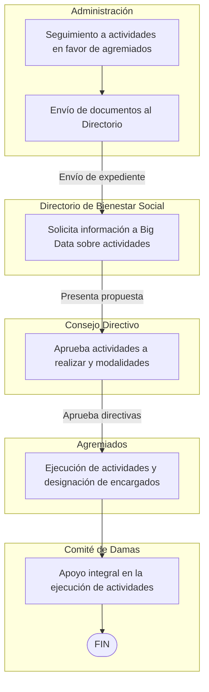
```mermaid
flowchart TD
    subgraph Admin ["Administración"]
        A1["Seguimiento a actividades en favor de agremiados"]
        A2["Envío de documentos al Directorio"]
    end

    subgraph Bienestar ["Directorio de Bienestar Social"]
        B1["Solicita información a Big Data sobre actividades"]
    end

    subgraph Consejo ["Consejo Directivo"]
        C1["Aprueba actividades a realizar y modalidades"]
    end

    subgraph Agremiados ["Agremiados"]
        D1["Ejecución de actividades y designación de encargados"]
    end

    subgraph Damas ["Comité de Damas"]
        E1["Apoyo integral en la ejecución de actividades"]
        Fin(["FIN"])
    end

    A1 --> A2
    A2 -->|Envío de expediente| B1
    B1 -->|Presenta propuesta| C1
    C1 -->|Aprueba directivas| D1
    D1 --> E1
    E1 --> Fin
```

---

## 08. Proceso de Información Científica y Tecnológica

### 1. Ficha de Identificación del Proceso
| Parámetro | Detalle |
| :--- | :--- |
| **Macroproceso:** | Procesos Misionales y/o Principales |
| **Nombre del Proceso:** | Información Científica y Tecnológica |
| **Responsable del Proceso:** | Director de Información Científica y Tecnológica |
| **Objetivo del Proceso:** | Fomentar la investigación, divulgación del conocimiento científico en administración y el intercambio tecnológico interinstitucional. |
| **Alcance del Proceso:** | Inicia con la elaboración del plan de investigación y convenios y culmina con la catalogación, divulgación y acceso al acervo científico. |

### 2. Matriz de Caracterización (Ciclo PHVA / SIPOC)
| Entradas | Proveedor | PHVA | Actividad | Responsable | Salida | Beneficiarios |
| :--- | :--- | :---: | :--- | :--- | :--- | :--- |
| Propuesta de investigación | Dirección científica | **P** | Elaboración del Plan Anual para adquirir información científica y tecnológica. | Director de información científica | Plan anual de información científica | Decanatura |
| Aprobación de plan | Decanatura | **P** | Evaluación y emisión de la resolución aprobatoria del plan de investigación. | Decanatura | Resolución decanal de aprobación | Dirección científica |
| Gestión de convenios académicos | Dirección científica / Universidades | **H** | Suscripción de convenios de intercambio científico con universidades y centros de investigación. | Director de información científica / Administrador | Convenios de cooperación científica | Agremiados e investigadores |
| Acopio y catalogación | Dirección científica | **V** | Inventario, acopio de publicaciones y conformación del repositorio institucional. | Director de información científica / Practicantes | Catálogo de información científica | Comunidad profesional |
| Difusión del conocimiento | Dirección científica / Marketing | **A** | Difusión de artículos científicos, boletines y acceso a plataformas bibliográficas digitales. | Director científico / Marketing | Publicaciones y artículos científicos accesibles | Colegiados y sociedad |

### 3. Recursos del Proceso
- **Humano:** Encargado de la dirección de información científica y tecnológica, Practicantes, Encargado de imagen institucional.
- **Infraestructura:** Instalaciones del CORLAD Junín, mobiliario, equipos de cómputo, acceso a bases de datos científicas.
- **Ambiente de Trabajo:** Módulos de investigación y biblioteca institucional.

### 4. Documentos Asociados
- **Internos:** Estatuto del CORLAD Junín, Plan Estratégico, Directiva de fomento a la investigación.
- **Externos:** Normas del CONCYTEC, directivas del CLAD sobre comités científicos.

### 5. Registros
- Inventario de publicaciones y tesis del repositorio institucional.
- Registro de investigadores y artículos arbitrados.

### 6. Indicadores de Gestión
| Nombre del Indicador | Fórmula del Indicador | Meta | Frecuencia de Medición |
| :--- | :--- | :---: | :---: |
| **Nivel de adquisición científica** | $$\text{Cantidad de adquisiciones de información científica}$$ | $\ge 70\%$ | Anual |
| **Nivel de acopio de información científica** | $$\text{Nivel de acopio institucional de información científica}$$ | $\ge 50\%$ | Anual |

### 7. Flujograma del Proceso

#### A. Gráfico Oficial del Flujograma
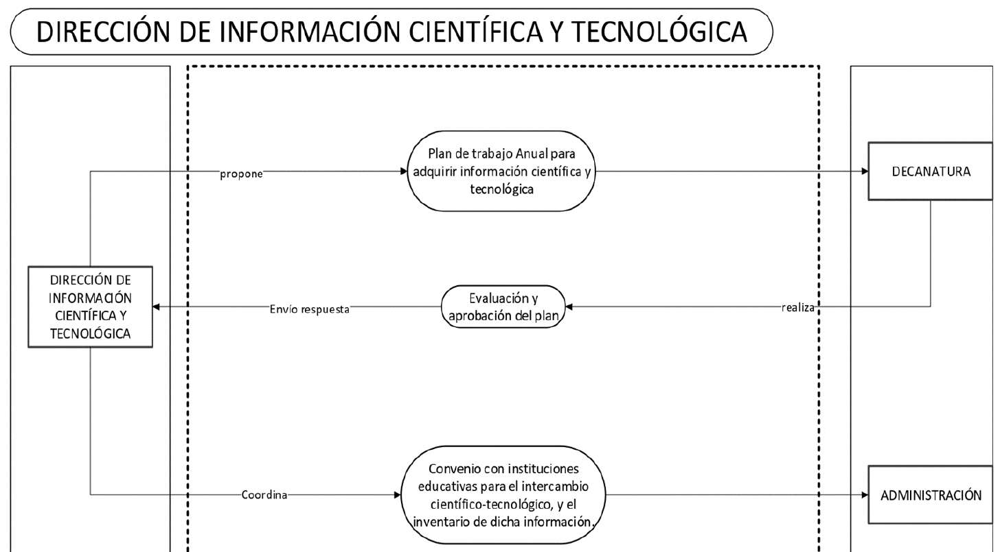

#### B. Descripción Detallada del Proceso y Flujo de Actividades
Fomenta la generación de nuevo conocimiento y asegura el acceso a publicaciones de frontera en ciencias de la administración.

1. **Actores Participantes (Swimlanes):**
   - **Dirección de Información Científica y Tecnológica:** Órgano técnico promotor de la investigación.
   - **Decanatura:** Instancia directiva que convalida los planes anuales.
   - **Administración:** Asiste en las coordinaciones operativas de convenios e inventarios.

2. **Narrativa Secuencial del Proceso (Paso a Paso):**
   - **Paso 1 (Propuesta del Plan Anual):** La *Dirección de Información Científica y Tecnológica* formula y propone a la *Decanatura* el Plan de Trabajo Anual para adquirir información científica y tecnológica.
   - **Paso 2 (Evaluación y Aprobación):** *Decanatura* realiza la evaluación técnica y emite la respuesta aprobatoria formal hacia la Dirección.
   - **Paso 3 (Coordinación y Convenios):** La Dirección coordina con *Administración* la suscripción de convenios interinstitucionales con entidades educativas para el intercambio científico y tecnológico.
   - **Paso 4 (Inventario y Cierre):** Se realiza el inventario formal de la información y publicaciones recopiladas para ponerlas a disposición de los agremiados (**FIN**).

#### C. Diagrama de Flujo (Mermaid)
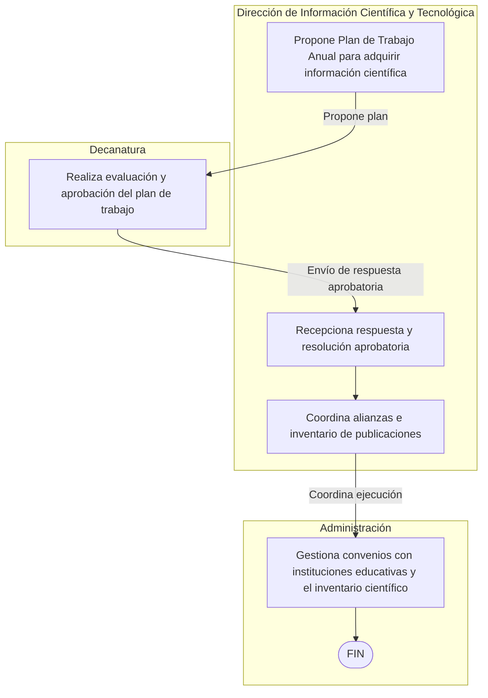
```mermaid
flowchart TD
    subgraph Direccion ["Dirección de Información Científica y Tecnológica"]
        D1["Propone Plan de Trabajo Anual para adquirir información científica"]
        D2["Recepciona respuesta y resolución aprobatoria"]
        D3["Coordina alianzas e inventario de publicaciones"]
    end

    subgraph Decanatura ["Decanatura"]
        C1["Realiza evaluación y aprobación del plan de trabajo"]
    end

    subgraph Administracion ["Administración"]
        A1["Gestiona convenios con instituciones educativas y el inventario científico"]
        Fin(["FIN"])
    end

    D1 -->|Propone plan| C1
    C1 -->|Envío de respuesta aprobatoria| D2
    D2 --> D3
    D3 -->|Coordina ejecución| A1
    A1 --> Fin
```

---

## 09. Proceso de Imagen Institucional

### 1. Ficha de Identificación del Proceso
| Parámetro | Detalle |
| :--- | :--- |
| **Macroproceso:** | Procesos Misionales y/o Principales |
| **Nombre del Proceso:** | Imagen Institucional |
| **Responsable del Proceso:** | Director Regional de Imagen Institucional |
| **Objetivo del Proceso:** | Posicionar, proyectar y consolidar una reputación de solvencia técnica, transparencia e identidad gremial del CORLAD Junín. |
| **Alcance del Proceso:** | Inicia con la planificación de campañas de identidad y culmina con la difusión de publicaciones, cobertura de eventos y monitoreo de medios. |

### 2. Matriz de Caracterización (Ciclo PHVA / SIPOC)
| Entradas | Proveedor | PHVA | Actividad | Responsable | Salida | Beneficiarios |
| :--- | :--- | :---: | :--- | :--- | :--- | :--- |
| Propuesta de identidad corporativa | Decano / Director de imagen | **P** | Planificación de la gestión comunicacional y manejo de marca institucional. | Director de imagen institucional | Plan de imagen institucional | Administración |
| Asignación y delegación | Administración | **P** | Asignación de responsabilidades para diseño gráfico, redes sociales y cobertura de prensa. | Administrador | Asignación de tareas operativas | Marketing / Imagen |
| Producción de material digital | Marketing | **H** | Elaboración de diseños gráficos, edición audiovisual, comunicados y notas de prensa. | Encargado de marketing / Practicantes | Bosquejos y propuestas de contenido | Administración |
| Revisión y control de línea gráfica | Administración | **V** | Revisión editorial, ortográfica y adecuación al manual de marca del colegio. | Administrador | Visto bueno / Observaciones de contenido | Marketing |
| Aprobación y difusión multiplataforma | Decanatura / Administración | **A** | Publicación en redes sociales oficiales, portal institucional y medios de comunicación masivos. | Marketing / Imagen institucional | Publicaciones oficiales difundidas | Agremiados y opinión pública |

### 3. Recursos del Proceso
- **Humano:** Director de imagen institucional, Administrador, Encargado de marketing, Tesorera, Practicantes de diseño y ciencias de la comunicación.
- **Infraestructura:** Cámaras fotográficas digitales, equipos de cómputo para diseño gráfico y edición multimedia, banners publicitarios.
- **Ambiente de Trabajo:** Oficina de imagen institucional y sala de prensa.

### 4. Documentos Asociados
- **Internos:** Estatuto del CORLAD Junín, Plan Estratégico, Manual de Identidad Visual Corporativa.
- **Externos:** Ley de Transparencia y Acceso a la Información Pública.

### 5. Registros
- Archivo fotográfico y videográfico digital institucional.
- Historial de publicaciones y métricas de alcance en redes sociales (Facebook, LinkedIn, Instagram).

### 6. Indicadores de Gestión
| Nombre del Indicador | Fórmula del Indicador | Meta | Frecuencia de Medición |
| :--- | :--- | :---: | :---: |
| **Nivel de aprobación de imagen institucional** | $$\text{Porcentaje de aprobación en mediciones de satisfacción}$$ | $\ge 50\%$ | Mensual |

### 7. Flujograma del Proceso

#### A. Gráfico Oficial del Flujograma
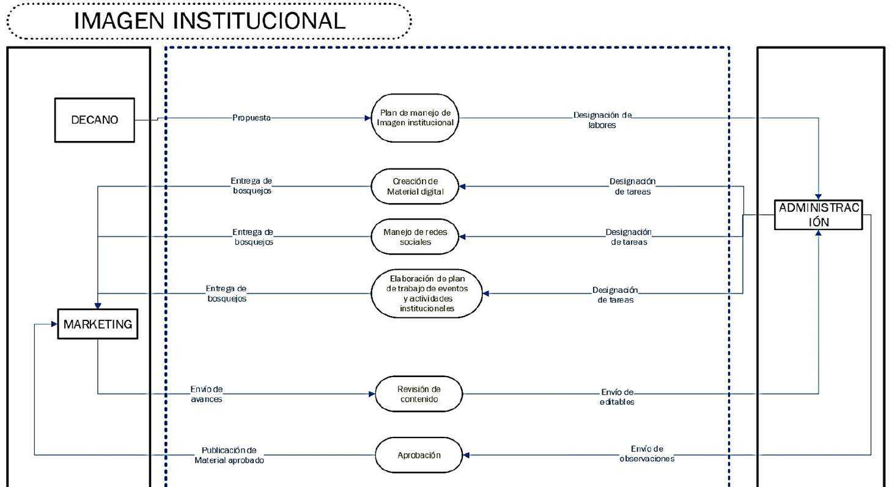

#### B. Descripción Detallada del Proceso y Flujo de Actividades
Regula la comunicación estratégica tanto interna como externa de la institución.

1. **Actores Participantes (Swimlanes):**
   - **Decano:** Genera los lineamientos centrales de comunicación.
   - **Marketing:** Célula creativa que produce los contenidos visuales y audiovisuales.
   - **Administración:** Supervisa los contenidos y autoriza su puesta en público.

2. **Narrativa Secuencial del Proceso (Paso a Paso):**
   - **Paso 1 (Propuesta Estratégica):** El *Decano* plantea la propuesta del Plan de Manejo de Imagen Institucional.
   - **Paso 2 (Designación de Labores):** Remite la propuesta a *Administración*, quien asume la coordinación y designación de labores.
   - **Paso 3 (Asignación de Tareas Creativas):** Administración distribuye las órdenes operativas al área de *Marketing*:
     - Creación de material digital.
     - Manejo y administración de redes sociales.
     - Elaboración del plan de trabajo de eventos y actividades institucionales.
   - **Paso 4 (Entrega de Bosquejos):** *Marketing* formula y entrega los bosquejos y borradores de contenido a Administración.
   - **Paso 5 (Revisión de Contenidos):** Se envían los archivos editables y avances para la revisión técnica y corrección de observaciones.
   - **Paso 6 (Aprobación y Publicación):** Tras levantar cualquier observación, Administración aprueba formalmente el arte final y *Marketing* procede a la publicación del material aprobado en los canales oficiales (**FIN**).

#### C. Diagrama de Flujo (Mermaid)
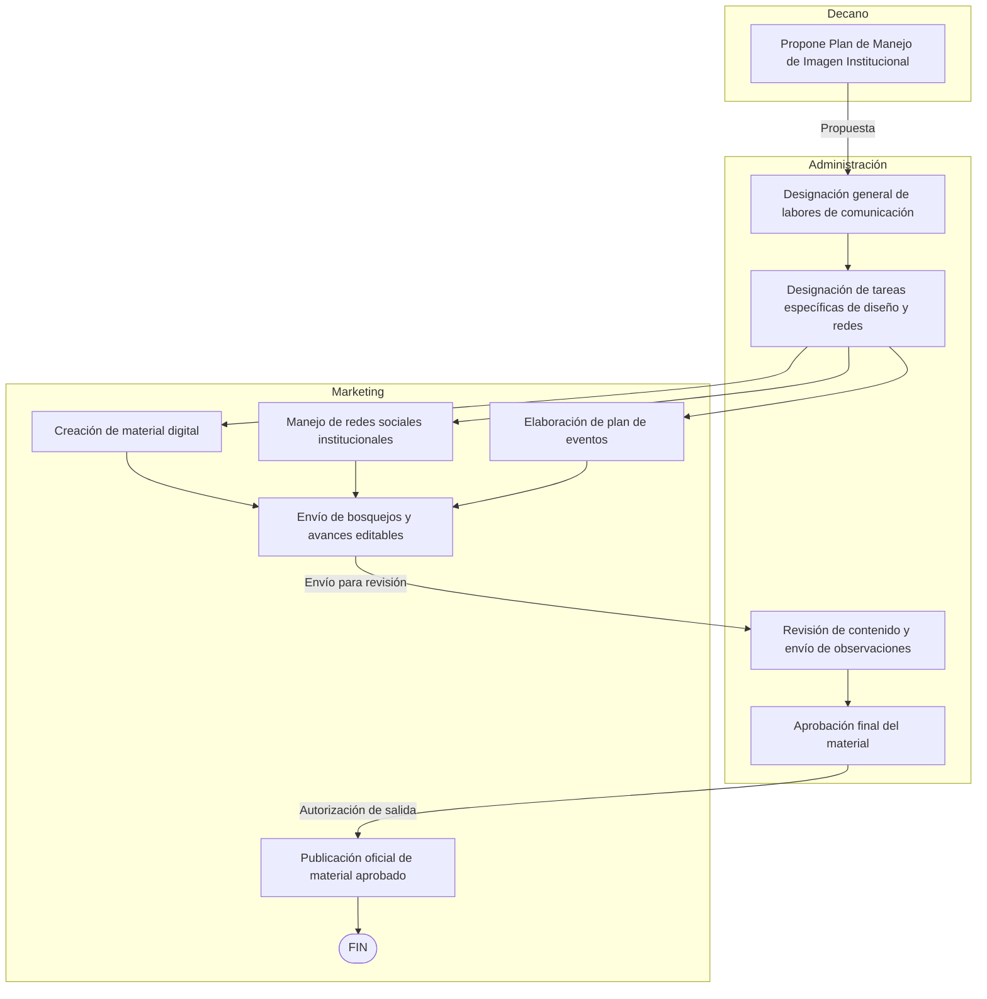
```mermaid
flowchart TD
    subgraph DecanoInst ["Decano"]
        D1["Propone Plan de Manejo de Imagen Institucional"]
    end

    subgraph Admin ["Administración"]
        A1["Designación general de labores de comunicación"]
        A2["Designación de tareas específicas de diseño y redes"]
        A3["Revisión de contenido y envío de observaciones"]
        A4["Aprobación final del material"]
    end

    subgraph Mkt ["Marketing"]
        M1["Creación de material digital"]
        M2["Manejo de redes sociales institucionales"]
        M3["Elaboración de plan de eventos"]
        M4["Envío de bosquejos y avances editables"]
        M5["Publicación oficial de material aprobado"]
        Fin(["FIN"])
    end

    D1 -->|Propuesta| A1
    A1 --> A2
    A2 --> M1 & M2 & M3
    M1 & M2 & M3 --> M4
    M4 -->|Envío para revisión| A3
    A3 --> A4
    A4 -->|Autorización de salida| M5
    M5 --> Fin
```

---

## 10. Proceso de Economía y Finanzas

### 1. Ficha de Identificación del Proceso
| Parámetro | Detalle |
| :--- | :--- |
| **Macroproceso:** | Procesos Misionales y/o Principales |
| **Nombre del Proceso:** | Economía y Finanzas |
| **Responsable del Proceso:** | Director Regional de Economía y Finanzas |
| **Objetivo del Proceso:** | Administrar eficientemente los fondos económicos, optimizar los recursos presupuestales y salvaguardar la salud financiera del colegio profesional. |
| **Alcance del Proceso:** | Inicia con la elaboración del presupuesto anual y requerimientos contables, y culmina con la formulación del balance económico y la rendición de cuentas. |

### 2. Matriz de Caracterización (Ciclo PHVA / SIPOC)
| Entradas | Proveedor | PHVA | Actividad | Responsable | Salida | Beneficiarios |
| :--- | :--- | :---: | :--- | :--- | :--- | :--- |
| Solicitud de requerimientos contables | Contador | **P** | Recopilación de necesidades contables, tributarias y presupuestarias del periodo. | Contador / Tesorera | Requerimiento de balance y documentación | Decanatura |
| Solicitud de informe y balance | Decanatura | **P** | Encomienda la formulación del balance económico y evaluación presupuestal al área contable. | Decanatura | Orden de formulación de balance | Contabilidad |
| Elaboración de estados y balances | Contabilidad | **H** | Consolidación de ingresos, egresos, conciliaciones bancarias y preparación del balance. | Contador / Asistente contable | Borrador de balance económico | Directorio de Economía |
| Revisión y emisión de dictamen | Directorio de Economía | **V** | Revisión analítica de las cuentas, ratios financieros y control de la ejecución presupuestal. | Director de economía y finanzas | Informe financiero consolidado | Consejo Directivo |
| Aprobación y rendición final | Consejo Directivo / Asamblea | **A** | Aprobación del balance económico anual en asamblea general y publicación de estados financieros. | Decano / Director de economía | Memoria económica anual aprobada | CORLAD Junín y colegiados |

### 3. Recursos del Proceso
- **Humano:** Decano, Consejo Directivo, Director de economía y finanzas, Tesorera, Contador público, Administrador.
- **Infraestructura:** Equipos de cómputo, sistemas de gestión financiera y contable, caja de seguridad, terminales bancarios.
- **Ambiente de Trabajo:** Oficinas de tesorería y administración.

### 4. Documentos Asociados
- **Internos:** Estatuto del CORLAD Junín, Plan Estratégico, Tarifario institucional, Políticas de caja chica.
- **Externos:** Normas Internacionales de Información Financiera (NIIF), Código Tributario de la SUNAT.

### 5. Registros
- Estados financieros auditados (Balance General y Estado de Ganancias y Pérdidas).
- Libros contables oficiales y conciliaciones bancarias mensuales.

### 6. Indicadores de Gestión
| Nombre del Indicador | Fórmula del Indicador | Meta | Frecuencia de Medición |
| :--- | :--- | :---: | :---: |
| **Gestión económica eficiente** | $$\frac{\text{Gastos periodo anterior} - \text{Gastos periodo actual}}{\text{Gastos periodo anterior}} \times 100$$ | $\ge 10\%$ | Anual |
| **Equilibrio financiero** | $$\frac{\text{Gastos}}{\text{Ingresos}} \times 100$$ | $\le 80\%$ | Anual |

### 7. Flujograma del Proceso

#### A. Gráfico Oficial del Flujograma
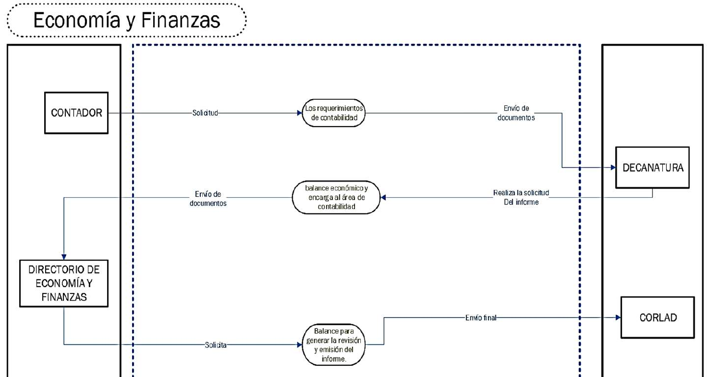

#### B. Descripción Detallada del Proceso y Flujo de Actividades
Asegura la adecuada programación, registro, auditoría y rendición transparente de los ingresos y egresos institucionales.

1. **Actores Participantes (Swimlanes):**
   - **Contador:** Procesa la información tributaria y elabora los estados contables.
   - **Directorio de Economía y Finanzas:** Revisa los aspectos presupuestarios y emite dictámenes.
   - **Decanatura:** Instancia ordenadora que instruye la rendición y formaliza los balances.
   - **CORLAD:** Representa la institución y la asamblea de agremiados que recibe el informe.

2. **Narrativa Secuencial del Proceso (Paso a Paso):**
   - **Paso 1 (Requerimientos de Contabilidad):** El *Contador* emite la solicitud formal detallando los requerimientos contables y financieros del periodo.
   - **Paso 2 (Envío a Decanatura):** Se envían los documentos preliminares a *Decanatura*.
   - **Paso 3 (Instrucción de Balance):** *Decanatura* emite la solicitud del informe integral y encarga formalmente la preparación del balance económico al área de contabilidad.
   - **Paso 4 (Envío al Directorio de Economía):** El balance elaborado es remitido al *Directorio de Economía y Finanzas*.
   - **Paso 5 (Revisión y Emisión de Informe):** El Directorio de Economía revisa exhaustivamente las partidas de ingresos y gastos, formulando el informe de conformidad.
   - **Paso 6 (Envío Final a la Institución):** Se efectúa el envío final del balance económico consolidado a la institución (*CORLAD*) para su presentación en asamblea y difusión a los agremiados (**FIN**).

#### C. Diagrama de Flujo (Mermaid)
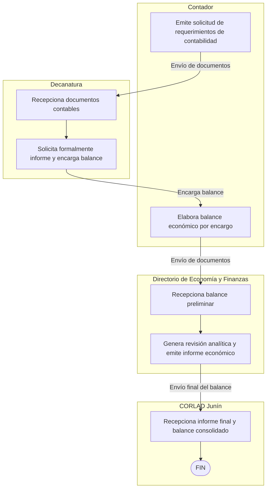
```mermaid
flowchart TD
    subgraph Contable ["Contador"]
        A1["Emite solicitud de requerimientos de contabilidad"]
        A2["Elabora balance económico por encargo"]
    end

    subgraph Decanato ["Decanatura"]
        D1["Recepciona documentos contables"]
        D2["Solicita formalmente informe y encarga balance"]
    end

    subgraph DirEconomia ["Directorio de Economía y Finanzas"]
        E1["Recepciona balance preliminar"]
        E2["Genera revisión analítica y emite informe económico"]
    end

    subgraph Institucion ["CORLAD Junín"]
        C1["Recepciona informe final y balance consolidado"]
        Fin(["FIN"])
    end

    A1 -->|Envío de documentos| D1
    D1 --> D2
    D2 -->|Encarga balance| A2
    A2 -->|Envío de documentos| E1
    E1 --> E2
    E2 -->|Envío final del balance| C1
    C1 --> Fin
```

---

## 11. Proceso de Secretaría y Actas

### 1. Ficha de Identificación del Proceso
| Parámetro | Detalle |
| :--- | :--- |
| **Macroproceso:** | Procesos Misionales y/o Principales |
| **Nombre del Proceso:** | Secretaría y Actas |
| **Responsable del Proceso:** | Director Regional de Secretaría |
| **Objetivo del Proceso:** | Garantizar la atención, redacción, archivo y despacho oportuno de la correspondencia institucional, así como la custodia y asentado de actas del Consejo Directivo. |
| **Alcance del Proceso:** | Inicia con la recepción de documentación física y virtual y culmina con la derivación, respuesta formal y archivo definitivo. |

### 2. Matriz de Caracterización (Ciclo PHVA / SIPOC)
| Entradas | Proveedor | PHVA | Actividad | Responsable | Salida | Beneficiarios |
| :--- | :--- | :---: | :--- | :--- | :--- | :--- |
| Documentos físicos y virtuales | Usuarios / Instituciones | **P** | Descarga, sellado, registro cronológico y derivación en el libro de partes. | Secretaria / Director de secretaría | Expediente registrado y proveído | Decano |
| Revisión y proveído de trámite | Decano | **P** | Lectura, análisis del contenido y disposición del tipo de respuesta que corresponda. | Decano | Proveído de atención / Decreto | Administrador |
| Derivación y atención | Administrador | **H** | Derivación a las áreas responsables para la confección de informes o respuestas. | Administrador | Expediente derivado a áreas | Áreas correspondientes |
| Redacción de actas y respuestas | Secretaría | **V** | Redacción de oficios de respuesta, resoluciones y transcripción fiel de actas de sesiones. | Director de secretaría / Secretaria | Oficios redactados y actas sentadas | Decanatura y Consejo Directivo |
| Notificación y archivo definitivo | Secretaría | **A** | Notificación al administrado y archivo técnico de los actuados en el archivo central. | Secretaria / Archivero | Documento notificado y legajo archivado | Usuarios y CORLAD |

### 3. Recursos del Proceso
- **Humano:** Director regional de secretaría, Administrador, Decano, Secretaria recepcionista.
- **Infraestructura:** Instalaciones del CORLAD Junín, mobiliario, equipos de cómputo, fotocopiadora, escáner de alta velocidad.
- **Ambiente de Trabajo:** Oficina de secretaría general y archivo documentario.

### 4. Documentos Asociados
- **Internos:** Estatuto del CORLAD Junín, Plan Estratégico, Manual de Trámite Documentario.
- **Externos:** Texto Único Ordenado de la Ley 27444 (Ley de Procedimiento Administrativo General).

### 5. Registros
- Libro de Mesa de Partes (físico y digital).
- Libros oficiales de Actas del Consejo Directivo y Asambleas Generales.
- Correlativo de correspondencia emitida y recibida.

### 6. Indicadores de Gestión
| Nombre del Indicador | Fórmula del Indicador | Meta | Frecuencia de Medición |
| :--- | :--- | :---: | :---: |
| **Eficiencia** | $$\text{Puntaje promedio de eficiencia en tramitación}$$ | $> 3$ | Mensual |
| **Satisfacción del cliente** | $$\text{Puntaje promedio de satisfacción del usuario}$$ | $> 3$ | Mensual |

### 7. Flujograma del Proceso

#### A. Gráfico Oficial del Flujograma
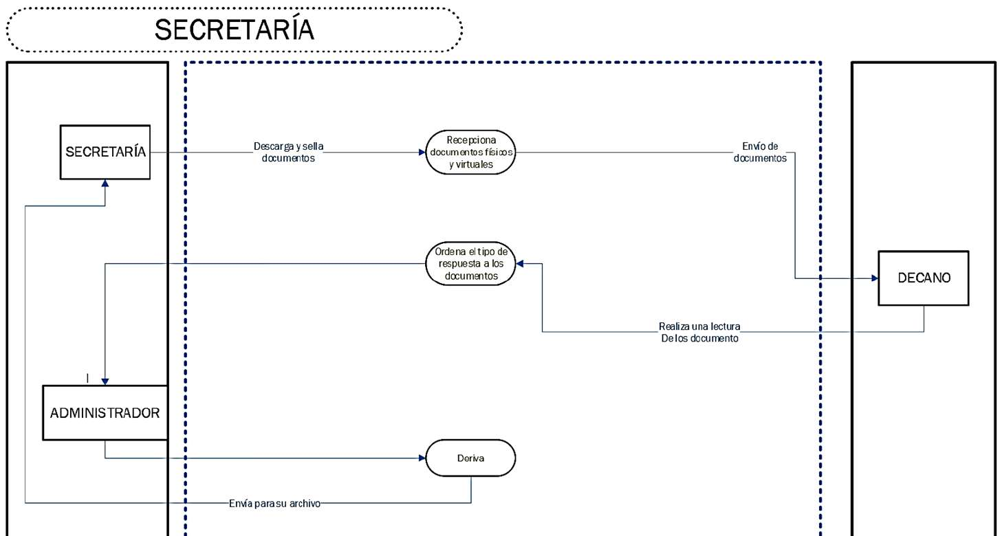

#### B. Descripción Detallada del Proceso y Flujo de Actividades
Eje neurálgico de la gestión documental y la fe pública institucional del CORLAD Junín.

1. **Actores Participantes (Swimlanes):**
   - **Secretaría:** Recepciona, clasifica, sella y archiva la correspondencia.
   - **Administrador:** Ejecuta y deriva operativamente el proveído a las áreas competentes.
   - **Decano:** Revisa el fondo de las comunicaciones y ordena el sentido de las respuestas.

2. **Narrativa Secuencial del Proceso (Paso a Paso):**
   - **Paso 1 (Recepción Documental):** *Secretaría* descarga documentos virtuales y recepciona documentos físicos, procediendo a su foliación y sellado oficial.
   - **Paso 2 (Envío al Decano):** Despacha los expedientes recepcionados al despacho del *Decano*.
   - **Paso 3 (Lectura y Proveído):** El *Decano* realiza la lectura detallada de los documentos y determina la orden o tipo de respuesta administrativa aplicable.
   - **Paso 4 (Canalización a Administración):** Decanatura envía la instrucción al *Administrador*.
   - **Paso 5 (Derivación):** El *Administrador* deriva el trámite al área pertinente para la elaboración de la respuesta o cumplimiento del mandato.
   - **Paso 6 (Archivo Definitivo):** Cumplida la atención, el expediente se remite a *Secretaría* para su archivo definitivo y custodia (**FIN**).

#### C. Diagrama de Flujo (Mermaid)
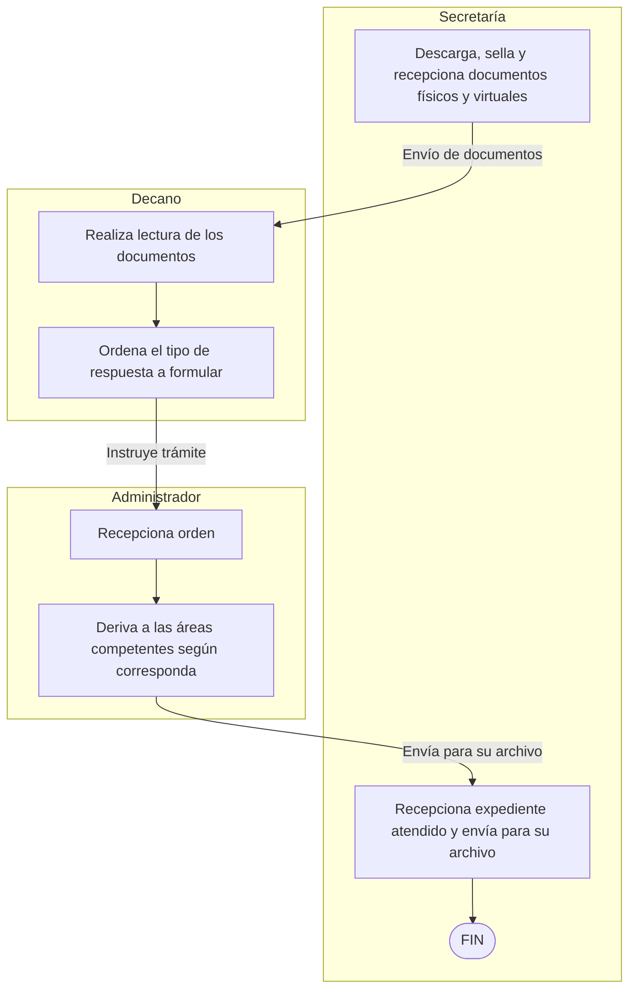
```mermaid
flowchart TD
    subgraph Sec ["Secretaría"]
        S1["Descarga, sella y recepciona documentos físicos y virtuales"]
        S2["Recepciona expediente atendido y envía para su archivo"]
        Fin(["FIN"])
    end

    subgraph Decanato ["Decano"]
        D1["Realiza lectura de los documentos"]
        D2["Ordena el tipo de respuesta a formular"]
    end

    subgraph Admin ["Administrador"]
        A1["Recepciona orden"]
        A2["Deriva a las áreas competentes según corresponda"]
    end

    S1 -->|Envío de documentos| D1
    D1 --> D2
    D2 -->|Instruye trámite| A1
    A1 --> A2
    A2 -->|Envía para su archivo| S2
    S2 --> Fin
```

---

# III. PROCESOS DE APOYO

---

## 12. Proceso de Gestión Asesoría Legal

### 1. Ficha de Identificación del Proceso
| Parámetro | Detalle |
| :--- | :--- |
| **Macroproceso:** | Procesos de Apoyo |
| **Nombre del Proceso:** | Asesoría Legal |
| **Responsable del Proceso:** | Encargado de Asesoría Legal / Asesor Legal |
| **Objetivo del Proceso:** | Cautelar la legalidad de los actos resolutivos e institucionales del colegio, prestando asesoramiento jurídico a la Decanatura y Consejo Directivo. |
| **Alcance del Proceso:** | Inicia con la derivación de expedientes y consultas legales y culmina con la emisión de informes jurídicos, visaciones y resoluciones formalizadas. |

### 2. Matriz de Caracterización (Ciclo PHVA / SIPOC)
| Entradas | Proveedor | PHVA | Actividad | Responsable | Salida | Beneficiarios |
| :--- | :--- | :---: | :--- | :--- | :--- | :--- |
| Derivación de expedientes | Decanatura | **P** | Recepción y análisis preliminar del caso, consulta o controversia legal. | Decanatura / Asesor legal | Expediente derivado a revisión | Abogado |
| Análisis normativo y designación | Abogado | **H** | Estudio de normas aplicables y asignación de tareas de investigación al asistente. | Abogado / Asistente legal | Instrucción de redacción de borrador | Asistente legal |
| Elaboración de borradores | Asistente legal | **H** | Búsqueda jurisprudencial y redacción de propuestas de informe o contrato. | Asistente legal | Borrador de informe legal | Abogado |
| Revisión y formulación de observaciones | Abogado | **V** | Revisión de fondo y forma, corrección y suscripción del informe legal definitivo. | Abogado | Informe legal suscrito | Decanatura |
| Aprobación y oficialización | Decanatura | **A** | Aprobación de la recomendación legal y expedición del acto administrativo o resolución. | Decanatura / Asesor legal | Resolución o acto formalizado | CORLAD e interesados |

### 3. Recursos del Proceso
- **Humano:** Encargado de asesoría legal (Abogado), Asistente legal.
- **Infraestructura:** Instalaciones del CORLAD Junín, mobiliario, equipos y materiales de escritorio, biblioteca de consulta legal.
- **Ambiente de Trabajo:** Oficina de asesoría legal.

### 4. Documentos Asociados
- **Internos:** Estatuto del CORLAD Junín, Plan Estratégico, Vademécum institucional, Protocolos y reglamentos del CLAD y CORLAD.
- **Externos:** Ley 31060, Ley 27444 (LPAG), Código Civil, Código Procesal Civil y normativa laboral.

### 5. Registros
- Archivo correlativo de informes jurídicos y opiniones legales.
- Registro de convenios y contratos legalmente visados.

### 6. Indicadores de Gestión
| Nombre del Indicador | Fórmula del Indicador | Meta | Frecuencia de Medición |
| :--- | :--- | :---: | :---: |
| **Resolución de casos** | $$\frac{\text{N° casos favorables}}{\text{N° total de casos}} \times 100$$ | $\ge 80\%$ | Anual |

### 7. Flujograma del Proceso

#### A. Gráfico Oficial del Flujograma
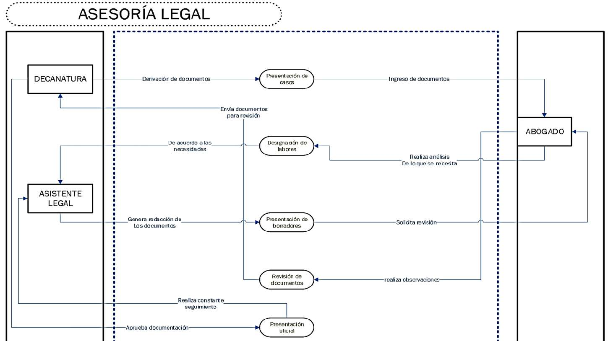

#### B. Descripción Detallada del Proceso y Flujo de Actividades
Garantiza el blindaje normativo de todos los actos institucionales y convenios celebrados por el CORLAD Junín.

1. **Actores Participantes (Swimlanes):**
   - **Decanatura:** Solicita opiniones legales y emite las resoluciones institucionales.
   - **Asistente Legal:** Redacta los proyectos y efectúa el seguimiento procesal.
   - **Abogado (Asesor Legal):** Dictamina y valida el sustento legal de las actuaciones.

2. **Narrativa Secuencial del Proceso (Paso a Paso):**
   - **Paso 1 (Derivación de Casos):** *Decanatura* realiza la derivación formal de documentos y casos que requieren opinión jurídica.
   - **Paso 2 (Ingreso al Abogado):** Se formaliza el ingreso de los expedientes al despacho del *Abogado*.
   - **Paso 3 (Análisis y Designación):** El Abogado analiza lo que se requiere y designa labores al *Asistente Legal* de acuerdo a las necesidades del caso.
   - **Paso 4 (Redacción y Borradores):** El *Asistente Legal* genera la redacción de los documentos, elabora los borradores y solicita la revisión al Abogado.
   - **Paso 5 (Revisión y Ajustes):** El Abogado realiza observaciones y ajustes a los documentos, emitiendo el visto bueno.
   - **Paso 6 (Envío para Revisión de Decanatura):** Se remite el expediente consolidado a *Decanatura*.
   - **Paso 7 (Seguimiento y Aprobación):** El Asistente realiza el seguimiento constante del trámite hasta que Decanatura aprueba formalmente la documentación.
   - **Paso 8 (Presentación Oficial):** Se realiza la presentación oficial de la resolución, acto o informe legal (**FIN**).

#### C. Diagrama de Flujo (Mermaid)
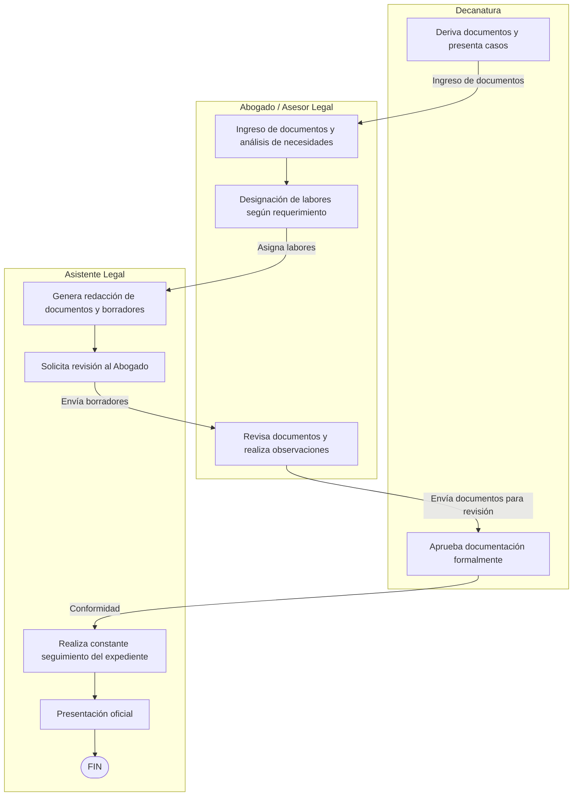
```mermaid
flowchart TD
    subgraph Decanato ["Decanatura"]
        D1["Deriva documentos y presenta casos"]
        D2["Aprueba documentación formalmente"]
    end

    subgraph Legal ["Abogado / Asesor Legal"]
        L1["Ingreso de documentos y análisis de necesidades"]
        L2["Designación de labores según requerimiento"]
        L3["Revisa documentos y realiza observaciones"]
    end

    subgraph Asistente ["Asistente Legal"]
        A1["Genera redacción de documentos y borradores"]
        A2["Solicita revisión al Abogado"]
        A3["Realiza constante seguimiento del expediente"]
        A4["Presentación oficial"]
        Fin(["FIN"])
    end

    D1 -->|Ingreso de documentos| L1
    L1 --> L2
    L2 -->|Asigna labores| A1
    A1 --> A2
    A2 -->|Envía borradores| L3
    L3 -->|Envía documentos para revisión| D2
    D2 -->|Conformidad| A3
    A3 --> A4
    A4 --> Fin
```

---

## 13. Proceso de Gestión Contable

### 1. Ficha de Identificación del Proceso
| Parámetro | Detalle |
| :--- | :--- |
| **Macroproceso:** | Procesos de Apoyo |
| **Nombre del Proceso:** | Asesoría Contable / Gestión Contable |
| **Responsable del Proceso:** | Encargado de Asesoría Contable / Contador |
| **Objetivo del Proceso:** | Asistir a la institución en todas las actividades contables, tributarias y financieras para el manejo y archivo idóneo de los documentos contables. |
| **Alcance del Proceso:** | Inicia con la recepción de boletas, facturas y comprobantes diarios y culmina con la aprobación, firma y presentación oficial de los balances económicos. |

### 2. Matriz de Caracterización (Ciclo PHVA / SIPOC)
| Entradas | Proveedor | PHVA | Actividad | Responsable | Salida | Beneficiarios |
| :--- | :--- | :---: | :--- | :--- | :--- | :--- |
| Comprobantes de pago | Cajera / Administración | **P** | Recopilación, clasificación y verificación de comprobantes de pago de ingresos y egresos. | Cajera / Asistente contable | Comprobantes ordenados y clasificados | Asistencia contable |
| Registro y liquidación | Asistencia contable | **H** | Registro en libros contables y elaboración preliminar de borradores de balance. | Asistente contable | Borradores de balances contables | Contador |
| Revisión y formulación de balances | Contador | **V** | Revisión técnica, cálculo de tributos mensuales y elaboración del balance general. | Contador | Balances e informes contables | Administrador |
| Aprobación ejecutiva | Administrador | **V** | Evaluación y aprobación administrativa de los informes y balances. | Administrador | Balances visados | Decanatura |
| Verificación y firma final | Decanatura | **A** | Verificación de constancia, firma oficial de estados financieros y archivo fiscal. | Decano / Contador | Estados financieros firmados y auditados | CORLAD Junín y SUNAT |

### 3. Recursos del Proceso
- **Humano:** Encargado de asesoría contable (Contador), Asistente contable, Cajera.
- **Infraestructura:** Instalaciones del CORLAD Junín, mobiliario, equipos de cómputo, software contable.
- **Ambiente de Trabajo:** Oficina del área contable y caja.

### 4. Documentos Asociados
- **Internos:** Estatuto del CORLAD Junín, Plan Estratégico, Vademécum, Protocolos contables.
- **Externos:** Normativa de la SUNAT, Código Tributario, Ley de Comprobantes de Pago.

### 5. Registros
- Archivo físico mensual de facturas, boletas y comprobantes de retención.
- Libros electrónicos contables y declaraciones juradas mensuales (PDT).

### 6. Indicadores de Gestión
| Nombre del Indicador | Fórmula del Indicador | Meta | Frecuencia de Medición |
| :--- | :--- | :---: | :---: |
| **Satisfacción del cliente** | $$\text{Puntaje promedio de satisfacción}$$ | $> 3$ | Mensual |

### 7. Flujograma del Proceso

#### A. Gráfico Oficial del Flujograma
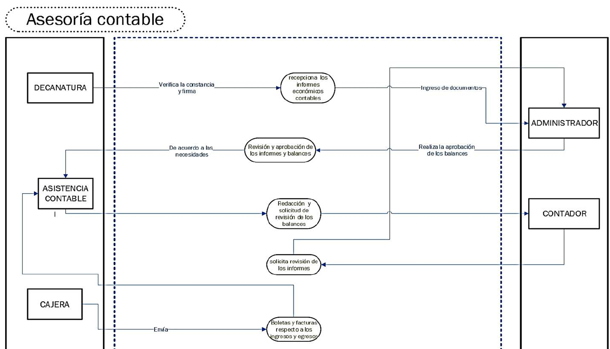

#### B. Descripción Detallada del Proceso y Flujo de Actividades
Registra de forma oportuna y fidedigna todas las operaciones comerciales y tributarias del colegio.

1. **Actores Participantes (Swimlanes):**
   - **Cajera:** Emite y recopila los comprobantes primarios de pago.
   - **Asistencia Contable:** Clasifica los comprobantes y estructura los borradores.
   - **Contador:** Revisa y emite los balances oficiales.
   - **Administrador:** Revisa la coherencia operativa de los gastos y aprueba los balances.
   - **Decanatura:** Refrenda con su firma los estados económicos finales.

2. **Narrativa Secuencial del Proceso (Paso a Paso):**
   - **Paso 1 (Comprobantes de Ingreso/Egreso):** La *Cajera* envía las boletas, facturas y vouchers de los ingresos y egresos diarios.
   - **Paso 2 (Recepción y Solicitud):** *Asistencia Contable* recepciona la documentación y solicita la revisión de los informes contables.
   - **Paso 3 (Redacción de Balances):** Se elabora la redacción y solicitud de revisión de los balances, derivándolos al *Contador*.
   - **Paso 4 (Ingreso a Administración):** El Contador consolida la información y remite los documentos al *Administrador*.
   - **Paso 5 (Aprobación Administrativa):** El Administrador realiza la aprobación ejecutiva de los balances e informa de acuerdo a las necesidades a Asistencia Contable.
   - **Paso 6 (Verificación en Decanatura):** *Decanatura* recepciona los informes económicos contables, verifica la constancia y suscribe con su firma los estados financieros oficiales (**FIN**).

#### C. Diagrama de Flujo (Mermaid)
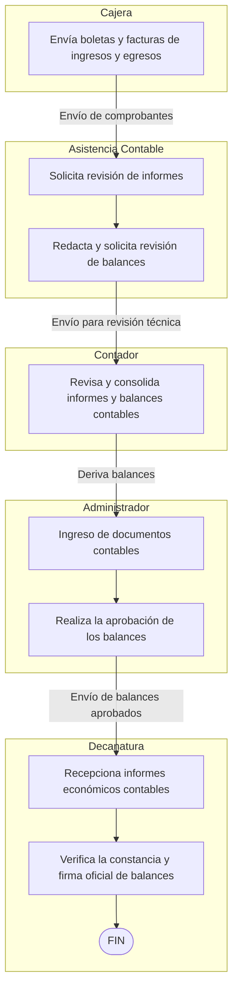
```mermaid
flowchart TD
    subgraph Caja ["Cajera"]
        C1["Envía boletas y facturas de ingresos y egresos"]
    end

    subgraph AsistContable ["Asistencia Contable"]
        A1["Solicita revisión de informes"]
        A2["Redacta y solicita revisión de balances"]
    end

    subgraph Contad ["Contador"]
        K1["Revisa y consolida informes y balances contables"]
    end

    subgraph Admin ["Administrador"]
        M1["Ingreso de documentos contables"]
        M2["Realiza la aprobación de los balances"]
    end

    subgraph Decanato ["Decanatura"]
        D1["Recepciona informes económicos contables"]
        D2["Verifica la constancia y firma oficial de balances"]
        Fin(["FIN"])
    end

    C1 -->|Envío de comprobantes| A1
    A1 --> A2
    A2 -->|Envío para revisión técnica| K1
    K1 -->|Deriva balances| M1
    M1 --> M2
    M2 -->|Envío de balances aprobados| D1
    D1 --> D2
    D2 --> Fin
```

---

## 14. Proceso de Gestión Logística

### 1. Ficha de Identificación del Proceso
| Parámetro | Detalle |
| :--- | :--- |
| **Macroproceso:** | Procesos de Apoyo |
| **Nombre del Proceso:** | Gestión Logística |
| **Responsable del Proceso:** | Encargado de Gestión Logística |
| **Objetivo del Proceso:** | Comprar, distribuir y almacenar oportunamente los elementos, bienes y suministros solicitados mediante requerimientos del personal. |
| **Alcance del Proceso:** | Inicia con el requerimiento de insumos por las áreas y culmina con la entrega de compras y control de inventarios. |

### 2. Matriz de Caracterización (Ciclo PHVA / SIPOC)
| Entradas | Proveedor | PHVA | Actividad | Responsable | Salida | Beneficiarios |
| :--- | :--- | :---: | :--- | :--- | :--- | :--- |
| Solicitud de compras | Áreas solicitantes | **P** | Consolidación y evaluación de los pedidos de materiales de escritorio y suministros. | Encargado de logística / Administrador | Requerimiento consolidado de compras | Decanatura |
| Aprobación de requerimientos | Decanatura | **P** | Evaluación de disponibilidad presupuestal y autorización de la compra. | Decanatura | Orden de compra autorizada | Tesorería |
| Asignación de fondos | Tesorería | **H** | Desembolso o provisión de fondos para la adquisición directa. | Tesorera | Fondos habilitados / Pago girado | Logística |
| Adquisición en proveedores | Proveedores | **H** | Compra efectiva de los suministros requeridos al mejor precio y calidad. | Encargado de logística | Bienes adquiridos y comprobantes | Almacén |
| Recepción y verificación | Encargado de logística | **V** | Verificación física de la mercadería comprada y control de conformidad. | Encargado de logística | Registro de ingreso en almacén | Áreas solicitantes |
| Distribución física a áreas | Logística | **A** | Entrega física de los insumos a las áreas usuarias mediante pecosa de entrega. | Encargado de logística | Pecosa firmada de recepción | Personal y áreas del CORLAD |

### 3. Recursos del Proceso
- **Humano:** Encargado de gestión logística, Administrador, Tesorera.
- **Infraestructura:** Instalaciones del CORLAD Junín, mobiliario, equipos y materiales de escritorio, plataforma de videoconferencia Zoom, movilidad/transporte.
- **Ambiente de Trabajo:** Cubículo de logística y almacén institucional.

### 4. Documentos Asociados
- **Internos:** Estatuto del CORLAD Junín, Plan Estratégico, Reglamento de Adquisiciones Institucionales.
- **Externos:** Normativa comercial y de comprobantes de pago.

### 5. Registros
- Cuaderno y archivo de órdenes de compra.
- Pecosas de salida de almacén debidamente firmadas por los usuarios.
- Inventario físico anual de bienes muebles y suministros.

### 6. Indicadores de Gestión
| Nombre del Indicador | Fórmula del Indicador | Meta | Frecuencia de Medición |
| :--- | :--- | :---: | :---: |
| **Satisfacción del cliente** | $$\text{Puntaje promedio de satisfacción en abastecimiento}$$ | $> 3$ | Mensual |

### 7. Flujograma del Proceso

#### A. Gráfico Oficial del Flujograma
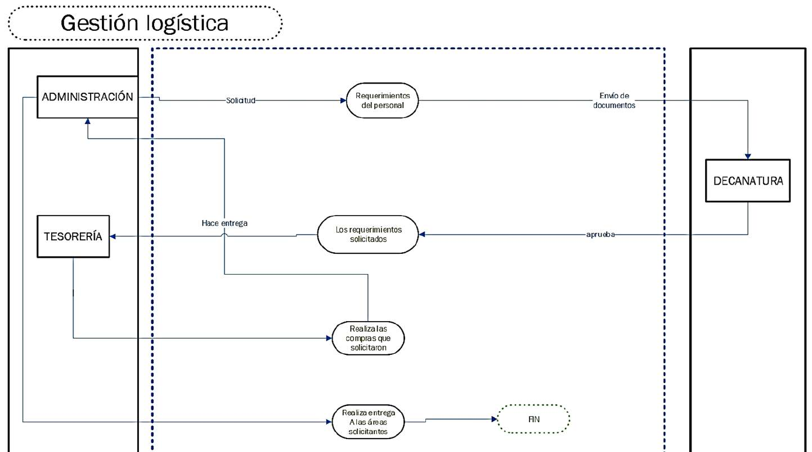

#### B. Descripción Detallada del Proceso y Flujo de Actividades
Suministra de forma ordenada y controlada los insumos necesarios para la operatividad de todas las oficinas del colegio.

1. **Actores Participantes (Swimlanes):**
   - **Administración:** Canaliza los requerimientos de las diferentes áreas.
   - **Tesorería:** Desembolsa los fondos o cancela a los proveedores.
   - **Decanatura:** Aprueba las compras solicitadas.

2. **Narrativa Secuencial del Proceso (Paso a Paso):**
   - **Paso 1 (Consolidación de Requerimientos):** *Administración* formula la solicitud consolidando los requerimientos de bienes y suministros presentados por el personal.
   - **Paso 2 (Envío a Decanatura):** Se remite el expediente de requerimientos a *Decanatura*.
   - **Paso 3 (Aprobación):** Decanatura evalúa la necesidad y aprueba formalmente los requerimientos solicitados.
   - **Paso 4 (Pase a Tesorería):** Decanatura hace entrega de los requerimientos aprobados a *Tesorería* para la asignación presupuestal y financiera.
   - **Paso 5 (Ejecución de Compras):** Con la disponibilidad de fondos, Administración/Logística realiza las compras que se solicitaron a los proveedores.
   - **Paso 6 (Distribución y Conformidad):** Se realiza la entrega física y distribución de los materiales adquiridos a las distintas áreas solicitantes (**FIN**).

#### C. Diagrama de Flujo (Mermaid)
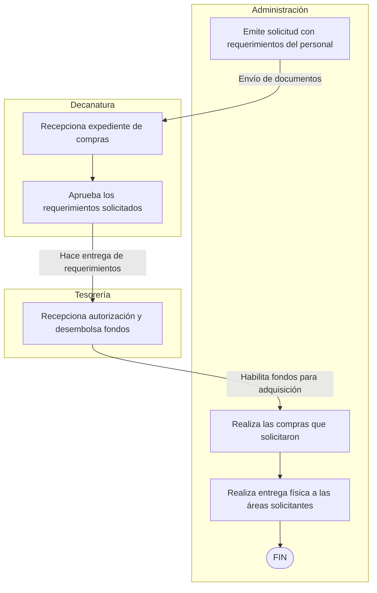
```mermaid
flowchart TD
    subgraph Admin ["Administración"]
        A1["Emite solicitud con requerimientos del personal"]
        A2["Realiza las compras que solicitaron"]
        A3["Realiza entrega física a las áreas solicitantes"]
        Fin(["FIN"])
    end

    subgraph Decanato ["Decanatura"]
        D1["Recepciona expediente de compras"]
        D2["Aprueba los requerimientos solicitados"]
    end

    subgraph Tesoreria ["Tesorería"]
        T1["Recepciona autorización y desembolsa fondos"]
    end

    A1 -->|Envío de documentos| D1
    D1 --> D2
    D2 -->|Hace entrega de requerimientos| T1
    T1 -->|Habilita fondos para adquisición| A2
    A2 --> A3
    A3 --> Fin
```

---

## 15. Proceso de Tecnología de la Información y Comunicación

### 1. Ficha de Identificación del Proceso
| Parámetro | Detalle |
| :--- | :--- |
| **Macroproceso:** | Procesos de Apoyo |
| **Nombre del Proceso:** | Tecnología de la Información y Comunicación (TIC) |
| **Responsable del Proceso:** | Encargado de Tecnologías de la Información y Comunicación |
| **Objetivo del Proceso:** | Administrar, mantener y dar soporte a los sistemas tecnológicos, infraestructura de redes, plataformas virtuales y equipos informáticos del colegio. |
| **Alcance del Proceso:** | Inicia con el requerimiento de soporte técnico o desarrollo digital y culmina con la reparación, levantamiento de observaciones y puesta en producción del servicio o material informático. |

### 2. Matriz de Caracterización (Ciclo PHVA / SIPOC)
| Entradas | Proveedor | PHVA | Actividad | Responsable | Salida | Beneficiarios |
| :--- | :--- | :---: | :--- | :--- | :--- | :--- |
| Solicitud de soporte o reparación | Personal / Administración | **P** | Diagnóstico inicial del requerimiento de soporte a equipos o requerimientos de sistemas. | Encargado TIC / Administrador | Ticket de soporte generado | Área TIC |
| Evaluación e instalación | Encargado TIC | **H** | Reparación de hardware, instalación de software, formateo, configuración de redes y seguridad. | Encargado TIC / Practicantes | Equipos informáticos operativos | Personal de oficinas |
| Creación de recursos digitales | Encargado TIC / Sistemas | **H** | Diseño de componentes web, adaptación de plataformas y soporte técnico en materiales digitales. | Profesionales en sistemas / TIC | Recursos y aplicaciones desarrolladas | Administración |
| Revisión y levantamiento de observaciones | Administración | **V** | Pruebas de funcionamiento, control de calidad y corrección de observaciones informáticas. | Administrador / TIC | Producto digital revisado | Administración |
| Aprobación y despliegue | Administrador / TIC | **A** | Publicación del material, despliegue de sistemas en servidor y mantenimiento preventivo continuo. | Encargado TIC / Administrador | Servicios web y aplicaciones en producción | Agremiados y personal |

### 3. Recursos del Proceso
- **Humano:** Encargado del área de tecnología, información y comunicación, Administrador, Practicante, Profesionales externos en desarrollo de sistemas de software.
- **Infraestructura:** Servidores, red cableada y Wi-Fi, computadoras, switch, herramientas de diagnóstico técnico, licencias de software.
- **Ambiente de Trabajo:** Centro de cómputo y cubículo de soporte técnico.

### 4. Documentos Asociados
- **Internos:** Estatuto del CORLAD Junín, Plan Estratégico, Manual de Políticas de Seguridad de la Información.
- **Externos:** Normas legales de protección de datos personales y ciberseguridad.

### 5. Registros
- Bitácora de atenciones de soporte técnico a equipos informáticos.
- Inventario de hardware, software y licencias del colegio.
- Copias de respaldo (backups) de bases de datos institucionales.

### 6. Indicadores de Gestión
| Nombre del Indicador | Fórmula del Indicador | Meta | Frecuencia de Medición |
| :--- | :--- | :---: | :---: |
| **Satisfacción del cliente** | $$\text{Puntaje promedio de satisfacción}$$ | $> 3$ | Mensual |

### 7. Flujograma del Proceso

#### A. Gráfico Oficial del Flujograma
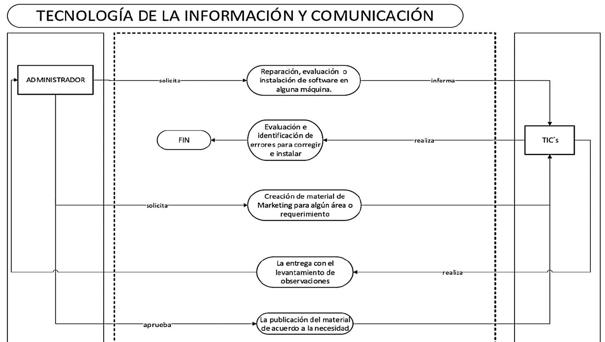

#### B. Descripción Detallada del Proceso y Flujo de Actividades
El flujo de **Tecnología de la Información y Comunicación** comprende dos circuitos operativos complementarios:

1. **Actores Participantes (Swimlanes):**
   - **Administrador:** Solicita y valida el servicio técnico o productos tecnológicos.
   - **Área de TIC's:** Ingenieros y técnicos que resuelven los requerimientos y desarrollan soluciones informáticas.

2. **Narrativa Secuencial del Proceso (Paso a Paso):**
   - **Circuito A: Soporte Técnico e Infraestructura:**
     - **Paso 1 (Solicitud de Servicio):** El *Administrador* o colaborador emite una solicitud por reparación, evaluación o instalación de software en alguna máquina del CORLAD.
     - **Paso 2 (Atención de TIC):** Se informa al área de *TIC's*, quien realiza la evaluación e identificación de errores para corregir, formatear o instalar los aplicativos necesarios.
     - **Paso 3 (Conclusión del Soporte):** Verificada la correcta operatividad del equipo, culmina la atención técnica (**FIN**).
   - **Circuito B: Creación y Soporte de Material Digital / Marketing:**
     - **Paso 4 (Solicitud de Creación):** El *Administrador* solicita la creación de material o soporte informático para requerimientos de áreas o campañas.
     - **Paso 5 (Entrega de TIC):** El área de *TIC's* realiza la entrega del producto con el respectivo levantamiento de observaciones técnicas.
     - **Paso 6 (Aprobación y Publicación):** El Administrador aprueba el material y se procede con la publicación y puesta a disposición de acuerdo a la necesidad institucional (**FIN**).

#### C. Diagrama de Flujo (Mermaid)
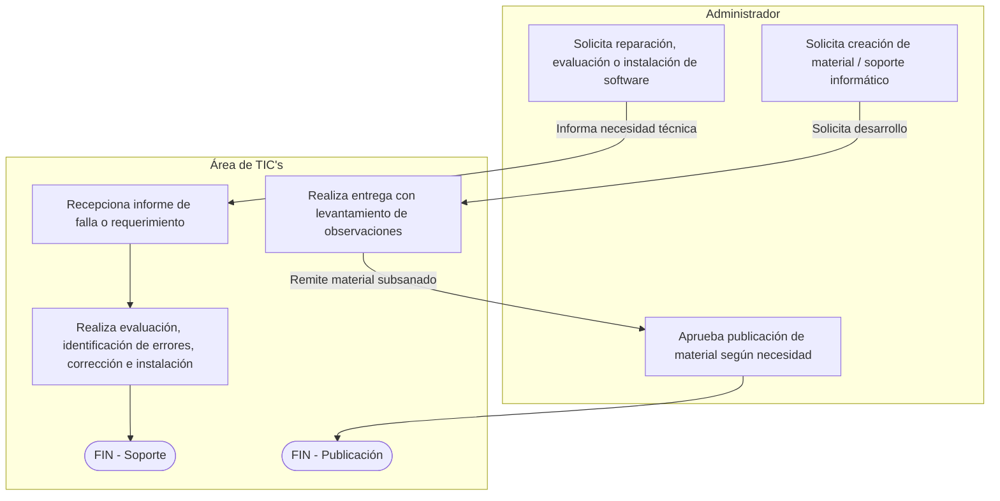
```mermaid
flowchart TD
    subgraph Admin ["Administrador"]
        A1["Solicita reparación, evaluación o instalación de software"]
        A2["Solicita creación de material / soporte informático"]
        A3["Aprueba publicación de material según necesidad"]
    end

    subgraph TICs ["Área de TIC's"]
        T1["Recepciona informe de falla o requerimiento"]
        T2["Realiza evaluación, identificación de errores, corrección e instalación"]
        T3["Realiza entrega con levantamiento de observaciones"]
        Fin1(["FIN - Soporte"])
        Fin2(["FIN - Publicación"])
    end

    A1 -->|Informa necesidad técnica| T1
    T1 --> T2
    T2 --> Fin1

    A2 -->|Solicita desarrollo| T3
    T3 -->|Remite material subsanado| A3
    A3 --> Fin2
```

---

## 16. Proceso de Tribunal de Honor

### 1. Ficha de Identificación del Proceso
| Parámetro | Detalle |
| :--- | :--- |
| **Macroproceso:** | Procesos de Apoyo |
| **Nombre del Proceso:** | Tribunal de Honor |
| **Responsable del Proceso:** | Encargado / Presidente del Tribunal de Honor Regional |
| **Objetivo del Proceso:** | Atender denuncias éticas, resolver recursos de apelación de los colegiados, emitir dictámenes disciplinarios y enviar al Consejo Directivo Nacional (CDN) los informes de los procesos concluidos. |
| **Alcance del Proceso:** | Inicia con la recepción de la denuncia o apelación y culmina con la audiencia, emisión de dictamen deontológico o elevación al CDN. |

### 2. Matriz de Caracterización (Ciclo PHVA / SIPOC)
| Entradas | Proveedor | PHVA | Actividad | Responsable | Salida | Beneficiarios |
| :--- | :--- | :---: | :--- | :--- | :--- | :--- |
| Denuncias éticas o apelaciones | Agremiados / Decanatura | **P** | Calificación y admisibilidad de denuncias sobre faltas a la ética profesional. | Tribunal de honor / Decano | Auto de apertura / Admisión del caso | Partes procesales |
| Instrucción e investigación | Tribunal de honor | **H** | Recepción de descargos, recaudo de medios probatorios y análisis de conductas. | Miembros del Tribunal de Honor | Actuados probatorios y descargos | Tribunal de honor |
| Audiencias internas y públicas | Tribunal de honor | **V** | Convocatoria y desarrollo de audiencias para sustentación de alegatos y deliberación. | Tribunal de honor / Decano | Actas de audiencia y proyectos de dictamen | Partes del proceso |
| Emisión y notificación de dictamen | Tribunal de honor | **A** | Expedición de dictámenes, imposición de sanciones o absolución, y elevación al CDN en apelación. | Tribunal de honor / Decano | Dictamen ético final / Remisión al CDN | Orden profesional y CDN |

### 3. Recursos del Proceso
- **Humano:** Miembros del Tribunal de honor regional, Decano, Administrador, Asistente legal y de actas.
- **Infraestructura:** Instalaciones del CORLAD Junín, mobiliario, sala de audiencias, equipos de grabación y materiales de escritorio.
- **Ambiente de Trabajo:** Sala de sesiones del Tribunal de Honor.

### 4. Documentos Asociados
- **Internos:** Estatuto del CORLAD Junín, Código de Ética Profesional del Licenciado en Administración, Reglamento del Tribunal de Honor.
- **Externos:** Ley 31060, Ley de Procedimiento Administrativo General (Ley 27444).

### 5. Registros
- Libro de registro de expedientes disciplinarios y denuncias éticas.
- Libro de actas de audiencias y archivo de resoluciones sancionatorias emitidas.

### 6. Indicadores de Gestión
| Nombre del Indicador | Fórmula del Indicador | Meta | Frecuencia de Medición |
| :--- | :--- | :---: | :---: |
| **Satisfacción del cliente** | $$\text{Puntaje promedio de satisfacción}$$ | $> 3$ | Mensual |

### 7. Flujograma del Proceso

#### A. Gráfico Oficial del Flujograma
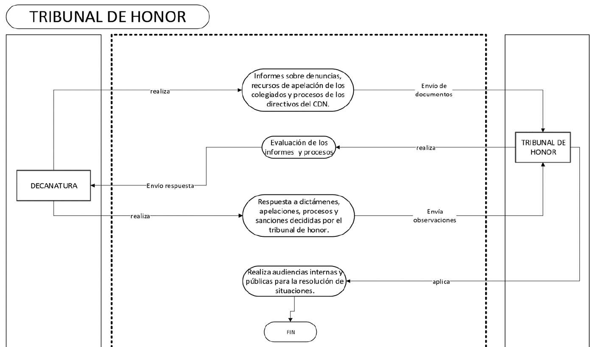

#### B. Descripción Detallada del Proceso y Flujo de Actividades
Garantiza la observancia de la ética profesional y la disciplina de los miembros de la orden, resguardando el prestigio y honor de la profesión.

1. **Actores Participantes (Swimlanes):**
   - **Decanatura:** Tramita los antecedentes, denuncias y notifica las resoluciones.
   - **Tribunal de Honor:** Órgano autónomo que instruye, evalúa, juzga y dictamina sobre faltas deontológicas.

2. **Narrativa Secuencial del Proceso (Paso a Paso):**
   - **Paso 1 (Presentación de Expedientes):** *Decanatura* tramita y remite los informes sobre denuncias, recursos de apelación de colegiados y procesos disciplinarios.
   - **Paso 2 (Envío al Tribunal de Honor):** Se realiza el envío formal de los documentos y expedientes al *Tribunal de Honor*.
   - **Paso 3 (Evaluación Técnica e Investigativa):** El Tribunal de Honor realiza la evaluación exhaustiva de los informes, actuaciones probatorias y apertura del proceso disciplinario.
   - **Paso 4 (Envío de Respuesta a Decanatura):** El Tribunal despacha la respuesta formal con los requerimientos complementarios a Decanatura.
   - **Paso 5 (Tramitación de Recursos y Descargos):** Decanatura tramita y traslada las respuestas a dictámenes, apelaciones y antecedentes de sanciones.
   - **Paso 6 (Observaciones y Convocatoria a Audiencia):** El Tribunal de Honor envía las observaciones finales y dispone la aplicación de audiencia.
   - **Paso 7 (Audiencias y Dictamen Final):** El Tribunal de Honor realiza audiencias internas y públicas para la resolución definitiva de las situaciones controvertidas, emitiendo el fallo correspondiente (**FIN**).

#### C. Diagrama de Flujo (Mermaid)
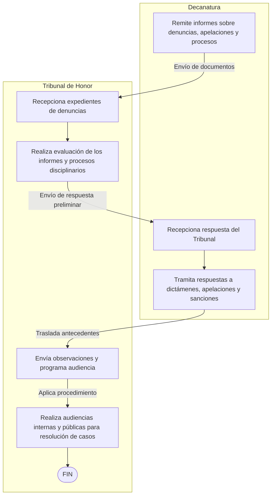
```mermaid
flowchart TD
    subgraph Decanato ["Decanatura"]
        D1["Remite informes sobre denuncias, apelaciones y procesos"]
        D2["Recepciona respuesta del Tribunal"]
        D3["Tramita respuestas a dictámenes, apelaciones y sanciones"]
    end

    subgraph Tribunal ["Tribunal de Honor"]
        T1["Recepciona expedientes de denuncias"]
        T2["Realiza evaluación de los informes y procesos disciplinarios"]
        T3["Envía observaciones y programa audiencia"]
        T4["Realiza audiencias internas y públicas para resolución de casos"]
        Fin(["FIN"])
    end

    D1 -->|Envío de documentos| T1
    T1 --> T2
    T2 -->|Envío de respuesta preliminar| D2
    D2 --> D3
    D3 -->|Traslada antecedentes| T3
    T3 -->|Aplica procedimiento| T4
    T4 --> Fin
```

---

## Conclusiones y Resumen del Modelo por Procesos

1. **Enfoque Integral (PHVA):** Los 16 procesos institucionales del CORLAD Junín están concebidos bajo el ciclo de Deming (**Planificar, Hacer, Verificar y Actuar**), asegurando la mejora continua en la prestación de servicios a los agremiados y a la sociedad.
2. **Articulación de Procesos:** La interacción entre los procesos Estratégicos, Misionales y de Apoyo garantiza que las decisiones de gobierno (Decanatura y Consejo Directivo) se ejecuten con soporte técnico (Legal, Contable, TIC, Logística) para beneficio directo de los procesos clave de colegiatura, habilitación, capacitación e integración profesional.
3. **Control y Medición:** Cada proceso cuenta con indicadores de gestión cuantitativos y cualitativos, facilitando la auditoría interna y la toma de decisiones basada en evidencias.
