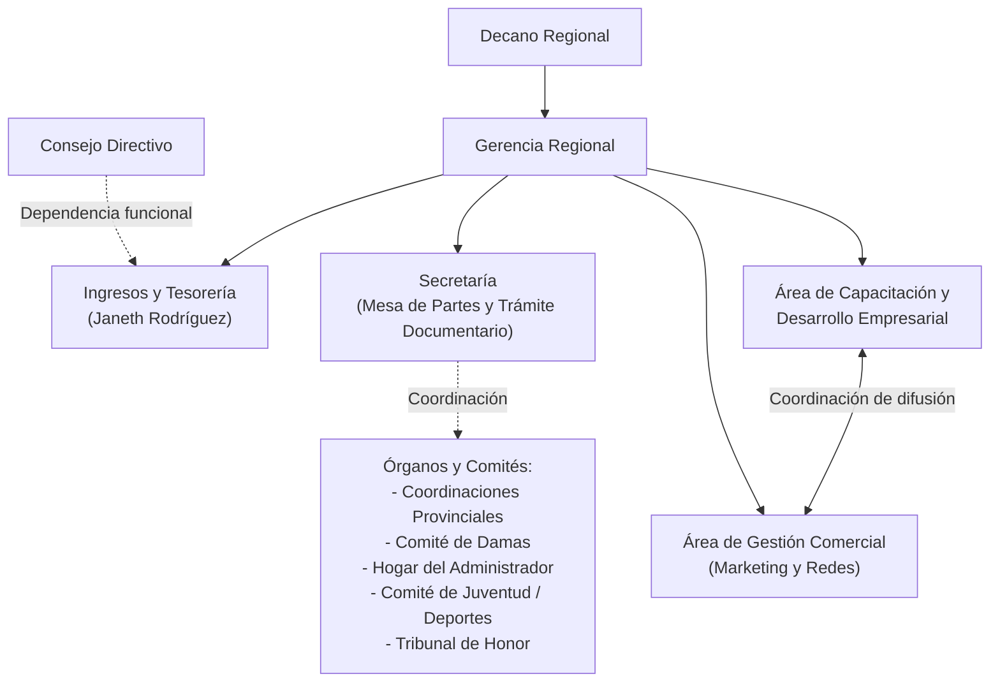

# Distribución de Funciones – CORLAD Junín (2018)

> **Documento Fuente:** `distribucion de funciones.pdf`  
> **Institución:** Colegio Regional de Licenciados en Administración (CORLAD) – Junín  
> **Objetivo:** Mejorar la gestión y operatividad de la Administración del CORLAD Junín mediante la asignación clara de responsabilidades, funciones permanentes y actividades programadas.

---

## Introducción

A continuación se describen las funciones asignadas con el objetivo de mejorar la gestión de la Administración del CORLAD Junín, algunas de ellas con fechas propuestas, las cuales deben ser cumplidas en el tiempo señalado. La realización de las demás actividades es de manera constante.

---

## Tabla de Contenidos

1. [1. Gerente Regional](#1-gerente-regional)
2. [2. Secretaria](#2-secretaria)
3. [3. Ingresos y Tesorería (Colaboradora: Janeth Rodríguez)](#3-ingresos-y-tesorería-colaboradora-janeth-rodríguez)
4. [4. Área de Capacitación y Desarrollo Empresarial](#4-área-de-capacitación-y-desarrollo-empresarial)
5. [5. Área de Gestión Comercial](#5-área-de-gestión-comercial)
6. [Estructura y Relaciones Funcionales (Diagrama)](#estructura-y-relaciones-funcionales)

---

## 1. Gerente Regional

### Funciones
- **Planificación institucional:** Planificar, organizar, dirigir y controlar las actividades del CORLAD – Junín.
- **Eventos académicos:** Planificar, organizar, dirigir y controlar los eventos académicos que organice el CORLAD – Junín.
- **Convenios:** Gestionar la firma de Convenios Interinstitucionales.
- **Coordinación orgánica:** Coordinar con los Órganos Desconcentrados y de línea para la realización de actividades en beneficio de la Institución y los miembros de la orden.
- **Beneficios del agremiado:** Plantear y materializar los **beneficios de estar colegiado**. Difusión entre los agremiados. Difundir y materializar los beneficios sociales para los miembros de la orden.
- **Atención en redes:** Atender a los miembros de la orden a través de las Redes Sociales.
- **Atención presencial:** Atender a los miembros de la orden y público en general en caso de que el/la Decano(a) Regional no se encuentre en la sede del Colegio.
- **Representación:** Representar al Decano en las actividades encargadas expresamente.
- **Plan de Trabajo Anual:** Elaborar el plan de trabajo anual en colaboración de la Oficina de Capacitación, Tesorería y Secretaría.
- **Control financiero:** Realizar el arqueo de caja de manera inopinada a la Oficina de Ingresos y Tesorería.
- **Manejo de fondos operativos:** Encargada del manejo de caja chica y entrega de dinero y demás para eventos académicos y tesorería.
- **Otras funciones:** Atender las demás funciones que se deriven de la naturaleza de su cargo y las que sean expresamente encomendadas por el Decano Regional.

---

## 2. Secretaria

### Funciones
- **Trámite documentario:** Recepcionar la documentación y registrar estos en el libro de Mesa de Partes y en el registro virtual.
- **Agenda institucional:** Gestionar la agenda del Decano y la participación de este en actividades protocolares.
- **Atenciones protocolares:** Enviar los arreglos florales por aniversario de instituciones y aparatos florales en caso de fallecimiento de un agremiado adscrito o un familiar.
- **Directorio institucional:** Actualizar el Directorio de agremiados, autoridades y demás para el desarrollo oportuno de sus actividades.
- **Constancias de habilidad:** Emisión de constancias de habilidad.
- **Registro de habilidad:** Llevar el Registro virtual de las Constancias de Habilidad y su correspondiente archivo en físico.
- **Matrícula y colegiatura:** Inscribir a nuevos colegiados y gestionar la reinscripción en la Colegiatura Nacional.
- **Entrega de implementos:** Entregar los Carnets, Diplomas de Colegiatura, Resoluciones u otra documentación de carácter personal a los agremiados.
- **Expedientes de colegiatura:** Preparar el expediente de Colegiatura para remitir a la ciudad de Lima (Sede Nacional).
- **Patrimonio documentario:** Archivar y custodiar la documentación (ordenar y clasificar todos los archivadores del CORLAD Junín).
- **Control de personal:** Llevar el control de asistencia de los colaboradores del CORLAD Junín.
- **Redacción administrativa:** Redactar los oficios, cartas, oficios múltiples u otros documentos administrativos.
- **Recepción y visitas:** Recepcionar las llamadas telefónicas y registrar las visitas institucionales.
- **Inventario físico:** Realizar y llevar el inventario físico de los bienes del CORLAD Junín con el apoyo respectivo que para el efecto disponga la Gerencia.
- **Coordinación con órganos y comités:** Coordinar con los Órganos Desconcentrados y de línea para la realización de actividades, canalizando acciones en el marco de los acuerdos tomados con la Gerencia del Colegio:
  - Coordinaciones Provinciales
  - Comité de Damas
  - Comité del Hogar del Administrador
  - Comité de la Juventud
  - Comité de Deportes
  - Tribunal de Honor
  - Comités Especializados (sector público y privado)
- **Saludos institucionales:** Saludos institucionales por aniversarios (oficios, tarjetas, arreglos florales).
- **Recordatorio y confirmación de agenda:** Recordatorio de agenda, organización de reuniones y confirmación de la participación del Decano.
- **Protocolo e imagen:** Coordinar acciones de Protocolo e Imagen Institucional en cada evento del Colegio.
- **Mantenimiento de ambientes:** Mantener limpios y ordenados las áreas de trabajo, la oficina del Decano y la Sala de Sesiones.
- **Atención al usuario:** Atender con amabilidad y respeto a los agremiados y al público visitante al CORLAD Junín.
- **Otras funciones:** Atender las demás funciones que se deriven de la naturaleza de su cargo y las que sean expresamente encomendadas por su jefe inmediato.

---

## 3. Ingresos y Tesorería (Colaboradora: Janeth Rodríguez)

### Dependencia
- Dependencia **lineal** de la Gerencia Regional.
- Dependencia **funcional** del Consejo Directivo.

### Funciones
- **Plan de ingresos:** Elaborar el plan anual de ingresos y cobros por todos los conceptos (aportaciones, colegiatura, habilidad, etc.).
- **Comprobantes de pago:** Emisión y cobranza de comprobantes de pago (facturas, boletas, notas de crédito, recibos, etc.).
- **Depósitos bancarios:** Realizar los depósitos en las diferentes cuentas corrientes por los ingresos de la venta de productos y prestación de servicios, dentro del plazo perentorio de 48 horas.
- **Trámites de giro:** Recepcionar y tramitar las solicitudes de giro y las rendiciones de cuenta.
- **Programa de Asistencia Social:** Llevar el Registro del Programa de Asistencia Social (Libro de Actas). Realizar el trámite y la entrega del dinero correspondiente, manteniendo actualizada la relación de beneficiarios.
- **Resumen financiero semanal:** Presentación del resumen de ingresos y egresos de forma semanal a la Gerencia.
- **Liquidación económica de eventos:** Presentar los informes económicos de los eventos organizados (sociales, deportivos, académicos y otros) en cuanto a ingresos y egresos.
- **Estados de cuenta:** Actualizar el Estado de Cuenta individual de los Licenciados en Administración.
- **Rendición de información:** Presentar la información solicitada por la Gerencia o el Consejo Directivo de manera oportuna y adecuada.
- **Cobranza de alquileres:** Realizar el cobro de los alquileres de los espacios y ambientes del CORLAD Junín.
- **Otras funciones:** Atender las demás funciones que se deriven de la naturaleza de su cargo y las que sean expresamente encomendadas por su jefe inmediato y el Decano Regional.

---

## 4. Área de Capacitación y Desarrollo Empresarial

### Funciones
- **Planificación de eventos:** Planificar, organizar, dirigir y controlar los eventos académicos en forma mensual.
- **Planes de trabajo específicos:** Entregar y desarrollar el plan de trabajo detallado por cada evento académico programado.
- **Gestión financiera del área:** Llevar y presentar los flujos de caja operativos.
- **Campañas de recaudación:** Realizar campañas de reinscripción, asistencia, cobro y otros a efectos de maximizar los ingresos.
- **Proyectos de inversión:** Proponer proyectos de ingresos y endeudamiento cuando corresponda.
- **Promoción de alquileres:** Promocionar los ambientes del colegio a instituciones y miembros de la orden para su alquiler comercial o académico.
- **Rendición de cuentas:** Presentar la rendición de cuentas de los eventos académicos desarrollados.
- **Conferencias de deontología:** Organizar la Conferencia Magistral en el *Código de Ética y Rol del Colegio de Licenciados en Administración*.
- **Cumplimiento de metas:** Desarrollar y cumplir la programación y metas de eventos académicos establecidas hasta el mes de diciembre.
- **Coordinación publicitaria:** Coordinar con el área comercial para la difusión y publicación de material publicitario de eventos propios, eventos de empresas con convenio y eventos de los agremiados.
- **Material impreso:** Coordinar la impresión de material publicitario y carpetas académicas para cada evento.
- **Aula Virtual:** Crear el Aula Virtual para cada evento académico programado y según sea requerido por la Gerencia Regional.
- **Control documental de gastos:** Elaboración del archivador de rendiciones de cuentas por cada evento ejecutado.
- **Eventos de gran magnitud:** Organizar eventos académicos de gran magnitud en el periodo (Congresos regionales/nacionales, convenciones, etc.).
- **Otras funciones:** Atender las demás funciones que se deriven de la naturaleza de su cargo y las que sean expresamente encomendadas por su jefe inmediato.

---

## 5. Área de Gestión Comercial

### Funciones
- **Herramientas digitales:** Implementar herramientas digitales y estrategias de marketing institucional.
- **Página web y redes sociales:** Actualizar la Página Web oficial y diseñar formatos para la publicación sistemática de contenido en redes sociales.
- **Publicaciones digitales:** Gestionar las publicaciones en redes sociales institucionales (Twitter, Instagram, Facebook).
- **Difusión integral:** Difundir los eventos académicos y demás actividades del colegio a través de medios digitales y medios impresos.
- **Biblioteca Digital y donaciones:** Promover donaciones a cambio de entrega de Resoluciones. Gestionar la implementación de la Biblioteca Digital y el beneficio de presentación de libros.
- **Biblioteca física institucional:** Implementar el uso y la difusión de la Biblioteca del CORLAD – Junín, manteniendo actualizada la información catalogada.
- **Formularios de inscripción:** Crear el formulario de registro y captura de datos por cada evento académico programado.
- **Promoción de representación decanal:** Promocionar las actividades institucionales desarrolladas por el CORLAD y donde participe el Decano en representación de la orden.
- **Otras funciones:** Atender las demás funciones que se deriven de la naturaleza de su cargo y las que sean expresamente encomendadas por su jefe inmediato.

---

## Estructura y Relaciones Funcionales

